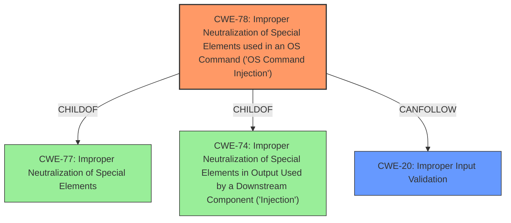

# Analysis for CVE-2021-22502

# Summary
| CWE ID | CWE Name | Confidence | CWE Abstraction Level | CWE Vulnerability Mapping Label | CWE-Vulnerability Mapping Notes |
|---|---|---|---|---|---|
| CWE-78 | Improper Neutralization of Special Elements used in an OS Command ('OS Command Injection') | 1 | Base | Allowed | Primary CWE |
| CWE-20 | Improper Input Validation | 0.8 | Base | Allowed | Secondary Candidate |

## Evidence and Confidence

*   **Confidence Score:** 0.9
*   **Evidence Strength:** HIGH

## Relationship Analysis
The primary CWE, CWE-78, is a base-level CWE that accurately represents the vulnerability. It is a child of CWE-77 (Improper Neutralization of Special Elements) and CWE-74 (Improper Neutralization of Special Elements in Output Used by a Downstream Component ('Injection')). The secondary CWE, CWE-20, represents the root cause of the command injection, where the input validation is missing.

## Vulnerability Chain
The vulnerability chain starts with **insufficient input validation** (CWE-20) of the `Token` and `userName` parameters. This leads to **OS command injection** (CWE-78) because the unsanitized input is used in a system call. The final impact is **remote code execution (RCE)** with root privileges on the server.

## Summary of Analysis
The analysis is based on the provided evidence, which includes a detailed breakdown of the vulnerability in the "CVE Reference Links Content Summary" section. The root cause is identified as **insufficient input validation**, which allows an attacker to inject arbitrary commands into a system call.

The primary CWE is CWE-78, which accurately reflects the **OS command injection** vulnerability. The evidence from the "CVE Reference Links Content Summary" clearly states that the application uses user-supplied input without proper sanitization, leading to command injection. The secondary CWE is CWE-20, which represents the **improper input validation** that leads to the command injection.

The selection of CWE-78 is based on the "CVE Reference Links Content Summary" section, which states: "The root cause is **insufficient input validation** of the `Token` and `userName` parameters, leading to command injection." This aligns with the CWE-78 description, which states: "The product constructs all or part of an OS command using externally-influenced input from an upstream component, but it does not neutralize or incorrectly neutralizes special elements that could modify the intended OS command when it is sent to a downstream component."

The selected CWEs are at the optimal level of specificity because CWE-78 is a base-level CWE that directly represents the command injection vulnerability, and CWE-20 is a base-level CWE that represents the cause of the vulnerability.

Relevant CWE Information:

# Enhanced Context (25 CWEs)
The following CWEs were identified as potentially relevant to this vulnerability:

## CWE-1220: Insufficient Granularity of Access Control
**Abstraction Level**: Base
**Similarity Score**: 0.76

## CWE-41: Improper Resolution of Path Equivalence
**Abstraction Level**: Base
**Similarity Score**: 0.76

## CWE-74: Improper Neutralization of Special Elements in Output Used by a Downstream Component ('Injection')
**Abstraction Level**: Class
**Similarity Score**: 0.76

## CWE-653: Improper Isolation or Compartmentalization
**Abstraction Level**: Class
**Similarity Score**: 0.76

## CWE-639: Authorization Bypass Through User-Controlled Key
**Abstraction Level**: Base
**Similarity Score**: 0.76

## CWE-668: Exposure of Resource to Wrong Sphere
**Abstraction Level**: Class
**Similarity Score**: 0.76

## CWE-807: Reliance on Untrusted Inputs in a Security Decision
**Abstraction Level**: Base
**Similarity Score**: 0.76

## CWE-691: Insufficient Control Flow Management
**Abstraction Level**: Pillar
**Similarity Score**: 0.76

## CWE-664: Improper Control of a Resource Through its Lifetime
**Abstraction Level**: Pillar
**Similarity Score**: 0.76

## CWE-274: Improper Handling of Insufficient Privileges
**Abstraction Level**: Base
**Similarity Score**: 0.75

## CWE-22: Improper Limitation of a Pathname to a Restricted Directory ('Path Traversal')
**Abstraction Level**: Base
**Similarity Score**: 7221.12

## CWE-863: Incorrect Authorization
**Abstraction Level**: Class
**Similarity Score**: 7103.40

## CWE-59: Improper Link Resolution Before File Access ('Link Following')
**Abstraction Level**: Base
**Similarity Score**: 7052.72

## CWE-88: Improper Neutralization of Argument Delimiters in a Command ('Argument Injection')
**Abstraction Level**: Base
**Similarity Score**: 7031.22

## CWE-94: Improper Control of Generation of Code ('Code Injection')
**Abstraction Level**: Base
**Similarity Score**: 7016.87

## CWE-22: Improper Limitation of a Pathname to a Restricted Directory ('Path Traversal')
**Abstraction Level**: base
**Similarity Score**: 4.33

## CWE-804: Guessable CAPTCHA
**Abstraction Level**: base
**Similarity Score**: 4.33

## CWE-78: Improper Neutralization of Special Elements used in an OS Command ('OS Command Injection')
**Abstraction Level**: base
**Similarity Score**: 4.31

## CWE-88: Improper Neutralization of Argument Delimiters in a Command ('Argument Injection')
**Abstraction Level**: base
**Similarity Score**: 3.64

## CWE-94: Improper Control of Generation of Code ('Code Injection')
**Abstraction Level**: base
**Similarity Score**: 3.49

## CWE-98: Improper Control of Filename for Include/Require Statement in PHP Program ('PHP Remote File Inclusion')
**Abstraction Level**: variant
**Similarity Score**: 3.33

## CWE-787: Out-of-bounds Write
**Abstraction Level**: base
**Similarity Score**: 3.14

## CWE-41: Improper Resolution of Path Equivalence
**Abstraction Level**: Base
**Similarity Score**: 2.91

## CWE-1257: Improper Access Control Applied to Mirrored or Aliased Memory Regions
**Abstraction Level**: base
**Similarity Score**: 2.87

## CWE-1260: Improper Handling of Overlap Between Protected Memory Ranges
**Abstraction Level**: base
**Similarity Score**: 2.87

**CWEs Considered But Not Used**:

*   **CWE-74:** While this is a parent of CWE-78, CWE-78 is a more specific representation of the vulnerability.
*   **CWE-94:** While code execution is the impact, the vulnerability is not about generating code but rather injecting commands.
*   **CWE-863, CWE-285, CWE-732**: These CWEs relate to authorization issues, but this vulnerability doesn't primarily involve authorization. The endpoint is simply missing authentication, but the core issue is the lack of input validation leading to command injection.
*   **CWE-22, CWE-59, CWE-41:** These are path traversal related, but this vulnerability is about command execution, not file access.
*   **CWE-787:** This relates to memory corruption, but the vulnerability isn't about writing to memory outside of bounds.
*   **CWE-88:** Argument injection is related to command injection, but CWE-78 is a better fit as it is more general.
*   **CWE-330, CWE-804**: Relates to insufficient randomness in CAPTCHA, but is not applicable here.