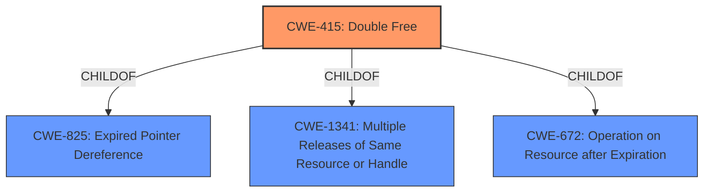

# Enhanced Analysis for CVE-2021-22600

# Summary
| CWE ID | CWE Name | Confidence | CWE Abstraction Level | CWE Vulnerability Mapping Label | CWE-Vulnerability Mapping Notes |
|---|---|---|---|---|---|
| CWE-415 | Double Free | 1.0 | Variant | Allowed | Primary CWE |

## Evidence and Confidence

*   **Confidence Score:** 1.0
*   **Evidence Strength:** HIGH

## Relationship Analysis
The primary relationship influencing the selection was the direct match of the "**double free**" condition described in the vulnerability to the description of CWE-415.
CWE-415 is a Variant of CWE-825 (Expired Pointer Dereference), CWE-1341 (Multiple Releases of Same Resource or Handle), CWE-672 (Operation on Resource after Expiration). No chain relationships were applicable in this case.



## Vulnerability Chain
The vulnerability chain is straightforward:
1.  **Root Cause:** **Double Free** (CWE-415)
2.  **Impact:** Privilege escalation and denial of service.

## Summary of Analysis
The initial analysis immediately pointed to CWE-415 due to the explicit mention of "**double free**" in the vulnerability description. The CVE Reference Links Content Summary further confirmed that the vulnerability is caused by incorrect memory freeing, which aligns perfectly with the definition of CWE-415.

The relationship analysis reinforces this choice, as CWE-415 is a variant that directly addresses the specific issue of double freeing memory. The evidence explicitly states "The code was freeing memory that was already freed."

The selection of CWE-415 is at the optimal level of specificity because it directly describes the **root cause** of the vulnerability, as evidenced by the vulnerability description key phrases and CVE reference links content summary.

Relevant CWE Information:

# Enhanced Context (25 CWEs)

## CWE-415: Double Free
**Abstraction:** Variant
**Similarity Score**: 0.76
**Source**: dense

**Description**:
The product calls free() twice on the same memory address, potentially leading to modification of unexpected memory locations.

**Mapping Guidance**:
- Usage: Allowed
- Rationale: This CWE entry is at the Variant level of abstraction, which is a preferred level of abstraction for mapping to the root causes of vulnerabilities.

# Technical Explanation for CWE-415
*   **How the vulnerability's details match the CWE's characteristics:** The vulnerability description clearly states a "**double free**" bug. CWE-415 directly addresses the condition where `free()` is called twice on the same memory address.
*   **The security implications and potential impact:** The security implications of a **double free** can range from denial of service (due to memory corruption or program crash) to privilege escalation if an attacker can manipulate memory allocation after the **double free**.
*   **Any parent-child relationships or chain patterns that influenced your mapping:** CWE-415 is a variant of CWE-825 (Expired Pointer Dereference) and CWE-1341 (Multiple Releases of Same Resource or Handle).
*   **Whether the weakness is primary or secondary in the vulnerability:** CWE-415 is the primary weakness.
*   **How the official MITRE mapping guidance influenced your decision:** The MITRE mapping guidance for CWE-415 allows its use and states that it is at the Variant level of abstraction, which is a preferred level for mapping to the **root causes** of vulnerabilities.

# Other CWEs Considered:
*   CWE-362 (Concurrent Execution using Shared Resource with Improper Synchronization ('Race Condition')): While the Observed Examples for CWE-362 includes CVE-2006-5051 with a **double free**, the vulnerability description does not indicate that concurrency or race conditions are a factor.
*   CWE-787 (Out-of-bounds Write): While the impact of a double free can lead to memory corruption and potentially out-of-bounds writes, the **root cause** here is the **double free** itself, not a direct out-of-bounds write.
*   CWE-416 (Use After Free): Although related, the vulnerability explicitly states a **double free**, meaning the memory is freed twice, not used after a single free.
*   CWE-123 (Write-what-where Condition): This could be a consequence of the **double free**, but is not the **root cause** itself.
*   CWE-911 (Improper Update of Reference Count): Not directly related to the **double free** condition, though reference counting might be a memory management technique in the affected code.


## CWE Relationship Analysis

Current CWEs represent these abstraction levels: .


### Vulnerability Chain Analysis

**Chain starting from CWE-415:**
- 415 (Double Free) - ROOT


**Chain starting from CWE-787:**
- 787 (Out-of-bounds Write) - ROOT


### CWE Relationship Diagram

```mermaid
graph TD
    classDef primary fill:#f96,stroke:#333,stroke-width:2px
    classDef secondary fill:#69f,stroke:#333
    classDef tertiary fill:#9e9,stroke:#333
```