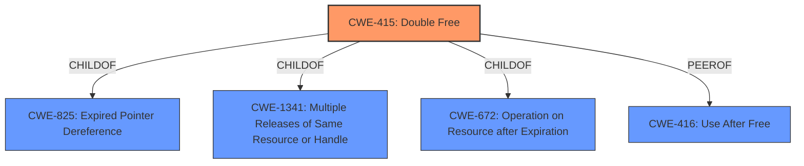

# Enhanced Analysis for CVE-2021-22600

# Summary
| CWE ID | CWE Name | Confidence | CWE Abstraction Level | CWE Vulnerability Mapping Label | CWE-Vulnerability Mapping Notes |
|---|---|---|---|---|---|
| CWE-415 | Double Free | 1.0 | Variant | Allowed | Primary CWE |

## Evidence and Confidence

*   **Confidence Score:** 1.0
*   **Evidence Strength:** HIGH

## Relationship Analysis
The primary identified weakness is CWE-415 **Double Free**, which is a variant-level CWE. The relationships show that it is a child of CWE-825 (Expired Pointer Dereference), CWE-1341 (Multiple Releases of Same Resource or Handle), and CWE-672 (Operation on Resource after Expiration). It is also a peer of CWE-416 (Use After Free). The choice of CWE-415 is based on direct evidence and the recommended usage for variant-level CWEs.



## Vulnerability Chain
The vulnerability chain starts with the **double free** condition in `packet_set_ring()` (root cause), leading to potential memory corruption (weakness), and culminating in privilege escalation or denial of service (impact).

## Summary of Analysis
The primary weakness is a **double free** condition, which directly corresponds to CWE-415.

The vulnerability description explicitly states: "A **double free** bug in packet_set_ring() in net/packet/af_packet.c can be exploited by a local user through crafted syscalls to escalate privileges or deny service." The "CVE Reference Links Content Summary" section confirms this root cause: "The vulnerability is caused by a flaw in the packet socket (AF_PACKET) implementation within the Linux kernel. Specifically, the issue arises from incorrect memory freeing within this module... The code was freeing memory that was already freed."

The selection of CWE-415 is based on direct evidence of a **double free** condition. The retriever results also list CWE-415 as the top candidate. The relationship analysis shows that it's a variant, which is the preferred level of abstraction. The MITRE mapping guidance allows the usage of CWE-415. Other CWEs were considered, but they do not accurately represent the root cause. For example, CWE-416 (Use After Free) is a peer, but the vulnerability is specifically a **double free**, not a use after free. CWE-787 (Out-of-bounds Write) is not directly applicable as the root cause is not a write but an incorrect free.


## CWE Relationship Analysis

Current CWEs represent these abstraction levels: .


### Vulnerability Chain Analysis

**Chain starting from CWE-825:**
- 825 (Expired Pointer Dereference) - ROOT


**Chain starting from CWE-672:**
- 672 (Operation on a Resource after Expiration or Release) - ROOT


### CWE Relationship Diagram

```mermaid
graph TD
    classDef primary fill:#f96,stroke:#333,stroke-width:2px
    classDef secondary fill:#69f,stroke:#333
    classDef tertiary fill:#9e9,stroke:#333
```