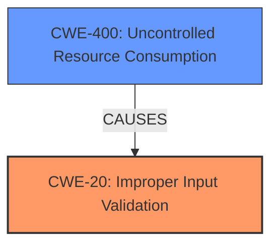

# Enhanced Analysis for CVE-2021-22787

# Summary
| CWE ID | CWE Name | Confidence | CWE Abstraction Level | CWE Vulnerability Mapping Label | CWE-Vulnerability Mapping Notes |
|---|---|---|---|---|---|
| CWE-20 | Improper Input Validation | 0.8 | Class | Primary | Discouraged |
| CWE-400 | Uncontrolled Resource Consumption | 0.6 | Class | Secondary | Discouraged |

## Evidence and Confidence

*   **Confidence Score:** 0.7
*   **Evidence Strength:** MEDIUM

## Relationship Analysis
The primary CWE is CWE-20 **Improper Input Validation**. While the description mentions a denial-of-service (DoS) impact, the root cause is the lack of proper validation of the HTTP request. CWE-20 is a class-level CWE, and it can lead to various impacts, including DoS. CWE-400 **Uncontrolled Resource Consumption** is considered a secondary CWE because the **Improper Input Validation** leads to a DoS. CWE-400 is also a class-level CWE.



## Vulnerability Chain
The vulnerability chain starts with the **Improper Input Validation** (CWE-20). An attacker sends a specially crafted HTTP request. Due to the **lack of validation**, the device's web server is vulnerable to a denial-of-service condition. The final impact is the denial of service (DoS).

## Summary of Analysis
The initial assessment points to CWE-20 **Improper Input Validation** as the primary weakness, as stated in the "Vulnerability Description Key Phrases": "**rootcause:** **Improper Input Validation**". The vulnerability description states that an attacker can send a specially crafted HTTP request to the device's web server, leading to a denial-of-service condition. This aligns with CWE-20, where the product does not validate or incorrectly validates the input, allowing an attacker to craft an input that is not expected by the application.

The CWE for similar CVE Descriptions includes CWE-787 **Out-of-bounds Write**, but this is not supported by the vulnerability description since there is no mention of writing past the end of a buffer.

The Retriever Results listed CWE-20 **Improper Input Validation** as a potential match, but the score was low. CWE-20 is listed as Discouraged, but it is still the best match based on the description provided. The vulnerability description explicitly identifies **Improper Input Validation** as the root cause, which is strong evidence.

CWE-400 **Uncontrolled Resource Consumption** is considered as a secondary weakness. The **Improper Input Validation** (CWE-20) allows the attacker to influence the amount of resources consumed, which can lead to the exhaustion of available resources and a denial-of-service condition. The description of CWE-400 states, "The product does not properly control the allocation and maintenance of a limited resource, thereby enabling an actor to influence the amount of resources consumed, eventually leading to the exhaustion of available resources."

The selected CWEs are at the appropriate level of specificity, with CWE-20 representing the root cause and CWE-400 representing the consequence of the vulnerability.

Relevant CWE Information:

# Enhanced Context (25 CWEs)
The following CWEs were identified as potentially relevant to this vulnerability:

## CWE-405: Asymmetric Resource Consumption (Amplification)
**Abstraction Level**: Class
**Similarity Score**: 0.79

## CWE-404: Improper Resource Shutdown or Release
**Abstraction Level**: Class
**Similarity Score**: 0.77

## CWE-799: Improper Control of Interaction Frequency
**Abstraction Level**: Class
**Similarity Score**: 0.77

## CWE-664: Improper Control of a Resource Through its Lifetime
**Abstraction Level**: Pillar
**Similarity Score**: 0.76

## CWE-226: Sensitive Information in Resource Not Removed Before Reuse
**Abstraction Level**: Base
**Similarity Score**: 0.76

## CWE-668: Exposure of Resource to Wrong Sphere
**Abstraction Level**: Class
**Similarity Score**: 0.76

## CWE-789: Memory Allocation with Excessive Size Value
**Abstraction Level**: Variant
**Similarity Score**: 0.76

## CWE-1289: Improper Validation of Unsafe Equivalence in Input
**Abstraction Level**: Base
**Similarity Score**: 0.75

## CWE-807: Reliance on Untrusted Inputs in a Security Decision
**Abstraction Level**: Base
**Similarity Score**: 0.75

## CWE-407: Inefficient Algorithmic Complexity
**Abstraction Level**: Class
**Similarity Score**: 0.75

## CWE-190: Integer Overflow or Wraparound
**Abstraction Level**: Base
**Similarity Score**: 8757.87

## CWE-200: Exposure of Sensitive Information to an Unauthorized Actor
**Abstraction Level**: Class
**Similarity Score**: 8433.03

## CWE-1284: Improper Validation of Specified Quantity in Input
**Abstraction Level**: Base
**Similarity Score**: 8397.55

## CWE-119: Improper Restriction of Operations within the Bounds of a Memory Buffer
**Abstraction Level**: Class
**Similarity Score**: 8390.61

## CWE-125: Out-of-bounds Read
**Abstraction Level**: Base
**Similarity Score**: 8360.00

## CWE-434: Unrestricted Upload of File with Dangerous Type
**Abstraction Level**: base
**Similarity Score**: 5.03

## CWE-22: Improper Limitation of a Pathname to a Restricted Directory ('Path Traversal')
**Abstraction Level**: base
**Similarity Score**: 4.33

## CWE-770: Allocation of Resources Without Limits or Throttling
**Abstraction Level**: base
**Similarity Score**: 4.33

## CWE-73: External Control of File Name or Path
**Abstraction Level**: base
**Similarity Score**: 4.33

## CWE-190: Integer Overflow or Wraparound
**Abstraction Level**: base
**Similarity Score**: 4.33

## CWE-1284: Improper Validation of Specified Quantity in Input
**Abstraction Level**: base
**Similarity Score**: 4.33

## CWE-59: Improper Link Resolution Before File Access ('Link Following')
**Abstraction Level**: base
**Similarity Score**: 4.33

## CWE-681: Incorrect Conversion between Numeric Types
**Abstraction Level**: base
**Similarity Score**: 4.33

## CWE-410: Insufficient Resource Pool
**Abstraction Level**: base
**Similarity Score**: 4.33

## CWE-201: Insertion of Sensitive Information Into Sent Data
**Abstraction Level**: base
**Similarity Score**: 4.33


## CWE Relationship Analysis

Current CWEs represent these abstraction levels: .


### Vulnerability Chain Analysis

**Chain starting from CWE-807:**
- 807 (Reliance on Untrusted Inputs in a Security Decision) - ROOT


**Chain starting from CWE-668:**
- 668 (Exposure of Resource to Wrong Sphere) - ROOT


### CWE Relationship Diagram

```mermaid
graph TD
    classDef primary fill:#f96,stroke:#333,stroke-width:2px
    classDef secondary fill:#69f,stroke:#333
    classDef tertiary fill:#9e9,stroke:#333
```