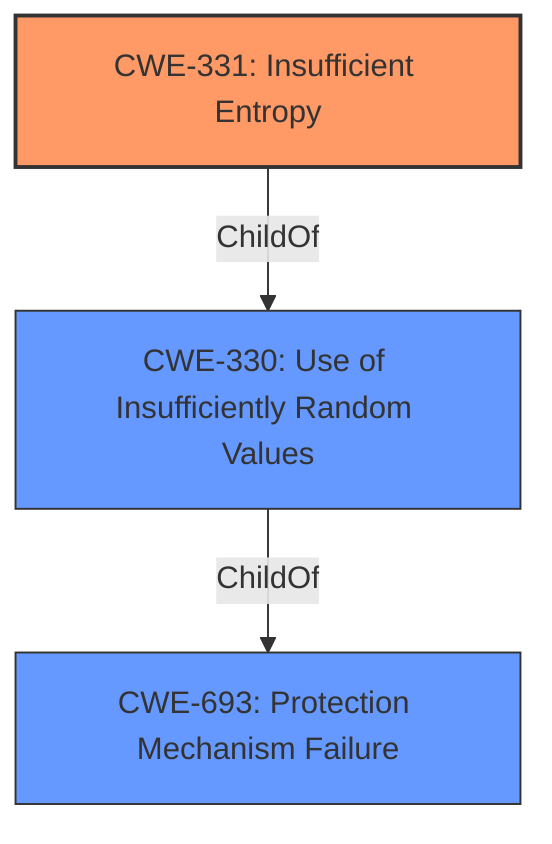

# Analysis for CVE-2021-22799

# Summary
| CWE ID | CWE Name | Confidence | CWE Abstraction Level | CWE Vulnerability Mapping Label | CWE-Vulnerability Mapping Notes |
|---|---|---|---|---|---|
| CWE-331 | Insufficient Entropy | 1 | Base | Allowed | Primary CWE |

## Evidence and Confidence

*   **Confidence Score:** 1
*   **Evidence Strength:** HIGH

## Relationship Analysis
The primary relationship influencing my decision is the ChildOf relationship between CWE-331 and CWE-330, where CWE-331 is a more specific case of CWE-330. Because the vulnerability description explicitly mentions "**insufficient entropy**" as the **rootcause**, CWE-331 is the more appropriate choice.

## Vulnerability Chain
The vulnerability chain begins with the **root cause**, which is the **insufficient entropy**, leading to a weakness where an attacker can decrypt the SESU proxy password, ultimately resulting in an unintended network connection.

*   **Root Cause:** CWE-331 Insufficient Entropy
*   **Weakness:** Decryptable Password
*   **Impact:** Unintended Network Connection

## Summary of Analysis
The initial assessment based on the vulnerability description and retriever results points towards CWE-331 (Insufficient Entropy) as the primary weakness. The vulnerability description key phrases highlight "**insufficient entropy**" as the **rootcause**.

The evidence from the vulnerability description is strong: "A CWE-331 Insufficient Entropy vulnerability exists...". The "CVE Reference Links Content Summary" provided "NOINFO", meaning there is no further information to be gained from that source.

CWE-331 is a Base level CWE, which is the preferred level of abstraction. The MITRE mapping guidance for CWE-331 states "This CWE entry is at the Base level of abstraction, which is a preferred level of abstraction for mapping to the root causes of vulnerabilities."

I considered CWE-330 (Use of Insufficiently Random Values), but the description specifically mentions insufficient entropy, making CWE-331 a more precise match. While CWE-330 is a parent of CWE-331, it is a Class, and the more specific Base CWE is more appropriate. Other CWEs like CWE-668, CWE-327, CWE-321, etc. were considered but deemed less relevant as they address different aspects of security vulnerabilities.

Therefore, the final decision is to classify this vulnerability as CWE-331 (Insufficient Entropy) with a confidence score of 1. The selection of CWE-331 is at the optimal level of specificity, aligning with the provided evidence and MITRE's mapping guidance.

Relevant CWE Information: