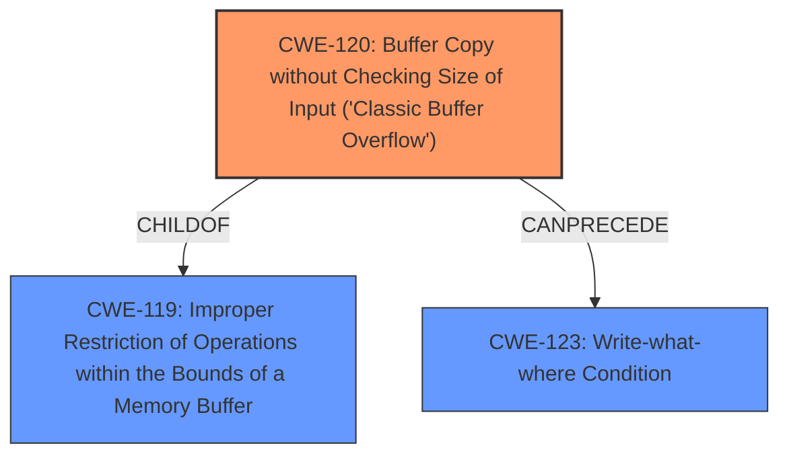

# Raw Analyzer Response for CVE-2021-22894

# Summary
| CWE ID | CWE Name | Confidence | CWE Abstraction Level | CWE Vulnerability Mapping Label | CWE-Vulnerability Mapping Notes |
|---|---|---|---|---|---|
| CWE-120 | Buffer Copy without Checking Size of Input ('Classic Buffer Overflow') | 0.9 | Base | Allowed-with-Review | Primary CWE: The vulnerability description explicitly mentions a "buffer overflow" and the CWE description matches this. |

## Evidence and Confidence

*   **Confidence Score:** 0.9
*   **Evidence Strength:** HIGH

## Relationship Analysis
The primary CWE is CWE-120, which is a Base level CWE. CWE-120 is a child of CWE-119 (Improper Restriction of Operations within the Bounds of a Memory Buffer), a Class level CWE. There are also potential chain relationships, such as CWE-120 potentially preceding CWE-123 (Write-what-where Condition).

## Vulnerability Chain
The vulnerability chain starts with a **buffer overflow** in Pulse Connect Secure, triggered by a maliciously crafted meeting room by a remote authenticated attacker, leading to the ability to execute arbitrary code as the root user. The root cause is the **lack of input size checking** before copying data into a buffer.

## Summary of Analysis
The primary CWE is CWE-120, which directly addresses the **buffer overflow** due to **missing size checks**. This aligns with the vulnerability description and the **Retriever Results**. The description clearly indicates a classic **buffer overflow** scenario.

The vulnerability description states: "A **buffer overflow** vulnerability exists in Pulse Connect Secure before 9.1R11.4 allows a remote authenticated attacker to execute arbitrary code as the root user via maliciously crafted meeting room."

CWE-120 matches the root cause evidence, as it involves copying a buffer without verifying the input size, leading to an overflow.

CWE-119 was considered but it is a class-level CWE and the description mentions it should be avoided for low-information vulnerability reports. The vulnerability report has sufficient information, thus the more specific CWE-120 is a better fit.
CWE-190 was considered but it deals with integer overflows and wraparounds, and the provided information does not suggest any integer overflow issues.
CWE-121 and CWE-122 were considered, but there isn't enough information to specify if the overflow is stack-based or heap-based, so the base CWE-120 is the best fit.
CWE-287 was considered but the report mentions the attacker is authenticated. The authentication itself is not the root cause of the vulnerability.