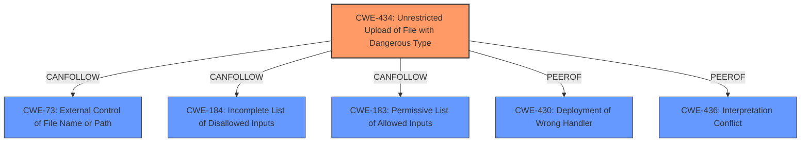

# Raw Analyzer Response for CVE-2021-22900

# Summary
| CWE ID | CWE Name | Confidence | CWE Abstraction Level | CWE Vulnerability Mapping Label | CWE-Vulnerability Mapping Notes |
|---|---|---|---|---|---|
| CWE-434 | Unrestricted Upload of File with Dangerous Type | 1 | Base | Allowed | Primary CWE |
| CWE-73 | External Control of File Name or Path | 0.7 | Base | Allowed | Secondary Candidate |

## Evidence and Confidence

*   **Confidence Score:** 0.85
*   **Evidence Strength:** HIGH

## Relationship Analysis
The primary CWE selected, CWE-434 **Unrestricted Upload of File with Dangerous Type**, is a base-level CWE, making it appropriately specific. It has peer relationships with CWE-430 and CWE-436, and CANFOLLOW relationships with CWE-73, CWE-184, and CWE-183, indicating potential chaining. The secondary CWE, CWE-73 **External Control of File Name or Path**, also at the base level, CANFOLLOW CWE-434. This reflects that after a file is uploaded, its name or path could be influenced, leading to further vulnerabilities.

## Vulnerability Chain
The vulnerability chain begins with **multiple unrestricted uploads** (CWE-434) that an authenticated administrator can perform. This leads to a file write, implying that the attacker has control over the file's content and potentially its location (CWE-73). The chain highlights how an initial flaw (unrestricted upload) allows further exploitation (file write).

## Summary of Analysis
My assessment heavily relies on the provided vulnerability description, which explicitly mentions "**multiple unrestricted uploads**". The description states that this can "lead to an authenticated administrator to perform a file write via a maliciously crafted archive upload in the administrator web interface."

The primary selection, CWE-434, aligns perfectly with the **rootcause** of "**multiple unrestricted uploads**". The Retriever Results also ranked CWE-434 as a top candidate.

CWE-73 is a secondary candidate because the vulnerability results in the ability to perform a file write. This suggests that the attacker might have control over the file's name or path during the upload process, even if that is not explicitly stated.

Other considered CWEs, and the reasoning for their exclusion:

*   CWE-22 and CWE-23: Path Traversal - While file writes are possible, path traversal isn't directly indicated. The description focuses on unrestricted uploads, not necessarily incorrect path handling.
*   CWE-285 and CWE-863: Improper Authorization - These were not selected because the vulnerability focuses on the **unrestricted upload** itself, not an authorization bypass. The attacker is an authenticated administrator.
*   CWE-20: Improper Input Validation - While input validation could mitigate the issue, the core problem is the **unrestricted upload** of dangerous file types, making CWE-434 more specific.
*   CWE-306: Missing Authentication for Critical Function - This is not applicable because the attacker is an authenticated administrator, so there isn't missing authentication.
*   CWE-669: Incorrect Resource Transfer Between Spheres - This is a higher level class.

The selected CWEs are at the optimal level of specificity because they accurately reflect the **rootcause** (CWE-434) and a potential consequence (CWE-73) of the vulnerability, based on the available information.