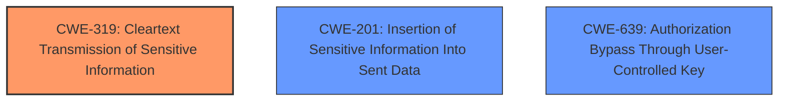

# Analysis for CVE-2021-22923

# Summary

| CWE ID  | CWE Name                                                                                                         | Confidence | CWE Abstraction Level | CWE Vulnerability Mapping Label | CWE-Vulnerability Mapping Notes |
|---------|-------------------------------------------------------------------------------------------------------------------|------------|-----------------------|---------------------------------|-----------------------------------|
| CWE-319 | Cleartext Transmission of Sensitive Information                                                                 | 0.9        | Base                  | Allowed                         | Primary CWE                       |
| CWE-201 | Insertion of Sensitive Information Into Sent Data | 0.7        | Base                  | Allowed                         | Secondary Candidate                       |
| CWE-639 | Authorization Bypass Through User-Controlled Key                                                                | 0.5        | Base                  | Allowed                         | Secondary Candidate                       |

## Evidence and Confidence

*   **Confidence Score:** 0.7
*   **Evidence Strength:** HIGH

## Relationship Analysis

The primary CWE, CWE-319, is a Base level weakness describing the transmission of sensitive information in cleartext. While it doesn't have a direct parent/child relationship with other selected CWEs, it shares a peer relationship with several related weaknesses concerning sensitive data handling. CWE-201, a secondary CWE, is related as it involves insertion of sensitive data. CWE-639 represents a bypass due to user-controlled keys, but the connection to the vulnerability is weaker. The abstraction levels (all Base) were chosen to provide the most specific classifications possible based on available evidence.

## Vulnerability Chain

The vulnerability chain starts with the **improper reuse of credentials** by the curl tool. When credentials are provided to download a Metalink file, these credentials are then used to access URLs specified within that Metalink file. The key weakness here is the **transmission of these credentials in cleartext** (CWE-319) to unintended servers, which could lead to information disclosure. The **insertion of these credentials into the sent data** is also a factor (CWE-201).

## Summary of Analysis

The analysis concludes that the primary weakness is CWE-319, "Cleartext Transmission of Sensitive Information." This is supported by the vulnerability description, which states that the curl tool reuses credentials and sends them to servers without informing the user. The "CVE Reference Links Content Summary" also highlights the **insufficient protection of credentials** and the fact that user credentials are sent to unintended servers.

The selection of CWE-319 is further justified by its Base level of abstraction, as it directly represents the **root cause** of the vulnerability. The retriever results also show that CWE-319 is among the top candidates.

CWE-201, "Insertion of Sensitive Information Into Sent Data," is considered as a secondary CWE, as the credentials are being inserted into the data being sent to the servers.

CWE-639, "Authorization Bypass Through User-Controlled Key," is considered but seems less appropriate because it is not a direct result of a user manipulating keys, but more about curl **improperly using existing credentials**.

The final decision is based on direct evidence from the vulnerability description and supporting information from the CVE summary, leading to a selection of CWEs at the optimal level of specificity.

Relevant CWE Information:

# Enhanced Context (25 CWEs)
The following CWEs were identified as potentially relevant to this vulnerability:

## CWE-538: Insertion of Sensitive Information into Externally-Accessible File or Directory
**Abstraction Level**: Base
**Similarity Score**: 0.78
**Source**: dense

**Description**:
The product places sensitive information into files or directories that are accessible to actors who are allowed to have access to the files, but not to the sensitive information.

**Mapping Guidance**:
- Usage: Allowed
- Rationale: This CWE entry is at the Base level of abstraction, which is a preferred level of abstraction for mapping to the root causes of vulnerabilities.

## CWE-212: Improper Removal of Sensitive Information Before Storage or Transfer
**Abstraction Level**: Base
**Similarity Score**: 0.78
**Source**: dense

**Description**:
The product stores, transfers, or shares a resource that contains sensitive information, but it does not properly remove that information before the product makes the resource available to unauthorized actors.

**Mapping Guidance**:
- Usage: Allowed
- Rationale: This CWE entry is at the Base level of abstraction, which is a preferred level of abstraction for mapping to the root causes of vulnerabilities.

## CWE-226: Sensitive Information in Resource Not Removed Before Reuse
**Abstraction Level**: Base
**Similarity Score**: 0.77
**Source**: dense

**Description**:
The product releases a resource such as memory or a file so that it can be made available for reuse, but it does not clear or "zeroize" the information contained in the resource before the product performs a critical state transition or makes the resource available for reuse by other entities.

**Mapping Guidance**:
- Usage: Allowed
- Rationale: This CWE entry is at the Base level of abstraction, which is a preferred level of abstraction for mapping to the root causes of vulnerabilities.

## CWE-668: Exposure of Resource to Wrong Sphere
**Abstraction Level**: Class
**Similarity Score**: 0.76
**Source**: dense

**Description**:
The product exposes a resource to the wrong control sphere, providing unintended actors with inappropriate access to the resource.

**Mapping Guidance**:
- Usage: Discouraged
- Rationale: CWE-668 is high-level and is often misused as a catch-all when lower-level CWE IDs might be applicable. It is sometimes used for low-information vulnerability reports [REF-1287]. It is a level-1 Class (i.e., a child of a Pillar). It is not useful for trend analysis.

## CWE-552: Files or Directories Accessible to External Parties
**Abstraction Level**: Base
**Similarity Score**: 0.76
**Source**: dense

**Description**:
The product makes files or directories accessible to unauthorized actors, even though they should not be.

**Mapping Guidance**:
- Usage: Allowed
- Rationale: This CWE entry is at the Base level of abstraction, which is a preferred level of abstraction for mapping to the root causes of vulnerabilities.

## CWE-319: Cleartext Transmission of Sensitive Information
**Abstraction Level**: Base
**Similarity Score**: 0.76
**Source**: dense

**Description**:
The product transmits sensitive or security-critical data in cleartext in a communication channel that can be sniffed by unauthorized actors.

**Mapping Guidance**:
- Usage: Allowed
- Rationale: This CWE entry is at the Base level of abstraction, which is a preferred level of abstraction for mapping to the root causes of vulnerabilities.

## CWE-41: Improper Resolution of Path Equivalence
**Abstraction Level**: Base
**Similarity Score**: 0.76
**Source**: dense

**Description**:
The product is vulnerable to file system contents disclosure through path equivalence. Path equivalence involves the use of special characters in file and directory names. The associated manipulations are intended to generate multiple names for the same object.

**Mapping Guidance**:
- Usage: Allowed
- Rationale: This CWE entry is at the Base level of abstraction, which is a preferred level of abstraction for mapping to the root causes of vulnerabilities.

## CWE-74: Improper Neutralization of Special Elements in Output Used by a Downstream Component ('Injection')
**Abstraction Level**: Class
**Similarity Score**: 0.75
**Source**: dense

**Description**:
The product constructs all or part of a command, data structure, or record using externally-influenced input from an upstream component, but it does not neutralize or incorrectly neutralizes special elements that could modify how it is parsed or interpreted when it is sent to a downstream component.

**Mapping Guidance**:
- Usage: Discouraged
- Rationale: CWE-74 is high-level and often misused when lower-level weaknesses are more appropriate.

## CWE-312: Cleartext Storage of Sensitive Information
**Abstraction Level**: Base
**Similarity Score**: 0.75
**Source**: dense

**Description**:
The product stores sensitive information in cleartext within a resource that might be accessible to another control sphere.

**Mapping Guidance**:
- Usage: Allowed
- Rationale: This CWE entry is at the Base level of abstraction, which is a preferred level of abstraction for mapping to the root causes of vulnerabilities.

## CWE-23: Relative Path Traversal
**Abstraction Level**: Base
**Similarity Score**: 0.75
**Source**: dense

**Description**:
The product uses external input to construct a pathname that should be within a restricted directory, but it does not properly neutralize sequences such as ".." that can resolve to a location that is outside of that directory.

**Mapping Guidance**:
- Usage: Allowed
- Rationale: This CWE entry is at the Base level of abstraction,