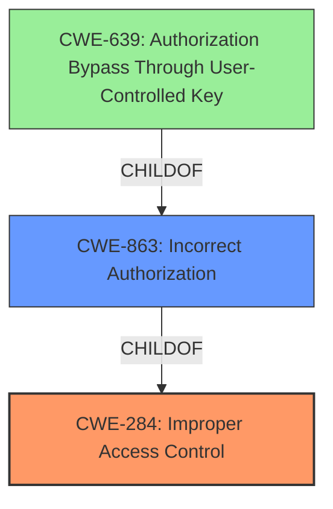

# Analysis for CVE-2021-22941

# Summary
| CWE ID  | CWE Name                                                                    | Confidence | CWE Abstraction Level | CWE Vulnerability Mapping Label | CWE-Vulnerability Mapping Notes |
| :-------- | :-------------------------------------------------------------------------- | :--------- | :---------------------- | :------------------------------ | :------------------------------ |
| CWE-284 | Improper Access Control                                                    | 0.75      | Pillar                  | Primary                         | Discouraged                   |
| CWE-863 | Incorrect Authorization                                                   | 0.60      | Class                   | Secondary                        | Allowed-with-Review           |

## Evidence and Confidence

*   **Confidence Score:** 0.70
*   **Evidence Strength:** MEDIUM

## Relationship Analysis
The primary CWE is CWE-284 which is a Pillar and thus at a very high level. There are many children of CWE-284 that are more specific like CWE-863 Incorrect Authorization which is a Class.

## Vulnerability Chain
The vulnerability chain starts with **improper access control** in Citrix ShareFile storage zones controller which allows an unauthenticated attacker to remotely compromise the storage zones controller.

## Summary of Analysis
The initial assessment identified **improper access control** as the root cause. The retriever results also identified CWE-284 as a potential match.

The vulnerability description states: "**Improper Access Control** in Citrix ShareFile storage zones controller before 5.11.20 may allow an unauthenticated attacker to remotely compromise the storage zones controller." The key phrase also highlights "**improper access control**" as the root cause.

CWE-284 (Improper Access Control) is a Pillar-level CWE, which is very high-level and discouraged for use according to MITRE's guidance. However, given the limited information available, it serves as a starting point. The description of CWE-284 states, "The product does not restrict or incorrectly restricts access to a resource from an unauthorized actor." This broadly aligns with the vulnerability description.

CWE-863 (Incorrect Authorization) is a Class-level CWE and a child of CWE-284. The description of CWE-863 states, "The product performs an authorization check when an actor attempts to access a resource or perform an action, but it does not correctly perform the check." This is more specific than CWE-284 and potentially more relevant if the **improper access control** is due to an incorrect authorization check.

Given that the vulnerability allows an unauthenticated attacker to compromise the storage zones controller, it suggests that the authorization mechanism is flawed or missing. Therefore, while CWE-284 is a valid initial classification, CWE-863 provides a more precise characterization of the weakness.

Ultimately, I am selecting CWE-284 as the primary because the vulnerability description is vague and "**improper access control**" is the only rootcause provided. I am adding CWE-863 because it is a valid child of CWE-284 and could apply.

Relevant CWE Information:

# Enhanced Context (25 CWEs)
The following CWEs were identified as potentially relevant to this vulnerability:

## CWE-691: Insufficient Control Flow Management
**Abstraction Level**: Pillar
**Similarity Score**: 0.81

## CWE-664: Improper Control of a Resource Through its Lifetime
**Abstraction Level**: Pillar
**Similarity Score**: 0.77

## CWE-274: Improper Handling of Insufficient Privileges
**Abstraction Level**: Base
**Similarity Score**: 0.76

## CWE-653: Improper Isolation or Compartmentalization
**Abstraction Level**: Class
**Similarity Score**: 0.76

## CWE-73: External Control of File Name or Path
**Abstraction Level**: Base
**Similarity Score**: 0.76

## CWE-41: Improper Resolution of Path Equivalence
**Abstraction Level**: Base
**Similarity Score**: 0.76

## CWE-1220: Insufficient Granularity of Access Control
**Abstraction Level**: Base
**Similarity Score**: 0.75

## CWE-639: Authorization Bypass Through User-Controlled Key
**Abstraction Level**: Base
**Similarity Score**: 0.75

## CWE-668: Exposure of Resource to Wrong Sphere
**Abstraction Level**: Class
**Similarity Score**: 0.75

## CWE-1390: Weak Authentication
**Abstraction Level**: Class
**Similarity Score**: 0.75

## CWE-639: Authorization Bypass Through User-Controlled Key
**Abstraction Level**: Base
**Similarity Score**: 5729.53

## CWE-22: Improper Limitation of a Pathname to a Restricted Directory ('Path Traversal')
**Abstraction Level**: Base
**Similarity Score**: 5387.61

## CWE-863: Incorrect Authorization
**Abstraction Level**: Class
**Similarity Score**: 5301.05

## CWE-1390: Weak Authentication
**Abstraction Level**: Class
**Similarity Score**: 5183.29

## CWE-287: Improper Authentication
**Abstraction Level**: Class
**Similarity Score**: 5167.34

## CWE-613: Insufficient Session Expiration
**Abstraction Level**: base
**Similarity Score**: 4.33

## CWE-22: Improper Limitation of a Pathname to a Restricted Directory ('Path Traversal')
**Abstraction Level**: base
**Similarity Score**: 4.33

## CWE-266: Incorrect Privilege Assignment
**Abstraction Level**: base
**Similarity Score**: 3.64

## CWE-322: Key Exchange without Entity Authentication
**Abstraction Level**: base
**Similarity Score**: 3.57

## CWE-184: Incomplete List of Disallowed Inputs
**Abstraction Level**: base
**Similarity Score**: 3.22

## CWE-73: External Control of File Name or Path
**Abstraction Level**: Base
**Similarity Score**: 3.20

## CWE-193: Off-by-one Error
**Abstraction Level**: base
**Similarity Score**: 3.06

## CWE-843: Access of Resource Using Incompatible Type ('Type Confusion')
**Abstraction Level**: base
**Similarity Score**: 2.91

## CWE-170: Improper Null Termination
**Abstraction Level**: base
**Similarity Score**: 2.87

## CWE-911: Improper Update of Reference Count
**Abstraction Level**: base
**Similarity Score**: 2.87