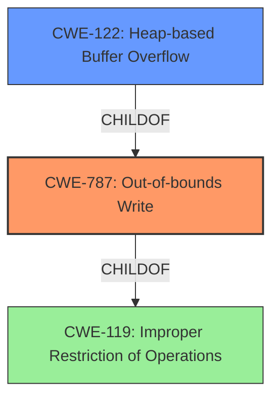

# Analysis Report for CVE-2021-23157

# Vulnerability Analysis Report: CVE-2021-23157

## Description


## Analysis (with Relationship Data)

# Summary
| CWE ID | CWE Name | Confidence | CWE Abstraction Level | CWE Vulnerability Mapping Label | CWE-Vulnerability Mapping Notes |
|---|---|---|---|---|---|
| CWE-787 | Out-of-bounds Write | 1.0 | Base | Allowed | Primary CWE |
| CWE-122 | Heap-based Buffer Overflow | 0.7 | Variant | Allowed | Secondary Candidate |

## Evidence and Confidence

*   **Confidence Score:** 0.85
*   **Evidence Strength:** HIGH

## Relationship Analysis
The primary weakness, CWE-787 **(Out-of-bounds Write)**, is a **Base** level CWE. The vulnerability description indicates a **heap-based buffer overflow**. CWE-122 **(Heap-based Buffer Overflow)** is a **Variant** of CWE-787, and thus more specific. However, since the description doesn't provide explicit details beyond the general type of buffer overflow, and CWE-787 is the primary match based on similar CVE descriptions, I'm favoring the **Base** CWE-787 as the primary mapping. The relationship of CWE-122 being a child of CWE-787 supports the consideration of CWE-122 as a secondary candidate, although I'm not making it the primary due to lack of explicit detail on the overflow mechanism.



## Vulnerability Chain
The chain begins with a **heap-based buffer overflow** (**CWE-122** or **CWE-787**), where the application writes data beyond the allocated buffer in the heap. The impact is remote code execution. The provided information doesn't detail the precise steps leading to the overflow (e.g., how the input is received or processed), so that part of the chain is missing.

## Summary of Analysis
The initial analysis identified a **heap-based buffer overflow**, leading to remote code execution. The primary CWE match for similar CVE descriptions is CWE-787 **(Out-of-bounds Write)**. The **Vulnerability Description Key Phrases** also highlight the **weakness** as **heap-based buffer overflow**. The CVE Reference Links Content Summary also confirms a **heap-based buffer overflow** as the root cause. While CWE-122 **(Heap-based Buffer Overflow)** is a more specific **Variant**, the available information doesn't provide sufficient detail to definitively choose it over the **Base** CWE-787. Therefore, CWE-787 is chosen as the primary CWE with a high confidence score. The selection is based on the evidence of a heap-based overflow leading to remote code execution.

Other CWEs considered but not used:
*   CWE-119 **(Improper Restriction of Operations within the Bounds of a Memory Buffer)**: This is a **Class** level CWE and is too general, as the specific issue is an out-of-bounds write. The mapping guidance discourages the use of CWE-119 when lower-level CWEs are available.
*   CWE-190 **(Integer Overflow or Wraparound)**: While integer overflows can sometimes lead to buffer overflows, there is no indication of an integer overflow in this vulnerability description.
*   CWE-193 **(Off-by-one Error)**: This is a possible cause of a buffer overflow, but there is no direct evidence of an off-by-one error in the description.
*   CWE-121 **(Stack-based Buffer Overflow)**: The vulnerability is specifically described as **heap-based**, not stack-based, so this CWE is not applicable.
*   CWE-805 **(Buffer Access with Incorrect Length Value)**: This could potentially be a contributing factor, but the primary issue is the out-of-bounds write itself. There is no explicit mention of an incorrect length value.
*   CWE-130 **(Improper Handling of Length Parameter Inconsistency)**: Similar to CWE-805, this is a possible contributing factor, but there is no direct evidence of it in the description.
*   CWE-126 **(Buffer Over-read)**: The vulnerability is described as a **heap-based buffer overflow**, which implies a write, not a read.
* CWE-1284 **(Improper Validation of Specified Quantity in Input)**: This could be related to how the size of the heap buffer is determined but there isn't enough evidence to select.
* CWE-805 **(Buffer Access with Incorrect Length Value)**: This could be related to how the size of the heap buffer is determined but there isn't enough evidence to select.
* CWE-128 **(Wrap-around Error)**: This could be related to how the size of the heap buffer is determined but there isn't enough evidence to select.

The choice of CWE-787 **(Out-of-bounds Write)** is at the optimal level of specificity because it accurately describes the root cause of the vulnerability, which is writing data beyond the intended boundaries of a buffer. While CWE-122 **(Heap-based Buffer Overflow)** is more specific, the description lacks the detail required to definitively select it, making CWE-787 the most appropriate choice based on the available evidence.


## CWE Relationship Analysis

Current CWEs represent these abstraction levels: .


### Vulnerability Chain Analysis

**Chain starting from CWE-190:**
- 190 (Integer Overflow or Wraparound) - ROOT


**Chain starting from CWE-130:**
- 130 (Improper Handling of Length Parameter Inconsistency) - ROOT


### CWE Relationship Diagram

```mermaid
graph TD
    classDef primary fill:#f96,stroke:#333,stroke-width:2px
    classDef secondary fill:#69f,stroke:#333
    classDef tertiary fill:#9e9,stroke:#333
```


*Report generated on 2025-03-31 07:45:50*
