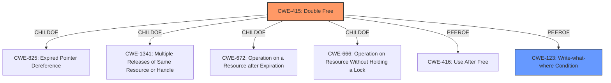

# Enhanced Analysis for CVE-2021-23158

# Summary
| CWE ID | CWE Name | Confidence | CWE Abstraction Level | CWE Vulnerability Mapping Label | CWE-Vulnerability Mapping Notes |
|---|---|---|---|---|---|
| CWE-415 | Double Free | 1.0 | Variant | Allowed | Primary CWE |
| CWE-123 | Write-what-where Condition | 0.7 | Base | Allowed | Secondary Candidate |

## Evidence and Confidence

*   **Confidence Score:** 0.9
*   **Evidence Strength:** HIGH

## Relationship Analysis
The primary relationship influencing the choice of CWE-415 is its direct match to the vulnerability description. The secondary relationship to consider is the peer relationship between CWE-415 and CWE-123, given that a double free can often lead to a write-what-where condition.



## Vulnerability Chain
The vulnerability chain starts with a **Double-free** (CWE-415), which can lead to a write-what-where condition (CWE-123), ultimately resulting in arbitrary code execution and denial of service.

## Summary of Analysis
The initial assessment, based on the provided evidence, strongly points to CWE-415 as the primary weakness. The vulnerability description explicitly mentions a **Double-free** condition, making CWE-415 the most direct and accurate classification.

The evidence from "CVE Reference Links Content Summary" confirms the **root_cause** as "Double-free in the `pspdf_export` function" and identifies "Double-free vulnerability (CWE-415)" as a weakness. The impact is described as "Arbitrary code execution and denial of service."

The relationship graph further supports the selection of CWE-415, showing its connections to related weaknesses such as CWE-123 and CWE-416.

CWE-415 is selected because it is the most specific and directly applicable CWE based on the provided evidence. It accurately represents the **Double-free** condition described in the vulnerability. The other CWEs considered either represent broader categories or different types of weaknesses.

# Enhanced Context (25 CWEs)
The following CWEs were identified as potentially relevant to this vulnerability:

## CWE-191: Integer Underflow (Wrap or Wraparound)
**Abstraction Level**: Base
**Similarity Score**: 0.78
**Source**: dense
*This CWE was not selected because it does not accurately describe the **Double-free** vulnerability.*

## CWE-131: Incorrect Calculation of Buffer Size
**Abstraction Level**: Base
**Similarity Score**: 0.77
**Source**: dense
*This CWE was not selected because it does not accurately describe the **Double-free** vulnerability.*

## CWE-124: Buffer Underwrite ('Buffer Underflow')
**Abstraction Level**: Base
**Similarity Score**: 0.77
**Source**: dense
*This CWE was not selected because it does not accurately describe the **Double-free** vulnerability.*

## CWE-126: Buffer Over-read
**Abstraction Level**: Variant
**Similarity Score**: 0.77
**Source**: dense
*This CWE was not selected because it does not accurately describe the **Double-free** vulnerability.*

## CWE-125: Out-of-bounds Read
**Abstraction Level**: Base
**Similarity Score**: 0.77
**Source**: dense
*This CWE was not selected because it does not accurately describe the **Double-free** vulnerability.*

## CWE-789: Memory Allocation with Excessive Size Value
**Abstraction Level**: Variant
**Similarity Score**: 0.77
**Source**: dense
*This CWE was not selected because it does not accurately describe the **Double-free** vulnerability.*

## CWE-667: Improper Locking
**Abstraction Level**: Class
**Similarity Score**: 0.76
**Source**: dense
*This CWE was not selected because it does not accurately describe the **Double-free** vulnerability.*

## CWE-119: Improper Restriction of Operations within the Bounds of a Memory Buffer
**Abstraction Level**: Class
**Similarity Score**: 0.76
**Source**: dense
*This CWE was not selected because it is too general and there are more specific CWEs available.*

## CWE-190: Integer Overflow or Wraparound
**Abstraction Level**: Base
**Similarity Score**: 0.76
**Source**: dense
*This CWE was not selected because it does not accurately describe the **Double-free** vulnerability.*

## CWE-805: Buffer Access with Incorrect Length Value
**Abstraction Level**: Base
**Similarity Score**: 0.76
**Source**: dense
*This CWE was not selected because it does not accurately describe the **Double-free** vulnerability.*

## CWE-364: Signal Handler Race Condition
**Abstraction Level**: Base
**Similarity Score**: 7636.44
**Source**: sparse
*This CWE was not selected because it does not accurately describe the **Double-free** vulnerability.*

## CWE-190: Integer Overflow or Wraparound
**Abstraction Level**: Base
**Similarity Score**: 7088.72
**Source**: sparse
*This CWE was not selected because it does not accurately describe the **Double-free** vulnerability.*

## CWE-415: Double Free
**Abstraction Level**: Variant
**Similarity Score**: 6826.91
**Source**: sparse
*This CWE was selected because the vulnerability description explicitly mentions a **Double-free** condition.*

### Description
The product calls free() twice on the same memory address, potentially leading to modification of unexpected memory locations.

## CWE-362: Concurrent Execution using Shared Resource with Improper Synchronization ('Race Condition')
**Abstraction Level**: Class
**Similarity Score**: 6740.84
**Source**: sparse
*This CWE was not selected because it does not accurately describe the **Double-free** vulnerability.*

## CWE-667: Improper Locking
**Abstraction Level**: Class
**Similarity Score**: 6666.64
**Source**: sparse
*This CWE was not selected because it does not accurately describe the **Double-free** vulnerability.*

## CWE-123: Write-what-where Condition
**Abstraction Level**: base
**Similarity Score**: 5.03
**Source**: graph
*This CWE was considered as the impact of the vulnerability is "write-what-where condition".*

**Description**:
CWE-123: Write-what-where Condition

## CWE-434: Unrestricted Upload of File with Dangerous Type
**Abstraction Level**: base
**Similarity Score**: 5.03
**Source**: graph
*This CWE was not selected because it does not accurately describe the **Double-free** vulnerability.*

## CWE-184: Incomplete List of Disallowed Inputs
**Abstraction Level**: base
**Similarity Score**: 4.82
**Source**: graph
*This CWE was not selected because it does not accurately describe the **Double-free** vulnerability.*

## CWE-183: Permissive List of Allowed Inputs
**Abstraction Level**: base
**Similarity Score**: 4.82
**Source**: graph
*This CWE was not selected because it does not accurately describe the **Double-free** vulnerability.*

## CWE-415: Double Free
**Abstraction Level**: variant
**Similarity Score**: 4.53
**Source**: graph
*This CWE was selected because the vulnerability description explicitly mentions a **Double-free** condition.*

**Description**:
CWE-415: Double Free

## CWE-416: Use After Free
**Abstraction Level**: variant
**Similarity Score**: 4.53
**Source**: graph
*This CWE was not selected because the vulnerability is a **double free** not use after free.*

## CWE-364: Signal Handler Race Condition
**Abstraction


## CWE Relationship Analysis

Current CWEs represent these abstraction levels: .


### Vulnerability Chain Analysis

**Chain starting from CWE-123:**
- 123 (Write-what-where Condition) - ROOT


**Chain starting from CWE-119:**
- 119 (Improper Restriction of Operations within the Bounds of a Memory Buffer) - ROOT


### CWE Relationship Diagram

```mermaid
graph TD
    classDef primary fill:#f96,stroke:#333,stroke-width:2px
    classDef secondary fill:#69f,stroke:#333
    classDef tertiary fill:#9e9,stroke:#333
```