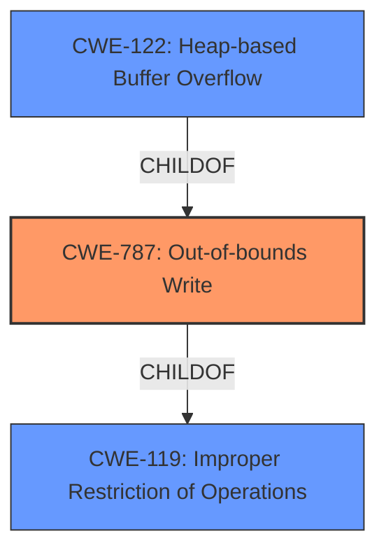

# Enhanced Analysis for CVE-2021-23165

# Summary
| CWE ID | CWE Name | Confidence | CWE Abstraction Level | CWE Vulnerability Mapping Label | CWE-Vulnerability Mapping Notes |
|---|---|---|---|---|---|
| CWE-787 | Out-of-bounds Write | 1.0 | Base | Primary | Allowed |
| CWE-122 | Heap-based Buffer Overflow | 0.8 | Variant | Secondary | Allowed |
| CWE-119 | Improper Restriction of Operations within the Bounds of a Memory Buffer | 0.6 | Class | Secondary | Discouraged |

## Evidence and Confidence

*   **Confidence Score:** 0.9
*   **Evidence Strength:** HIGH

## Relationship Analysis
The primary CWE is CWE-787 (**CWE-787: Out-of-bounds Write**), which is a base-level CWE. CWE-122 (**CWE-122: Heap-based Buffer Overflow**) is a variant of CWE-787, making it a more specific classification when the overflow occurs on the heap. CWE-119 (**CWE-119: Improper Restriction of Operations**), the parent of CWE-787, is a broader classification. The relationship between these CWEs is hierarchical, with CWE-119 being the most general and CWE-122 being the most specific when applicable.



## Vulnerability Chain
The vulnerability chain starts with a **missing boundary check** in the `pspdf_prepare_outpages()` function, leading to a **heap buffer overflow**, which can then lead to arbitrary code execution or denial of service.

## Summary of Analysis
The initial analysis strongly pointed towards CWE-787 (**CWE-787: Out-of-bounds Write**) due to the explicit mention of "**heap buffer overflow**" in the vulnerability description and "**Heap buffer overflow**" in the CVE Reference Links Content Summary. The root cause, a **missing boundary check**, further supports this classification.

The Retriever Results also list CWE-787 but with a lower score because it's coming from graph-based analysis instead of the text based analysis that found it in the **Vulnerability Description**. The Primary CWE Match under "CWE for similar CVE Descriptions" is CWE-787.

Given that the **heap buffer overflow** is explicitly mentioned, CWE-122 (**CWE-122: Heap-based Buffer Overflow**) is a more precise classification as it specifies the location of the buffer. However, since the root cause is the **out-of-bounds write** itself, CWE-787 is still the primary weakness. CWE-122 is thus a secondary, more specific classification.

CWE-119 (**CWE-119: Improper Restriction of Operations**) is a more general class of weakness. While it applies, it's less specific than CWE-787 and CWE-122. The mapping guidance for CWE-119 discourages its use when more specific CWEs are available.

Based on the evidence, the primary CWE is CWE-787 (**CWE-787: Out-of-bounds Write**), with CWE-122 (**CWE-122: Heap-based Buffer Overflow**) as a secondary classification and CWE-119 (**CWE-119: Improper Restriction of Operations**) being a tertiary candidate. This decision is based on the vulnerability description, the root cause analysis, and the hierarchical relationship between the CWEs.

Relevant CWE Information:
```
## CWE-787: Out-of-bounds Write
**Abstraction Level**: base

**Description**:
CWE-787: Out-of-bounds Write

**Mapping Guidance**:
- Usage: Allowed
- Rationale: This CWE entry is at the Base level of abstraction, which is a preferred level of abstraction for mapping to the root causes of vulnerabilities.
```

```
## CWE-122: Heap-based Buffer Overflow
**Abstraction Level**: Variant

**Description**:
A heap overflow condition is a buffer overflow, where the buffer that can be overwritten is allocated in the heap portion of memory, generally meaning that the buffer was allocated using a routine such as malloc().

**Mapping Guidance**:
- Usage: Allowed
- Rationale: This CWE entry is at the Variant level of abstraction, which is a preferred level of abstraction for mapping to the root causes of vulnerabilities.
```

```
## CWE-119: Improper Restriction of Operations within the Bounds of a Memory Buffer
**Abstraction Level**: Class

### Mapping Guidance
**Usage:** Discouraged
**Rationale:** CWE-119 is commonly misused in low-information vulnerability reports when lower-level CWEs could be used instead, or when more details about the vulnerability are available.
```


## CWE Relationship Analysis

Current CWEs represent these abstraction levels: .


### Vulnerability Chain Analysis

**Chain starting from CWE-787:**
- 787 (Out-of-bounds Write) - ROOT


**Chain starting from CWE-119:**
- 119 (Improper Restriction of Operations within the Bounds of a Memory Buffer) - ROOT


### CWE Relationship Diagram

```mermaid
graph TD
    classDef primary fill:#f96,stroke:#333,stroke-width:2px
    classDef secondary fill:#69f,stroke:#333
    classDef tertiary fill:#9e9,stroke:#333
```