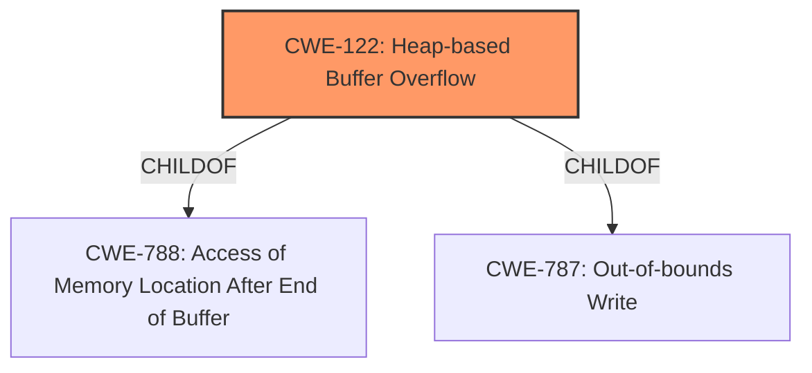

# Analysis for CVE-2021-23169

# Summary
| CWE ID | CWE Name | Confidence | CWE Abstraction Level | CWE Vulnerability Mapping Label | CWE-Vulnerability Mapping Notes |
|---|---|---|---|---|---|
| CWE-122 | Heap-based Buffer Overflow | 1.0 | Variant | Allowed | Primary CWE |

## Evidence and Confidence

*   **Confidence Score:** 1.0
*   **Evidence Strength:** HIGH

## Relationship Analysis
The primary relationship to consider here is the ChildOf relationship. CWE-122 is a child of both CWE-788 (Access of Memory Location After End of Buffer) and CWE-787 (Out-of-bounds Write). The vulnerability is described as a **heap-buffer overflow**, making CWE-122 a more specific and accurate representation of the weakness than its parent CWEs. The abstraction level of CWE-122 is Variant, which is a preferred level of abstraction for mapping to the root causes of vulnerabilities.

## Vulnerability Chain
The vulnerability chain is relatively simple: a **heap-buffer overflow** (CWE-122) allows an attacker to execute arbitrary code.

## Summary of Analysis
The vulnerability description clearly states that the issue is a **heap-buffer overflow**. The "CVE Reference Links Content Summary" also confirms this, stating "Heap-buffer-overflow in the `Imf_2_5::copyIntoFrameBuffer` function" and listing "Heap-buffer-overflow" as a weakness.

CWE-122 (Heap-based Buffer Overflow) is the most appropriate CWE because it directly describes the vulnerability. It is a Variant-level CWE, which is preferred for root cause mapping. The retriever results also list CWE-122 as a candidate.

I considered CWE-119 (Improper Restriction of Operations within the Bounds of a Memory Buffer), which is a more general Class-level CWE. While a buffer overflow falls under CWE-119, CWE-122 provides a more specific classification by specifying that the overflow occurs in the heap. MITRE's mapping guidance discourages the use of CWE-119 when more specific CWEs are available.

CWE-190 (Integer Overflow or Wraparound) was also considered because integer overflows can sometimes lead to buffer overflows. However, there is no evidence in the description or reference links to suggest that an integer overflow is involved in this vulnerability.

CWE-125 (Out-of-bounds Read) was considered, but the description explicitly mentions a **heap-buffer overflow**, indicating a write operation rather than a read operation.

The selection of CWE-122 is at the optimal level of specificity because it accurately reflects the type of buffer overflow (heap-based) described in the vulnerability.