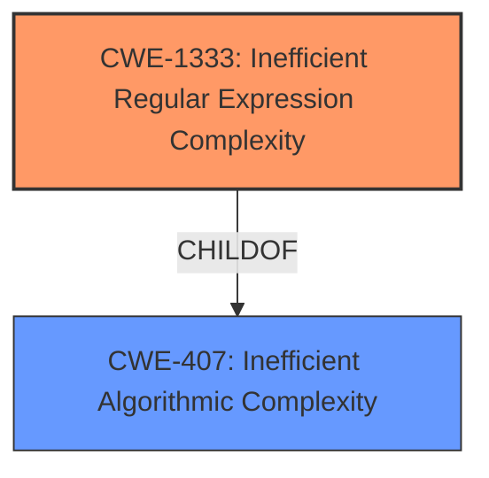

# Raw Analyzer Response for CVE-2021-23364

# Summary
| CWE ID | CWE Name | Confidence | CWE Abstraction Level | CWE Vulnerability Mapping Label | CWE-Vulnerability Mapping Notes |
|---|---|---|---|---|---|
| CWE-1333 | Inefficient Regular Expression Complexity | 1.0 | Base | Allowed | Primary CWE |

## Evidence and Confidence

*   **Confidence Score:** 1.0
*   **Evidence Strength:** HIGH

## Relationship Analysis
The primary relationship impacting the decision is the ChildOf relationship between CWE-1333 and CWE-407. While CWE-407 (Inefficient Algorithmic Complexity) is a broader class, the vulnerability description explicitly mentions "Regular Expression Denial of Service (ReDoS)" and the inefficient regular expression `\d*\.?\d+`. This aligns perfectly with CWE-1333, which is a specific type of inefficient algorithmic complexity related to regular expressions. The graph shows that CWE-1333 is a `CHILDOF` CWE-407.

## Vulnerability Chain
The vulnerability chain is straightforward:
1.  **Root Cause:** Inefficient Regular Expression (`\d*\.?\d+`)
2.  **Weakness:** CWE-1333: Inefficient Regular Expression Complexity
3.  **Impact:** Denial of Service (ReDoS)

## Summary of Analysis
The initial analysis strongly points to CWE-1333 due to the clear evidence of an inefficient regular expression leading to a denial-of-service vulnerability. The vulnerability description explicitly mentions "Regular Expression Denial of Service (ReDoS)" and the specific vulnerable regex pattern. The "CVE Reference Links Content Summary" confirms that the root cause is the inefficient regular expression `\d*\.?\d+`, which is vulnerable to catastrophic backtracking. This aligns directly with CWE-1333's description: "The product uses a regular expression with an inefficient, possibly exponential worst-case computational complexity that consumes excessive CPU cycles." The provided evidence is strong. The confidence score is 1.0. CWE-1333 is at the optimal level of specificity (Base).

Relevant CWE Information:
*   **CWE-1333: Inefficient Regular Expression Complexity**
    *   **Match:** The vulnerability description explicitly states "Regular Expression Denial of Service (ReDoS)" due to the regex pattern `\d*\.?\d+`, which aligns with the CWE description.
    *   **Justification:** The regex `\d*\.?\d+` can lead to catastrophic backtracking.
    *   **Abstraction Level:** Base
    *   **Usage:** Allowed

Other CWEs Considered:

*   **CWE-407: Inefficient Algorithmic Complexity:** While related, it's a more general class. CWE-1333 is a more specific instance of this class, focusing on regular expressions.
*   **CWE-617: Reachable Assertion:** Not applicable, as there's no mention of assertions in the vulnerability description.
*   **CWE-777: Regular Expression without Anchors:** Not applicable because the core issue is not the lack of anchors, but rather the inefficient complexity of the regular expression itself.
*   **CWE-185: Incorrect Regular Expression:** While the regex is "incorrect" in the sense that it's inefficient, CWE-1333 is a more precise classification focusing on the complexity aspect.