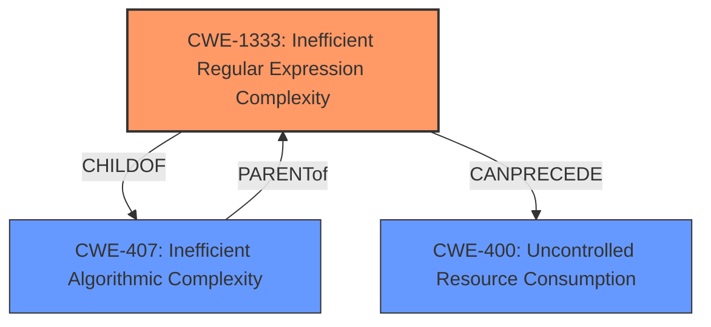

# Analysis Report for CVE-2021-23382

# Vulnerability Analysis Report: CVE-2021-23382

## Description


## Analysis (with Relationship Data)

# Summary
| CWE ID  | CWE Name                                                                                                                     | Confidence | CWE Abstraction Level | CWE Vulnerability Mapping Label | CWE-Vulnerability Mapping Notes |
| :-------- | :--------------------------------------------------------------------------------------------------------------------------- | :--------- | :---------------------- | :-------------------------------- | :-------------------------------- |
| CWE-1333  | Inefficient Regular Expression Complexity                                                                                    | 1.0        | Base                    | Allowed                           | Primary CWE                     |
| CWE-400   | Uncontrolled Resource Consumption                                                                                                | 0.5        | Class                   | Allowed-with-Review                | Secondary Candidate               |

## Evidence and Confidence

*   **Confidence Score:** 0.75
*   **Evidence Strength:** HIGH

## Relationship Analysis
The primary relationship influencing the CWE selection is the hierarchical relationship between CWE-407 (Inefficient Algorithmic Complexity) and CWE-1333 (Inefficient Regular Expression Complexity), where CWE-1333 is a child of CWE-407. This indicates that CWE-1333 is a more specific instance of CWE-407. The retriever results also suggest considering CWE-770 (Allocation of Resources Without Limits or Throttling) which is a child of CWE-400 (Uncontrolled Resource Consumption), but in this specific case, the vulnerability is clearly tied to regular expression inefficiency rather than general resource allocation issues, and CWE-1333 is a better fit.



## Vulnerability Chain
The vulnerability chain starts with the **inefficient regular expression** (CWE-1333) leading to excessive CPU consumption, which results in a denial-of-service condition.

## Summary of Analysis
The initial analysis strongly points to CWE-1333, Inefficient Regular Expression Complexity, as the primary CWE. The vulnerability description clearly states that the **root cause** is an **inefficient regular expression** in the `getAnnotationURL()` and `loadAnnotation()` functions. The **Vulnerability Description Key Phrases** also highlights **"regular expression denial of service"** and "**sub-pattern /\*\s* sourceMappingURL=(.\*)**" as root causes. The retriever results also list CWE-1333 as the top result. The CVE Reference Links Content Summary confirms that the regular expression is susceptible to catastrophic backtracking.

The relationship analysis also reinforces this decision. CWE-1333 is a child of CWE-407 (Inefficient Algorithmic Complexity), providing a more specific classification.

The evidence directly supports the selection of CWE-1333 with high confidence. While CWE-400 could be a secondary candidate, the root cause is specifically an inefficient regular expression.

CWE-400 (Uncontrolled Resource Consumption) and its related CWEs such as CWE-770 (Allocation of Resources Without Limits or Throttling) were considered but not selected as the primary CWE. While the ultimate impact is resource consumption, the **root cause** is the **inefficient regular expression**. Therefore, CWE-1333 is a more precise and appropriate classification.

Relevant CWE Information:

# Enhanced Context (25 CWEs)
The following CWEs were identified as potentially relevant to this vulnerability:

## CWE-1333: Inefficient Regular Expression Complexity
**Abstraction Level**: Base
**Similarity Score**: 0.78
**Source**: dense

**Description**:
The product uses a regular expression with an inefficient, possibly exponential worst-case computational complexity that consumes excessive CPU cycles.

**Mapping Guidance**:
- Usage: Allowed
- Rationale: This CWE entry is at the Base level of abstraction, which is a preferred level of abstraction for mapping to the root causes of vulnerabilities.

## CWE-400: Uncontrolled Resource Consumption
**Abstraction Level**: Class
**Similarity Score**: 0.77
**Source**: dense

**Description**:
The product does not properly control resource consumption, potentially leading to denial of service or reduced performance.

**Mapping Guidance**:
- Usage: Allowed-with-Review
- Rationale: This CWE entry is a Class and might have Base-level children that would be more appropriate

## CWE-770: Allocation of Resources Without Limits or Throttling
**Abstraction Level**: Base
**Similarity Score**: 5024.69
**Source**: sparse

**Description**:
The product allocates a reusable resource or group of resources on behalf of an actor without imposing any restrictions on the size or number of resources that can be allocated, in violation of the intended security policy for that actor.

**Mapping Guidance**:
- Usage: Allowed
- Rationale: This CWE entry is at the Base level of abstraction, which is a preferred level of abstraction for mapping to the root causes of vulnerabilities.


## CWE Relationship Analysis

Current CWEs represent these abstraction levels: .


### Vulnerability Chain Analysis

**Chain starting from CWE-1333:**
- 1333 (Inefficient Regular Expression Complexity) - ROOT


**Chain starting from CWE-770:**
- 770 (Allocation of Resources Without Limits or Throttling) - ROOT


### CWE Relationship Diagram

```mermaid
graph TD
    classDef primary fill:#f96,stroke:#333,stroke-width:2px
    classDef secondary fill:#69f,stroke:#333
    classDef tertiary fill:#9e9,stroke:#333
```


*Report generated on 2025-03-31 01:33:37*
