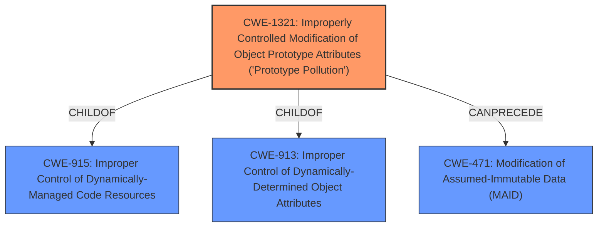

# Enhanced Analysis for CVE-2021-23396

# Summary
| CWE ID  | CWE Name                                                                                | Confidence | CWE Abstraction Level | CWE Vulnerability Mapping Label | CWE-Vulnerability Mapping Notes |
| :------- | :--------------------------------------------------------------------------------------- | :--------- | :---------------------- | :------------------------------ | :------------------------------ |
| CWE-1321 | Improperly Controlled Modification of Object Prototype Attributes ('Prototype Pollution') | 1          | Variant               | Primary                       | Allowed                       |

## Evidence and Confidence

*   **Confidence Score:** 1
*   **Evidence Strength:** HIGH

## Relationship Analysis
The primary relationship influencing the decision is the direct match of the vulnerability description to **CWE-1321 (Improperly Controlled Modification of Object Prototype Attributes ('Prototype Pollution'))**, which is a Variant-level CWE. This CWE is a child of CWE-915 (Improperly Controlled Modification of Dynamically-Determined Object Attributes) and CWE-913 (Improper Control of Dynamically-Managed Code Resources). The `CanPrecede` relationship to CWE-471 (Modification of Assumed-Immutable Data (MAID)) also indicates a potential progression where prototype pollution can lead to the modification of immutable data. The Variant level is preferred because it directly reflects the specific weakness.



## Vulnerability Chain
The vulnerability chain starts with the **root cause**, which is the unsafe recursive merge function in the `lutils` package. This leads to **Prototype Pollution**, where an attacker can modify the prototype of `Object` by injecting malicious properties. The impact of this pollution can range from denial of service to remote code execution, and property injection.

## Summary of Analysis
The analysis is strongly based on the provided evidence, which explicitly mentions **Prototype Pollution** as the vulnerability. The vulnerability description states: "All versions of package lutils are vulnerable to **Prototype Pollution** via the main (merge) function." The CVE Reference Links Content Summary further details: "The `lutils` package is vulnerable to prototype pollution due to an unsafe recursive merge function in its main `merge` function."

The graph relationships confirm that **CWE-1321 (Improperly Controlled Modification of Object Prototype Attributes ('Prototype Pollution'))** is the most specific and accurate classification, especially since the description of CWE-1321 includes "The product receives input from an upstream component that specifies attributes that are to be initialized or updated in an object, but it does not properly control modifications of attributes of the object prototype." This perfectly aligns with the vulnerability description.

Other CWEs were considered but deemed less suitable:

*   CWE-184, CWE-138, CWE-74, CWE-41, CWE-1289, CWE-73, CWE-212, CWE-668, CWE-472, CWE-653: These CWEs were considered but were not directly related to the root cause of **Prototype Pollution**.
*   CWE-335, CWE-1333, CWE-88: These CWEs relate to different attack vectors or vulnerabilities, and don't directly address **Prototype Pollution**.
*   CWE-471 (Modification of Assumed-Immutable Data (MAID)): While prototype pollution can lead to modification of immutable data, **CWE-1321 (Improperly Controlled Modification of Object Prototype Attributes ('Prototype Pollution'))** more accurately describes the initial weakness.
*   CWE-843 (Access of Resource Using Incompatible Type ('Type Confusion')): Not applicable, as the issue is not about type confusion but rather about uncontrolled modification of object prototypes.
*   CWE-78 (Improper Neutralization of Special Elements used in an OS Command ('OS Command Injection')): Not relevant as the vulnerability is not related to OS command injection.
*   CWE-98 (Improper Control of Filename for Include/Require Statement in PHP Program ('PHP Remote File Inclusion')): This is specific to PHP and remote file inclusion, which is not applicable here.
*   CWE-190 (Integer Overflow or Wraparound): Not applicable as the issue is not related to integer overflows.
*   CWE-434 (Unrestricted Upload of File with Dangerous Type): Not related to file uploads.

Therefore, **CWE-1321 (Improperly Controlled Modification of Object Prototype Attributes ('Prototype Pollution'))** is selected because it is the most specific Variant that accurately represents the weakness, aligning with the evidence and mapping guidance.


## CWE Relationship Analysis

Current CWEs represent these abstraction levels: .


### Vulnerability Chain Analysis

**Chain starting from CWE-41:**
- 41 (Improper Resolution of Path Equivalence) - ROOT


**Chain starting from CWE-913:**
- 913 (Improper Control of Dynamically-Managed Code Resources) - ROOT


### CWE Relationship Diagram

```mermaid
graph TD
    classDef primary fill:#f96,stroke:#333,stroke-width:2px
    classDef secondary fill:#69f,stroke:#333
    classDef tertiary fill:#9e9,stroke:#333
```