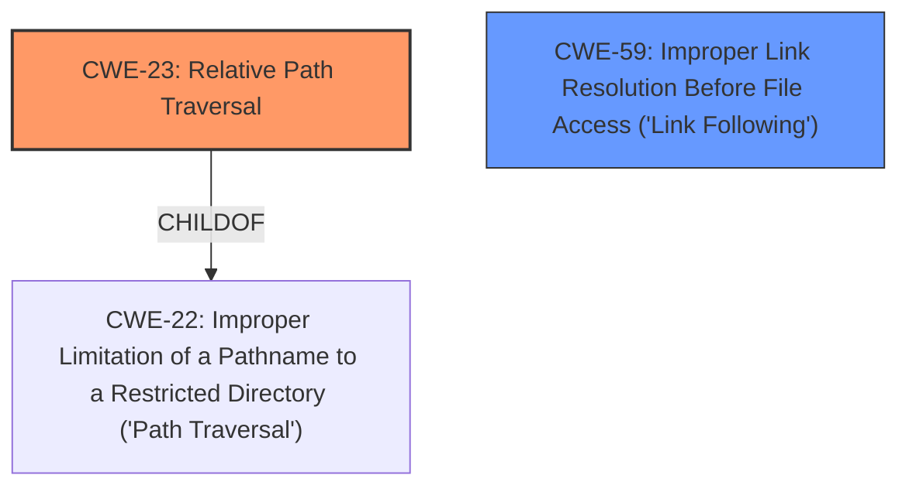

# Enhanced Analysis for CVE-2021-23484

# Summary
| CWE ID | CWE Name | Confidence | CWE Abstraction Level | CWE Vulnerability Mapping Label | CWE-Vulnerability Mapping Notes |
|---|---|---|---|---|---|
| CWE-23 | Relative Path Traversal | 1.0 | Base | Allowed | Primary CWE |
| CWE-59 | Improper Link Resolution Before File Access ('Link Following') | 0.7 | Base | Allowed | Secondary Candidate |

## Evidence and Confidence

*   **Confidence Score:** 0.9
*   **Evidence Strength:** HIGH

## Relationship Analysis
The primary CWE is CWE-23, which is a Base level CWE. CWE-59 is a potential secondary candidate due to the mention of "Zip Slip" being associated with both CWE-23 and CWE-59. The hierarchical relationships show that CWE-23 is a child of CWE-22, indicating a potential for path traversal vulnerabilities.



## Vulnerability Chain
The vulnerability chain starts with the **weakness**, **Zip Slip**, which leads to **Arbitrary File Write** outside the intended extraction directory. This can further lead to potential arbitrary code execution.

## Summary of Analysis
The initial assessment identifies CWE-23 as the primary candidate due to the nature of the **Zip Slip** vulnerability, where a crafted zip archive contains file entries with paths that include directory traversal sequences (e.g., `../`). This allows files to be written outside the intended target directory. CWE-59 is considered a secondary candidate because "Zip Slip" is also associated with link following. However, the primary mechanism described in the vulnerability is the traversal of the file system using relative paths, making CWE-23 the more accurate classification.

The selection of CWE-23 is based on the following evidence:

*   **Vulnerability Description Key Phrases:** "**weakness:** **Zip Slip**", "**impact:** Arbitrary File Write"
*   **CVE Reference Links Content Summary:** "The vulnerability stems from the improper handling of filenames within a zip archive during extraction...the `zip-local` library doesn't adequately sanitize or validate file paths present in the archive...This occurs when a malicious zip archive contains file entries with paths that include directory traversal sequences (e.g., `../`)."
*   **Retriever Results:** CWE-23 has a high similarity score and is listed as the top combined result.

The graph relationships support the selection of CWE-23, as it is a child of CWE-22, indicating its relevance to path traversal vulnerabilities.

The selected CWEs are at the optimal level of specificity because CWE-23 directly addresses the relative path traversal aspect of the **Zip Slip** vulnerability, while CWE-59 is a broader category that encompasses link following, which is not the primary mechanism in this case.

Relevant CWE Information:

# Enhanced Context (25 CWEs)
The following CWEs were identified as potentially relevant to this vulnerability:

## CWE-23: Relative Path Traversal
**Abstraction Level**: Base
**Similarity Score**: 0.80
**Source**: dense

**Description**:
The product uses external input to construct a pathname that should be within a restricted directory, but it does not properly neutralize sequences such as ".." that can resolve to a location that is outside of that directory.

**Mapping Guidance**:
- Usage: Allowed
- Rationale: This CWE entry is at the Base level of abstraction, which is a preferred level of abstraction for mapping to the root causes of vulnerabilities.

## CWE-59: Improper Link Resolution Before File Access ('Link Following')
**Abstraction Level**: Base
**Similarity Score**: 0.80
**Source**: dense

**Description**:
The product attempts to access a file based on the filename, but it does not properly prevent that filename from identifying a link or shortcut that resolves to an unintended resource.

**Mapping Guidance**:
- Usage: Allowed
- Rationale: This CWE entry is at the Base level of abstraction, which is a preferred level of abstraction for mapping to the root causes of vulnerabilities.

## CWE-22: Improper Limitation of a Pathname to a Restricted Directory ('Path Traversal')
**Abstraction Level**: Base
**Similarity Score**: 6641.39
**Source**: sparse

**Description**:
The product uses external input to construct a pathname that is intended to identify a file or directory that is located underneath a restricted parent directory, but the product does not properly neutralize special elements within the pathname that can cause the pathname to resolve to a location that is outside of the restricted directory.

**Mapping Guidance**:
- Usage: Allowed
- Rationale: This CWE entry is at the Base level of abstraction, which is a preferred level of abstraction for mapping to the root causes of vulnerabilities.

## CWE-61: UNIX Symbolic Link (Symlink) Following
**Abstraction Level**: Compound
**Similarity Score**: 6303.13
**Source**: sparse

**Description**:
The product, when opening a file or directory, does not sufficiently account for when the file is a symbolic link that resolves to a target outside of the intended control sphere. This could allow an attacker to cause the product to operate on unauthorized files.

**Mapping Guidance**:
- Usage: Allowed
- Rationale: This is a well-known Composite of multiple weaknesses that must all occur simultaneously, although it is attack-oriented in nature.

## CWE-73: External Control of File Name or Path
**Abstraction Level**: Base
**Similarity Score**: 3.20
**Source**: graph

**Description**:
The product allows user input to control or influence paths or file names that are used in filesystem operations.

**Mapping Guidance**:
- Usage: Allowed
- Rationale: This CWE entry is at the Base level of abstraction, which is a preferred level of abstraction for mapping to the root causes of vulnerabilities.

### Other CWEs Considered and Rejected:

*   CWE-22: Improper Limitation of a Pathname to a Restricted Directory ('Path Traversal') - While related to path traversal, CWE-23 is a more specific variant focusing on relative path traversal.
*   CWE-61: UNIX Symbolic Link (Symlink) Following - Although "Zip Slip" can involve symlinks, the primary mechanism in this case is the use of relative paths, making CWE-23 more appropriate.
*   CWE-73: External Control of File Name or Path - This is a broader category and less specific than CWE-23.
*   CWE-434: Unrestricted Upload of File with Dangerous Type - This CWE is not applicable as the vulnerability is not about uploading files but rather about extracting them improperly.
*   CWE-409: Improper Handling of Highly Compressed Data (Data Amplification) - This vulnerability is not about handling highly compressed data but rather about improper path validation during extraction.


## CWE Relationship Analysis

Current CWEs represent these abstraction levels: .


### Vulnerability Chain Analysis

**Chain starting from CWE-434:**
- 434 (Unrestricted Upload of File with Dangerous Type) - ROOT


**Chain starting from CWE-409:**
- 409 (Improper Handling of Highly Compressed Data (Data Amplification)) - ROOT


### CWE Relationship Diagram

```mermaid
graph TD
    classDef primary fill:#f96,stroke:#333,stroke-width:2px
    classDef secondary fill:#69f,stroke:#333
    classDef tertiary fill:#9e9,stroke:#333
```