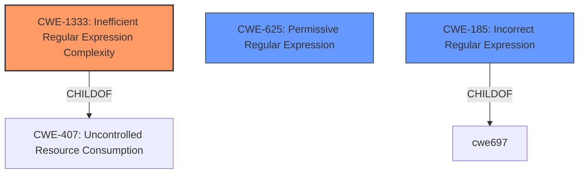

# Analysis for CVE-2021-23490

# Summary
| CWE ID  | CWE Name  | Confidence | CWE Abstraction Level | CWE Vulnerability Mapping Label | CWE-Vulnerability Mapping Notes |
|------------------|--------------------------------------------------------------------|------------------|-----------------------|-----------------------------------|--------------------------------------------------------------------|
| **CWE-1333** | Inefficient Regular Expression Complexity | 1.0 | Base  | Allowed  | Primary CWE |
| CWE-625  | Permissive Regular Expression | 0.7 | Base  | Allowed  | Secondary Candidate |
| CWE-185  | Incorrect Regular Expression | 0.6 | Class  | Allowed-with-Review | Secondary Candidate |

## Evidence and Confidence

*   **Confidence Score:** 0.9
*   **Evidence Strength:** HIGH

## Relationship Analysis
The primary CWE, CWE-1333, is a base-level CWE, providing a specific description of the **inefficient regular expression** issue. It is a child of CWE-407 (Uncontrolled Resource Consumption), which aligns with the DoS impact described.
CWE-625 (Permissive Regular Expression) and CWE-185 (Incorrect Regular Expression) are related, but CWE-1333 is more specific to the **complexity** aspect causing the denial of service.

## Vulnerability Chain
The vulnerability chain starts with the use of an **inefficient regular expression** (CWE-1333) in the `checkHeader` function, leading to catastrophic backtracking, which then results in excessive CPU consumption and ultimately a Denial of Service.

## Summary of Analysis
The primary weakness is the **inefficient regular expression** that leads to a denial of service. The analysis is based on the provided vulnerability description and the CVE reference summary, which explicitly mentions the **Regular Expression Denial of Service (ReDoS)** and catastrophic backtracking.

The evidence clearly points to **CWE-1333 (Inefficient Regular Expression Complexity)** as the most appropriate CWE. The vulnerability description states that the `checkHeader` function uses a regex vulnerable to catastrophic backtracking, leading to excessive CPU consumption. This aligns perfectly with the description of CWE-1333, which focuses on regular expressions with inefficient complexity causing excessive CPU cycles.

The selection of CWE-1333 is at the optimal level of specificity, as it directly addresses the root cause of the vulnerability – the inefficient regex. While other CWEs like CWE-625 (Permissive Regular Expression) and CWE-185 (Incorrect Regular Expression) were considered, they are either too general or don't fully capture the essence of the vulnerability being triggered by the inefficient complexity of the regular expression.

Relevant CWE Information:

# Enhanced Context (25 CWEs)
The following CWEs were identified as potentially relevant to this vulnerability:

## CWE-625: Permissive Regular Expression
**Abstraction Level**: Base
**Similarity Score**: 0.78
**Source**: dense

**Description**:
The product uses a regular expression that does not sufficiently restrict the set of allowed values.

**Mapping Guidance**:
- Usage: Allowed
- Rationale: This CWE entry is at the Base level of abstraction, which is a preferred level of abstraction for mapping to the root causes of vulnerabilities.

## CWE-185: Incorrect Regular Expression
**Abstraction Level**: Class
**Similarity Score**: 0.77
**Source**: dense

**Description**:
The product specifies a regular expression in a way that causes data to be improperly matched or compared.

**Mapping Guidance**:
- Usage: Allowed-with-Review
- Rationale: This CWE entry is a Class and might have Base-level children that would be more appropriate

## CWE-1333: Inefficient Regular Expression Complexity
**Abstraction Level**: Base
**Similarity Score**: 5113.91
**Source**: sparse

**Description**:
The product uses a regular expression with an inefficient, possibly exponential worst-case computational complexity that consumes excessive CPU cycles.

**Mapping Guidance**:
- Usage: Allowed
- Rationale: This CWE entry is at the Base level of abstraction, which is a preferred level of abstraction for mapping to the root causes of vulnerabilities.