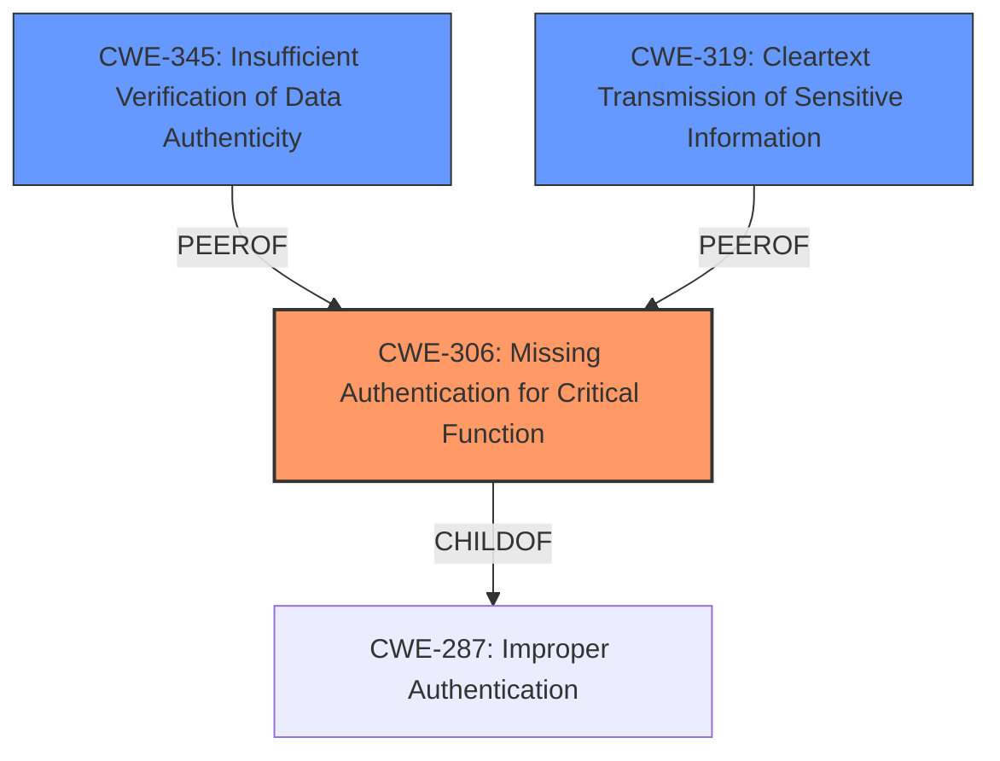

# Raw Analyzer Response for CVE-2021-2351

# Summary
| CWE ID | CWE Name | Confidence | CWE Abstraction Level | CWE Vulnerability Mapping Label | CWE-Vulnerability Mapping Notes |
|---|---|---|---|---|---|
| CWE-306 | Missing Authentication for Critical Function | 0.75 | Base | Allowed | Primary CWE |
| CWE-345 | Insufficient Verification of Data Authenticity | 0.60 | Class | Discouraged | Secondary Candidate |
| CWE-319 | Cleartext Transmission of Sensitive Information | 0.50 | Base | Allowed | Secondary Candidate |

## Evidence and Confidence

*   **Confidence Score:** 0.70
*   **Evidence Strength:** MEDIUM

## Relationship Analysis
The primary CWE selected, CWE-306 [Missing Authentication for Critical Function], is a base-level CWE that falls under the class CWE-287 [Improper Authentication]. This hierarchical relationship guided the selection towards the more specific base-level CWE, as it directly addresses the **lack of authentication** for a critical function, aligning with the vulnerability description.

CWE-345 [Insufficient Verification of Data Authenticity] is related to CWE-306, as authentication often involves verifying the authenticity of the user's identity. The choice of CWE-306 over CWE-345 indicates that the **missing authentication** is the primary issue, rather than just a failure in verifying the data's authenticity after authentication.

CWE-319 [Cleartext Transmission of Sensitive Information] is another potential consequence if authentication is missing and sensitive information is transmitted. However, without explicit evidence of cleartext transmission, this remains a secondary consideration.

## Vulnerability Chain
The vulnerability chain starts with the **lack of authentication** (CWE-306) for a critical function within the Advanced Networking Option of Oracle Database Server. This allows an unauthenticated attacker to compromise the system. Further, **insufficient security controls** and **improper input validation** weaknesses present in other components exploited via Oracle Net can lead to unauthorized data access, modification, or denial of service.

CWE-306 (Root Cause) -> Compromise of Advanced Networking Option (Impact)

## Summary of Analysis
The initial analysis focused on identifying the root cause of the vulnerability, which is the **missing authentication** for a critical function. The evidence from the "CVE Reference Links Content Summary" section supports the presence of **improper input validation** and **insufficient security controls** in related Oracle components that are exploited through the network. However, the primary vulnerability description highlights the **unauthenticated attacker** being able to compromise the Advanced Networking Option, which points directly to a **missing authentication** issue.

The graph relationships helped to refine the selection by showing how CWE-306 [Missing Authentication for Critical Function] relates to other authentication-related CWEs like CWE-345 [Insufficient Verification of Data Authenticity]. Ultimately, the selection of CWE-306 is based on the direct evidence of an **unauthenticated attacker** compromising the system. This is consistent with the base-level abstraction preference, providing a clear and specific identification of the **root cause**.

The evidence supporting the main CWE is the following:
*   "Difficult to exploit vulnerability allows **unauthenticated attacker** with network access via Oracle Net to compromise Advanced Networking Option."

I considered other CWEs, such as CWE-327 [Use of a Broken or Risky Cryptographic Algorithm], CWE-611 [Improper Restriction of XML External Entity Reference], and CWE-502 [Deserialization of Untrusted Data], but these require more specific evidence that isn't explicitly provided in the vulnerability description. The "CVE Reference Links Content Summary" section does mention vulnerabilities in other Oracle components involving **improper input validation** and **insufficient security controls**, but those are not the primary issue for the Advanced Networking Option vulnerability.