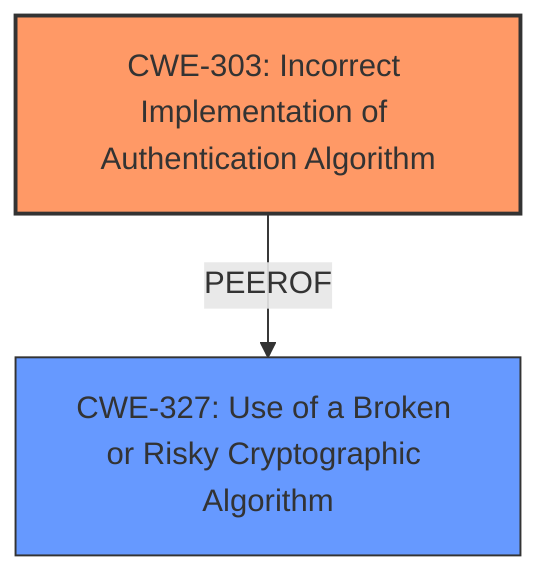

# Enhanced Analysis for CVE-2021-23839

# Summary
INSERT the assigned CWEs in a table format with the following columns: CWE ID, CWE Name, Confidence, CWE Abstraction Level, CWE Vulnerability Mapping Label, CWE-Vulnerability Mapping Notes
  - The Primary CWE should be first and noted as the Primary CWEs
  - The secondary candidate CWEs should be next and noted as secondary candidates.
  - The confidence is a confidence score 0 to 1 to rate your confidence in your assessment for that CWE.
  - The CWE Abstraction Level as one of these values: Base, Variant, Pillar, Class, Compound
  - The Mapping Notes Usage as one of these values: Allowed, Allowed-with-Review, Prohibited, Discouraged

| CWE ID   | CWE Name                                                   | Confidence | CWE Abstraction Level | CWE Vulnerability Mapping Label | CWE-Vulnerability Mapping Notes |
| :------- | :--------------------------------------------------------- | :--------- | :-------------------- | :------------------------------ | :------------------------------ |
| CWE-303 | Incorrect Implementation of Authentication Algorithm      | 0.8       | Base                 | Primary                           | Allowed                         |
| CWE-327 | Use of a Broken or Risky Cryptographic Algorithm | 0.5       | Class                 | Secondary                         | Allowed-with-Review             |

## Evidence and Confidence

*   **Confidence Score:** 0.7
*   **Evidence Strength:** HIGH

## Relationship Analysis
INSERT a concise analysis of the CWE relationships that impacted your decision:
  - Parent-child hierarchical relationships
  - Chain relationships showing progression of vulnerability
  - Peer relationships that offered alternative classifications
  - How abstraction levels influenced your selection

The primary relationship influencing the choice here is the hierarchical relationship between CWE-327 (Use of a Broken or Risky Cryptographic Algorithm) and potential child CWEs. While CWE-327 is a Class, the vulnerability description points to a more specific **incorrect implementation** rather than the algorithm itself being broken. CWE-303 (Incorrect Implementation of Authentication Algorithm) fits this better.



Note: The Mermaid diagram should be enclosed in triple backticks with "mermaid" as the language specifier, but do NOT use "markdown" as a language specifier anywhere in your response.

## Vulnerability Chain
INSERT the chain of root cause and weaknesses that followed for the Vulnerability Description.
  - Map the sequence from initial flaw to final impact
  - Identify which CWEs represent root causes vs. impacts
  - Note any missing links in the chain based on relationship data

The chain begins with the **incorrect implementation** of the padding check (CWE-303), leading to the acceptance of connections from version rollback attacks.

## Summary of Analysis
INSERT your analysis of both the initial analysis and criticism and your resulting conclusion.
  - Highlight how much your assessment is based on the provided evidence only, and show or quote that evidence.
  - Explain how the graph relationships influenced your final selection
  - Provide clear justification for your decision
  - Explain why your selected CWEs are at the optimal level of specificity

The primary CWE is based on the provided evidence specifically stating "**inverted logic for padding check**" which means the implementation of the padding check was flawed, not that the cryptographic algorithm itself was inherently broken.

The graph relationships show that CWE-303 and CWE-327 are peer CWEs. The retriever results showed CWE-327 as the top candidate, but after closer examination, the description for CWE-303 better fits the vulnerability. The vulnerability lies in the **incorrect implementation** of the padding check, not in the use of a broken or risky cryptographic algorithm.

The selected CWEs are at the optimal level of specificity because CWE-303 directly addresses the implementation flaw, while CWE-327 is a broader category that doesn't fully capture the specific nature of the vulnerability.

Relevant CWE Information:

# Enhanced Context (25 CWEs)
The following CWEs were identified as potentially relevant to this vulnerability:

## CWE-208: Observable Timing Discrepancy
**Abstraction Level**: Base
**Similarity Score**: 0.78
**Source**: dense

**Description**:
Two separate operations in a product require different amounts of time to complete, in a way that is observable to an actor and reveals security-relevant information about the state of the product, such as whether a particular operation was successful or not.

**Mapping Guidance**:
- Usage: Allowed
- Rationale: This CWE entry is at the Base level of abstraction, which is a preferred level of abstraction for mapping to the root causes of vulnerabilities.


## CWE-203: Observable Discrepancy
**Abstraction Level**: Base
**Similarity Score**: 0.78
**Source**: dense

**Description**:
The product behaves differently or sends different responses under different circumstances in a way that is observable to an unauthorized actor, which exposes security-relevant information about the state of the product, such as whether a particular operation was successful or not.

**Mapping Guidance**:
- Usage: Allowed
- Rationale: This CWE entry is at the Base level of abstraction, which is a preferred level of abstraction for mapping to the root causes of vulnerabilities.


## CWE-300: Channel Accessible by Non-Endpoint
**Abstraction Level**: Class
**Similarity Score**: 0.78
**Source**: dense

**Description**:
The product does not adequately verify the identity of actors at both ends of a communication channel, or does not adequately ensure the integrity of the channel, in a way that allows the channel to be accessed or influenced by an actor that is not an endpoint.

**Mapping Guidance**:
- Usage: Discouraged
- Rationale: CWE-300 is commonly misused for vulnerabilities in which the prerequisites for exploitation require the adversary to be in a privileged "in-the-middle" position.


## CWE-345: Insufficient Verification of Data Authenticity
**Abstraction Level**: Class
**Similarity Score**: 0.77
**Source**: dense

**Description**:
The product does not sufficiently verify the origin or authenticity of data, in a way that causes it to accept invalid data.

**Mapping Guidance**:
- Usage: Discouraged
- Rationale: This CWE entry is a level-1 Class (i.e., a child of a Pillar). It might have lower-level children that would be more appropriate


## CWE-941: Incorrectly Specified Destination in a Communication Channel
**Abstraction Level**: Base
**Similarity Score**: 0.77
**Source**: dense

**Description**:
The product creates a communication channel to initiate an outgoing request to an actor, but it does not correctly specify the intended destination for that actor.

**Mapping Guidance**:
- Usage: Allowed
- Rationale: This CWE entry is at the Base level of abstraction, which is a preferred level of abstraction for mapping to the root causes of vulnerabilities.


## CWE-319: Cleartext Transmission of Sensitive Information
**Abstraction Level**: Base
**Similarity Score**: 0.77
**Source**: dense

**Description**:
The product transmits sensitive or security-critical data in cleartext in a communication channel that can be sniffed by unauthorized actors.

**Mapping Guidance**:
- Usage: Allowed
- Rationale: This CWE entry is at the Base level of abstraction, which is a preferred level of abstraction for mapping to the root causes of vulnerabilities.


## CWE-807: Reliance on Untrusted Inputs in a Security Decision
**Abstraction Level**: Base
**Similarity Score**: 0.77
**Source**: dense

**Description**:
The product uses a protection mechanism that relies on the existence or values of an input, but the input can be modified by an untrusted actor in a way that bypasses the protection mechanism.

**Mapping Guidance**:
- Usage: Allowed
- Rationale: This CWE entry is at the Base level of abstraction, which is a preferred level of abstraction for mapping to the root causes of vulnerabilities.


## CWE-303: Incorrect Implementation of Authentication Algorithm
**Abstraction Level**: Base
**Similarity Score**: 0.77
**Source**: dense

**Description**:
The requirements for the product dictate the use of an established authentication algorithm, but the implementation of the algorithm is incorrect.

**Mapping Guidance**:
- Usage: Allowed
- Rationale: This CWE entry is at the Base level of abstraction, which is a preferred level of abstraction for mapping to the root causes of vulnerabilities.


## CWE-1240: Use of a Cryptographic Primitive with a Risky Implementation
**Abstraction Level**: Base
**Similarity Score**: 0.76
**Source**: dense

**Description**:
To fulfill the need for a cryptographic primitive, the product implements a cryptographic algorithm using a non-standard, unproven, or disallowed/non-compliant cryptographic implementation.

**Mapping Guidance**:
- Usage: Allowed
- Rationale: This CWE entry is at the Base level of abstraction, which is a preferred level of abstraction


## CWE Relationship Analysis

Current CWEs represent these abstraction levels: .


### Vulnerability Chain Analysis

**Chain starting from CWE-208:**
- 208 (Observable Timing Discrepancy) - ROOT


**Chain starting from CWE-203:**
- 203 (Observable Discrepancy) - ROOT


### CWE Relationship Diagram

```mermaid
graph TD
    classDef primary fill:#f96,stroke:#333,stroke-width:2px
    classDef secondary fill:#69f,stroke:#333
    classDef tertiary fill:#9e9,stroke:#333
```