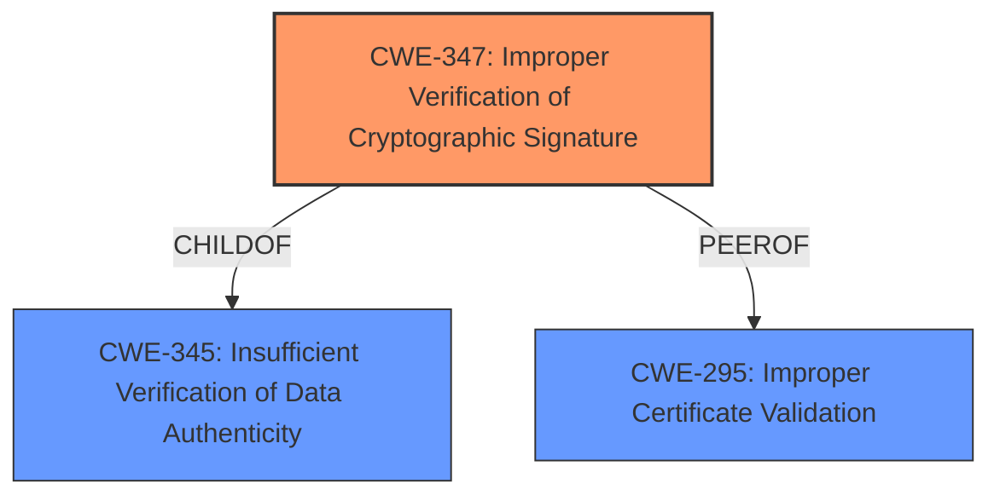

# Raw Analyzer Response for CVE-2021-23993

# Summary
| CWE ID  | CWE Name                                  | Confidence | CWE Abstraction Level | CWE Vulnerability Mapping Label | CWE-Vulnerability Mapping Notes |
| :-------- | :---------------------------------------- | :--------- | :-------------------- | :------------------------------ | :------------------------------ |
| CWE-347   | Improper Verification of Cryptographic Signature | 0.9        | Base                  | Primary CWE                    | Allowed                       |
| CWE-295   | Improper Certificate Validation          | 0.7        | Base                  | Secondary Candidate          | Allowed                       |

## Evidence and Confidence

*   **Confidence Score:** 0.8
*   **Evidence Strength:** HIGH

## Relationship Analysis
The primary weakness, **CWE-347 (Improper Verification of Cryptographic Signature)**, is a **Base** level CWE, indicating a specific type of flaw. This CWE stems from the root cause of the vulnerability, where Thunderbird fails to properly validate the self-signature of a subkey in an OpenPGP key. **CWE-347** is a child of **CWE-345 (Insufficient Verification of Data Authenticity)**, indicating that the broader class of insufficient verification applies. Another related CWE is **CWE-295 (Improper Certificate Validation)** because certificate validation also uses signatures. Selecting **CWE-347** offers a direct and specific match to the observed weakness.

## Vulnerability Chain
The vulnerability chain starts with the attacker creating a crafted OpenPGP key with an **invalid self signature in OpenPGP subkey**. Then the user imports the crafted key, Thunderbird tries to use the invalid subkey, but the RNP library rejects it, causing encryption to fail, and ultimately preventing the user from sending encrypted emails (DoS).

Root Cause: **Invalid self-signature** in OpenPGP subkey.
Weakness: **CWE-347 (Improper Verification of Cryptographic Signature)**
Impact: Denial of Service (DoS) - preventing the user from sending encrypted emails.

## Summary of Analysis
The initial analysis and criticism focused on identifying the root cause and the resulting impact. The provided evidence strongly supports the selection of **CWE-347 (Improper Verification of Cryptographic Signature)** as the primary CWE.

The key phrase "**invalid self signature in OpenPGP subkey**" and the "CVE Reference Links Content Summary" section both point to the core issue of improper signature verification. Specifically, the description states that Thunderbird's `find_suitable_key` function does not check for the validity of the subkey's self-signature.

The vulnerability description explicitly states: "If an attacker creates a crafted OpenPGP key with a subkey that has an **invalid self signature**, and the Thunderbird user imports the crafted key, then Thunderbird may try to use the invalid subkey, but the RNP library rejects it from being used, causing encryption to fail."

The selection of **CWE-347 (Improper Verification of Cryptographic Signature)** is at the optimal level of specificity. It directly addresses the **weakness** of improper signature verification, which is the root cause of the vulnerability. The high retriever score for **CWE-347 (Improper Verification of Cryptographic Signature)** further supports this choice. Other CWEs like **CWE-20 (Improper Input Validation)** are too general, while others like **CWE-787 (Out-of-bounds Write)** are unrelated to the specific **weakness** described.

Relevant CWE Information:

# Enhanced Context (25 CWEs)
The following CWEs were identified as potentially relevant to this vulnerability:

## CWE-203: Observable Discrepancy
**Abstraction Level**: Base
**Similarity Score**: 0.78
**Source**: dense

**Description**:
The product behaves differently or sends different responses under different circumstances in a way that is observable to an unauthorized actor, which exposes security-relevant information about the state of the product, such as whether a particular operation was successful or not.

**Mapping Guidance**:
- Usage: Allowed
- Rationale: This CWE entry is at the Base level of abstraction, which is a preferred level of abstraction for mapping to the root causes of vulnerabilities.

## CWE-208: Observable Timing Discrepancy
**Abstraction Level**: Base
**Similarity Score**: 0.77
**Source**: dense

**Description**:
Two separate operations in a product require different amounts of time to complete, in a way that is observable to an actor and reveals security-relevant information about the state of the product, such as whether a particular operation was successful or not.

**Mapping Guidance**:
- Usage: Allowed
- Rationale: This CWE entry is at the Base level of abstraction, which is a preferred level of abstraction for mapping to the root causes of vulnerabilities.

## CWE-204: Observable Response Discrepancy
**Abstraction Level**: Base
**Similarity Score**: 0.77
**Source**: dense

**Description**:
The product provides different responses to incoming requests in a way that reveals internal state information to an unauthorized actor outside of the intended control sphere.

**Mapping Guidance**:
- Usage: Allowed
- Rationale: This CWE entry is at the Base level of abstraction, which is a preferred level of abstraction for mapping to the root causes of vulnerabilities.

## CWE-451: User Interface (UI) Misrepresentation of Critical Information
**Abstraction Level**: Class
**Similarity Score**: 0.77
**Source**: dense

**Description**:
The user interface (UI) does not properly represent critical information to the user, allowing the information - or its source - to be obscured or spoofed. This is often a component in phishing attacks.

**Mapping Guidance**:
- Usage: Allowed-with-Review
- Rationale: This CWE entry is a Class and might have Base-level children that would be more appropriate

## CWE-345: Insufficient Verification of Data Authenticity
**Abstraction Level**: Class
**Similarity Score**: 0.77
**Source**: dense

**Description**:
The product does not sufficiently verify the origin or authenticity of data, in a way that causes it to accept invalid data.

**Mapping Guidance**:
- Usage: Discouraged
- Rationale: This CWE entry is a level-1 Class (i.e., a child of a Pillar). It might have lower-level children that would be more appropriate

## CWE-668: Exposure of Resource to Wrong Sphere
**Abstraction Level**: Class
**Similarity Score**: 0.76
**Source**: dense

**Description**:
The product exposes a resource to the wrong control sphere, providing unintended actors with inappropriate access to the resource.

**Mapping Guidance**:
- Usage: Discouraged
- Rationale: CWE-668 is high-level and is often misused as a catch-all when lower-level CWE IDs might be applicable. It is sometimes used for low-information vulnerability reports [REF-1287]. It is a level-1 Class (i.e., a child of a Pillar). It is not useful for trend analysis.

## CWE-226: Sensitive Information in Resource Not Removed Before Reuse
**Abstraction Level**: Base
**Similarity Score**: 0.76
**Source**: dense

**Description**:
The product releases a resource such as memory or a file so that it can be made available for reuse, but it does not clear or "zeroize" the information contained in the resource before the product performs a critical state transition or makes the resource available for reuse by other entities.

**Mapping Guidance**:
- Usage: Allowed
- Rationale: This CWE entry is at the Base level of abstraction, which is a preferred level of abstraction for mapping to the root causes of vulnerabilities.

## CWE-404: Improper Resource Shutdown or Release
**Abstraction Level**: Class
**Similarity Score**: 0.76
**Source**: dense

**Description**:
The product does not release or incorrectly releases a resource before it is made available for re-use.

**Mapping Guidance**:
- Usage: Allowed-with-Review
- Rationale: This CWE entry is a Class and might have Base-level children that would be more appropriate

## CWE-667: Improper Locking
**Abstraction Level**: Class
**Similarity Score**: 0.76
**Source**: dense

**Description**:
The product does not properly acquire or release a lock on a resource, leading to unexpected resource state changes and behaviors.

**Mapping Guidance**:
- Usage: Allowed-with-Review
- Rationale: This CWE entry is a Class and might have Base-level children that would be more appropriate

## CWE-755: Improper Handling of Exceptional Conditions
**Abstraction Level**: Class
**Similarity Score**: