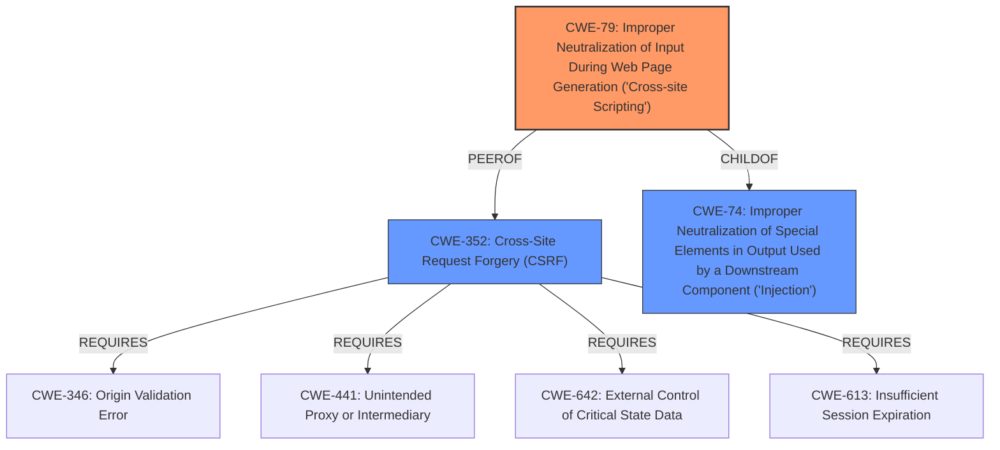

# Raw Analyzer Response for CVE-2021-24410

# Summary
| CWE ID | CWE Name | Confidence | CWE Abstraction Level | CWE Vulnerability Mapping Label | CWE-Vulnerability Mapping Notes |
|---|---|---|---|---|---|
| CWE-79 | Improper Neutralization of Input During Web Page Generation ('Cross-site Scripting') | 1.0 | Base | Allowed | Primary CWE. The application does not neutralize input before placing it in a web page served to other users, leading to Stored XSS. |
| CWE-352 | Cross-Site Request Forgery (CSRF) | 1.0 | Compound | Allowed | Secondary CWE. The application lacks CSRF checks when saving settings and verses, allowing attackers to make unintended requests. |

## Evidence and Confidence

*   **Confidence Score:** 1.0
*   **Evidence Strength:** HIGH

## Relationship Analysis
The primary weakness is CWE-79, which describes the improper neutralization of input leading to cross-site scripting. This is directly supported by the vulnerability description stating that the plugin "do not sanitise or escape them when outputting them back in the page" leading to **Stored XSS** issues.

The secondary weakness is CWE-352, which addresses the lack of CSRF checks. The vulnerability description explicitly states the plugin is "**lacking any CSRF check** when saving its settings and verses".

CWE-79 and CWE-352 can be related. An attacker could use CSRF to trick a victim into submitting requests containing an XSS payload.

## Vulnerability Chain
The vulnerability chain begins with the **lack of CSRF checks** (CWE-352), which allows an attacker to potentially **modify plugin settings**.
The second weakness is the **lack of sanitization and escaping** of input (CWE-79), enabling the injection of **malicious JavaScript code**.
This injected code leads to **stored XSS**, where the malicious script executes whenever the page is loaded.

## Summary of Analysis
The analysis is based on the provided evidence, which clearly indicates a **lack of CSRF checks** and **improper sanitization** of input. The vulnerability description explicitly mentions the absence of CSRF protection and the resulting stored XSS issues.
The graph relationships show how XSS and CSRF can be related, with CSRF potentially leading to XSS in some cases. The chosen CWEs are at the optimal level of specificity, as they directly address the root causes identified in the vulnerability description. CWE-79 is a Base level weakness. CWE-352 is a Compound weakness made up of other weaknesses.

The following CWEs were considered but not used:

*   **CWE-74: Improper Neutralization of Special Elements in Output Used by a Downstream Component ('Injection')**: While CWE-74 is a parent of CWE-79, CWE-79 is more specific to the context of web page generation and XSS, making it a better fit.
*   **CWE-116: Improper Encoding or Escaping of Output**: This CWE is related to output handling but is more general. CWE-79 specifically addresses the context of web page generation, which aligns better with the vulnerability description.