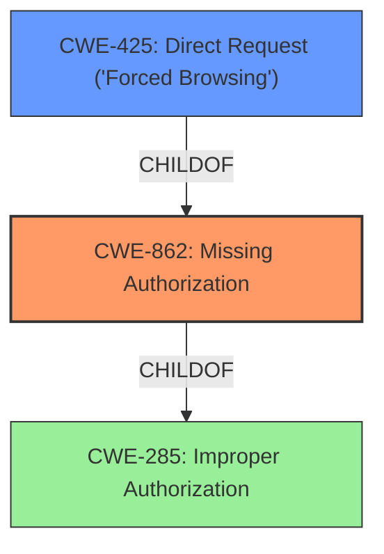

# Raw Analyzer Response for CVE-2021-24831

# Summary
| CWE ID | CWE Name | Confidence | CWE Abstraction Level | CWE Vulnerability Mapping Label | CWE-Vulnerability Mapping Notes |
|---|---|---|---|---|---|
| CWE-862 | Missing Authorization | 1.0 | Class | Primary | Allowed-with-Review |
| CWE-425 | Direct Request ('Forced Browsing') | 0.7 | Base | Secondary | Allowed |

## Evidence and Confidence

*   **Confidence Score:** 0.9
*   **Evidence Strength:** HIGH

## Relationship Analysis
The primary CWE is CWE-862 (Missing Authorization), which is a Class-level CWE. CWE-425 (Direct Request) is a related Base-level CWE and a child of CWE-862. The relationship informs that if authorization is missing (CWE-862), a direct request can bypass intended access controls (CWE-425). Since the vulnerability involves AJAX actions being directly accessible without authorization checks, both CWEs are relevant. CWE-862 represents the root cause, and CWE-425 represents a potential attack vector.

## Vulnerability Chain
The vulnerability chain starts with the **improper access control** on AJAX actions, specifically **missing authorization** (CWE-862). This allows unauthenticated users to directly request (CWE-425) and execute these actions, leading to the impact of modifying data in the plugin, such as adding, editing, or deleting arbitrary tabs. The root cause is the **missing authorization**, which results in a direct request bypassing the intended security controls.

## Summary of Analysis
The analysis concludes that CWE-862 (Missing Authorization) is the most appropriate primary CWE, with high confidence due to clear evidence of **missing authorization checks** on AJAX actions. CWE-425 (Direct Request) is a relevant secondary CWE.

The selection is based on the following evidence from the "Vulnerability Description Key Phrases" and "CVE Reference Links Content Summary":

*   "**rootcause:** **improper access control**"
*   "**Weaknesses/vulnerabilities present:** Missing authorization checks on AJAX actions."
*   "The plugin's AJAX actions did not have proper authorization checks, allowing unauthenticated users to access them."

The graph relationships influenced the selection by illustrating the connection between missing authorization and direct request attacks. The provided description clearly states that AJAX actions are accessible without authentication, which perfectly aligns with CWE-862. The addition of CWE-425 highlights how this lack of authorization allows direct access to restricted resources.

Both CWEs are at appropriate levels of specificity. CWE-862 is a Class that accurately describes the **missing authorization**, while CWE-425 is a Base that clarifies the attack vector.

Relevant CWE Information:

# Enhanced Context (25 CWEs)

## CWE-472: External Control of Assumed-Immutable Web Parameter
**Abstraction Level**: Base
**Similarity Score**: 0.76

**Description**:
The web application does not sufficiently verify inputs that are assumed to be immutable but are actually externally controllable, such as hidden form fields.
**Rationale for not selecting**: Not applicable, the issue is missing authorization checks, not the control of assumed-immutable parameters.

## CWE-74: Improper Neutralization of Special Elements in Output Used by a Downstream Component ('Injection')
**Abstraction Level**: Class
**Similarity Score**: 0.76
**Rationale for not selecting**: Not applicable, there is no indication of injection in the provided description.

## CWE-639: Authorization Bypass Through User-Controlled Key
**Abstraction Level**: Base
**Similarity Score**: 0.76
**Rationale for not selecting**: Not applicable, there's no evidence of authorization bypass through a user-controlled key.

## CWE-1289: Improper Validation of Unsafe Equivalence in Input
**Abstraction Level**: Base
**Similarity Score**: 0.76
**Rationale for not selecting**: Not applicable, the problem isn't improper validation of equivalence in input.

## CWE-80: Improper Neutralization of Script-Related HTML Tags in a Web Page (Basic XSS)
**Abstraction Level**: Variant
**Similarity Score**: 0.76
**Rationale for not selecting**: Not applicable, there is no mention of XSS or improper neutralization of HTML tags.

## CWE-807: Reliance on Untrusted Inputs in a Security Decision
**Abstraction Level**: Base
**Similarity Score**: 0.76
**Rationale for not selecting**: Not applicable, the weakness is missing authorization checks, not reliance on untrusted inputs for security decisions.

## CWE-116: Improper Encoding or Escaping of Output
**Abstraction Level**: Class
**Similarity Score**: 0.76
**Rationale for not selecting**: Not applicable, no indication of encoding/escaping issues.

## CWE-184: Incomplete List of Disallowed Inputs
**Abstraction Level**: Base
**Similarity Score**: 0.75
**Rationale for not selecting**: Not applicable, there is no mention of a list of disallowed inputs.

## CWE-138: Improper Neutralization of Special Elements
**Abstraction Level**: Class
**Similarity Score**: 0.75
**Rationale for not selecting**: Not applicable, the description doesn't mention special elements that need neutralization.

## CWE-915: Improperly Controlled Modification of Dynamically-Determined Object Attributes
**Abstraction Level**: Base
**Similarity Score**: 0.75
**Rationale for not selecting**: Not applicable, there is no mention of dynamically-determined object attributes.

## CWE-79: Improper Neutralization of Input During Web Page Generation ('Cross-site Scripting')
**Abstraction Level**: Base
**Similarity Score**: 7826.83
**Rationale for not selecting**: Not applicable, there is no mention of XSS or improper neutralization of input for web page generation.

## CWE-116: Improper Encoding or Escaping of Output
**Abstraction Level**: Class
**Similarity Score**: 7763.42
**Rationale for not selecting**: Not applicable, there is no mention of encoding/escaping issues.

## CWE-863: Incorrect Authorization
**Abstraction Level**: Class
**Similarity Score**: 7547.15
**Rationale for not selecting**: While authorization is involved, it's not "incorrect", it's missing entirely, making CWE-862 a better fit.

## CWE-352: Cross-Site Request Forgery (CSRF)
**Abstraction Level**: Compound
**Similarity Score**: 7525.85
**Rationale for not selecting**: There is no information about CSRF.

## CWE-285: Improper Authorization
**Abstraction Level**: Class
**Similarity Score**: 7506.71
**Rationale for not selecting**: CWE-285 is too general. CWE-862 (Missing Authorization) is more specific and better describes the vulnerability.

## CWE-613: Insufficient Session Expiration
**Abstraction Level**: base
**Similarity Score**: 4.33
**Rationale for not selecting**: There is no information about session expiration.

## CWE-494: Download of Code Without Integrity Check
**Abstraction Level**: base
**Similarity Score**: 4.33
**Rationale for not selecting**: There is no download of code without integrity checks.

## CWE-471: Modification of Assumed-Immutable Data (MAID)
**Abstraction Level**: base
**Similarity Score**: 4.33
**Rationale for not selecting**: There is no modification of assumed-immutable data involved.

## CWE-178: Improper Handling of Case Sensitivity
**Abstraction Level**: base
**Similarity Score**: 3.76
**Rationale for not selecting**: There is no improper handling of case sensitivity.

## CWE-98: Improper Control of Filename for Include/Require Statement in PHP Program ('PHP Remote File Inclusion')
**Abstraction Level**: variant
**Similarity Score**: 3.75
**Rationale for not selecting**: The application is a Wordpress plugin, but there is no indication of PHP remote file inclusion.

## CWE-457: Use of Uninitialized Variable
**Abstraction Level**: variant
**Similarity Score**: 3.34
**Rationale for not selecting**: There is no use of an uninitialized variable involved.

## CWE-20: Improper Input Validation
**Abstraction Level**: class
**Similarity Score**: 2.98
**Rationale for not selecting**: Although input validation is a good practice, the problem in this description is missing authorization, which makes input validation a