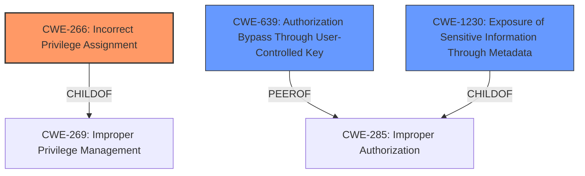

# Enhanced Analysis for CVE-2021-24859

# Summary
| CWE ID | CWE Name | Confidence | CWE Abstraction Level | CWE Vulnerability Mapping Label | CWE-Vulnerability Mapping Notes |
|---|---|---|---|---|---|
| CWE-266 | Incorrect Privilege Assignment | 0.9 | Base | Primary | Allowed |
| CWE-639 | Authorization Bypass Through User-Controlled Key | 0.7 | Base | Secondary | Allowed |
| CWE-1230 | Exposure of Sensitive Information Through Metadata | 0.6 | Base | Secondary | Allowed |

## Evidence and Confidence

*   **Confidence Score:** 0.8
*   **Evidence Strength:** HIGH

## Relationship Analysis
The primary relationship influencing the CWE selection is the hierarchical structure. CWE-266 (Incorrect Privilege Assignment) is a base-level CWE and a child of CWE-269 (Improper Privilege Management), offering a more specific classification than its parent. CWE-639 (Authorization Bypass Through User-Controlled Key) represents a related authorization bypass. CWE-1230 (Exposure of Sensitive Information Through Metadata) is also considered because the vulnerability leads to metadata exposure. All selected CWEs are at the Base level, aligning with the preference for the lowest applicable abstraction level.



## Vulnerability Chain
The chain of events for this vulnerability is as follows:
1.  **Incorrect Privilege Assignment (CWE-266):** A low-privileged user (contributor) is incorrectly granted the ability to access a function that should be restricted to higher-privileged users. This is the root cause.
2.  **Authorization Bypass Through User-Controlled Key (CWE-639):** The application allows modification of the "user login" parameter, enabling unauthorized access to other user's data.
3.  **Exposure of Sensitive Information Through Metadata (CWE-1230):** Attackers can extract sensitive user information, including password hashes.

## Summary of Analysis
The analysis is primarily based on the provided vulnerability description and the "CVE Reference Links Content Summary." The **root cause** is **improper access control**, which translates to **incorrect privilege assignment**. The vulnerability allows users with the "contributor" role to access sensitive metadata of other users by specifying their login as a parameter. This clearly indicates that the privilege assigned to the "contributor" role is incorrect, as it allows them to access information they shouldn't be able to.

The retriever results and graph relationships influenced the selection of CWE-266 as the primary CWE. The other potential CWEs considered were either too general (e.g., CWE-285) or didn't fully capture the specific nature of the vulnerability.

CWE-266 is the most specific and accurate representation of the vulnerability because it directly addresses the **incorrect** assignment of privileges. The evidence from the "Vulnerability Description Key Phrases" clearly states "**improper access control**" as the **rootcause**, and the "CVE Reference Links Content Summary" confirms the lack of proper authorization checks.

CWE-639 is considered as a secondary CWE because the attacker can bypass authorization by controlling the "user login" key.

CWE-1230 is considered a secondary weakness as the vulnerability leads to exposure of metadata (password hashes).

The selected CWEs are at the optimal level of specificity, providing a clear and accurate representation of the vulnerability.

Relevant CWE Information:

# Enhanced Context (25 CWEs)
The following CWEs were identified as potentially relevant to this vulnerability:

## CWE-266: Incorrect Privilege Assignment
**Abstraction Level**: Base
**Similarity Score**: 0.394 sparse, 3.64 graph
**Source**: dense

**Description**:
A product incorrectly assigns a privilege to a particular actor, creating an unintended sphere of control for that actor.

**Mapping Guidance**:
- Usage: Allowed
- Rationale: This CWE entry is at the Base level of abstraction, which is a preferred level of abstraction for mapping to the root causes of vulnerabilities.

## CWE-639: Authorization Bypass Through User-Controlled Key
**Abstraction Level**: Base
**Similarity Score**: 0.77 dense, 4627.36 sparse
**Source**: dense

**Description**:
The system's authorization functionality does not prevent one user from gaining access to another user's data or record by modifying the key value identifying the data.

**Mapping Guidance**:
- Usage: Allowed
- Rationale: This CWE entry is at the Base level of abstraction, which is a preferred level of abstraction for mapping to the root causes of vulnerabilities.

## CWE-1230: Exposure of Sensitive Information Through Metadata
**Abstraction Level**: Base
**Similarity Score**: 0.395 dense
**Source**: dense

**Description**:
The product prevents direct access to a resource containing sensitive information, but it does not sufficiently limit access to metadata that is derived from the original, sensitive information.

**Mapping Guidance**:
- Usage: Allowed
- Rationale: This CWE entry is at the Base level of abstraction, which is a preferred level of abstraction for mapping to the root causes of vulnerabilities.

### CWEs Considered but Not Used
*   **CWE-352 Cross-Site Request Forgery (CSRF)**: This CWE was considered but rejected because the vulnerability doesn't involve tricking a user into making unintentional requests. It's a direct **improper access control** issue.
*   **CWE-863 Incorrect Authorization**: While authorization is involved, CWE-266 is more specific as it pinpoints the issue to incorrect assignment of privileges, rather than a general incorrect authorization check.
*   **CWE-285 Improper Authorization**: This CWE is too high-level and the description specifically suggests looking for a more specific child CWE.
*   **CWE-472 External Control of Assumed-Immutable Web Parameter**: The vulnerability involves using the user login parameter to access data, which is not the same as modifying an immutable parameter.
*   **CWE-613 Insufficient Session Expiration**: This is not relevant as the vulnerability is about access control, not session management.
*   **CWE-201 Insertion of Sensitive Information Into Sent Data**: The vulnerability involves leaking existing sensitive data, not inserting new sensitive data into sent data.
*   **CWE-89 Improper Neutralization of Special Elements used in an SQL Command ('SQL Injection')**: There is no mention of SQL injection in the description.
*   **CWE-306 Missing Authentication for Critical Function**: Authentication isn't missing; the problem is with authorization and privilege assignment.


## CWE Relationship Analysis

Current CWEs represent these abstraction levels: .


### Vulnerability Chain Analysis

**Chain starting from CWE-201:**
- 201 (Insertion of Sensitive Information Into Sent Data) - ROOT


**Chain starting from CWE-89:**
- 89 (Improper Neutralization of Special Elements used in an SQL Command ('SQL Injection')) - ROOT


### CWE Relationship Diagram

```mermaid
graph TD
    classDef primary fill:#f96,stroke:#333,stroke-width:2px
    classDef secondary fill:#69f,stroke:#333
    classDef tertiary fill:#9e9,stroke:#333
```