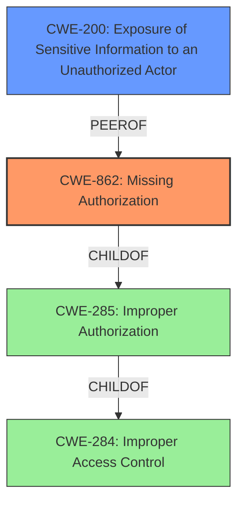

# Raw Analyzer Response for CVE-2021-24868

# Summary
| CWE ID | CWE Name | Confidence | CWE Abstraction Level | CWE Vulnerability Mapping Label | CWE-Vulnerability Mapping Notes |
|---|---|---|---|---|---|
| CWE-862 | Missing Authorization | 1.0 | Class | Primary | Allowed-with-Review |
| CWE-200 | Exposure of Sensitive Information to an Unauthorized Actor | 0.7 | Class | Secondary | Discouraged |

## Evidence and Confidence

*   **Confidence Score:** 0.9
*   **Evidence Strength:** HIGH

## Relationship Analysis
The primary relationship influencing the CWE selection is the hierarchical relationship. CWE-862 (Missing Authorization) is a child of CWE-285 (Improper Authorization) and CWE-284 (Improper Access Control). The vulnerability description clearly indicates a **missing** authorization check, making CWE-862 a more specific and appropriate choice than its parents. CWE-200 (Exposure of Sensitive Information to an Unauthorized Actor) is a potential secondary weakness, but it's a more general consequence of the **missing** authorization, making it a less direct mapping.

## Vulnerability Chain
The vulnerability chain starts with the **missing** authorization check on the AJAX action endpoint, leading to the exposure of sensitive information (title of private and draft posts) to unauthorized actors (any authenticated user).

Missing Authorization -> Sensitive Information Exposure

## Summary of Analysis
The initial analysis focused on identifying the root cause of the vulnerability. The vulnerability description and CVE Reference Links Content Summary clearly indicate that the Document Embedder WordPress plugin lacks a proper authorization check on its AJAX action endpoint. This allows any authenticated user to enumerate the title of private and draft posts, which they should not have access to.

The evidence for this conclusion is:
- "The Document Embedder WordPress plugin before 1.7.9 contains a AJAX action endpoint, which could allow any authenticated user, such as subscriber to enumerate the title of arbitrary private and draft posts."
- "The vulnerability stems from an AJAX action endpoint within the "Document Embedder" WordPress plugin that **does not properly restrict access** to post metadata."
- "**Insufficient Access Control:** The plugin **does not verify** if an authenticated user has the appropriate permissions to access the metadata of the requested post."

The retriever results also support this conclusion, with CWE-862 (Missing Authorization) being the top-ranked CWE.

CWE-862 (Missing Authorization) is selected as the primary CWE because it directly addresses the root cause of the vulnerability: the **lack of an authorization check**. CWE-200 (Exposure of Sensitive Information to an Unauthorized Actor) is considered as a secondary CWE because it represents the consequence of the **missing** authorization. However, CWE-200 is a high-level class that is often misused, as noted in its mapping guidance. Therefore, it is included as a secondary consideration with a lower confidence score.

The selected CWEs are at the optimal level of specificity because they directly address the root cause (CWE-862) and the resulting impact (CWE-200). More general CWEs, such as CWE-284 (Improper Access Control), would not be as precise in describing the vulnerability.

Relevant CWE Information:

# Enhanced Context (25 CWEs)

## CWE-74: Improper Neutralization of Special Elements in Output Used by a Downstream Component ('Injection')
**Abstraction Level**: Class
**Similarity Score**: 0.76
**Source**: dense

**Description**:
The product constructs all or part of a command, data structure, or record using externally-influenced input from an upstream component, but it does not neutralize or incorrectly neutralizes special elements that could modify how it is parsed or interpreted when it is sent to a downstream component.

**Mapping Guidance**:
- Usage: Discouraged
- Rationale: CWE-74 is high-level and often misused when lower-level weaknesses are more appropriate.

*Not Selected*: Injection is not the root cause.

## CWE-943: Improper Neutralization of Special Elements in Data Query Logic
**Abstraction Level**: Class
**Similarity Score**: 0.74
**Source**: dense

**Description**:
The product generates a query intended to access or manipulate data in a data store such as a database, but it does not neutralize or incorrectly neutralizes special elements that can modify the intended logic of the query.

**Mapping Guidance**:
- Usage: Allowed-with-Review
- Rationale: This CWE entry is a Class and might have Base-level children that would be more appropriate

*Not Selected*: SQL injection is not the root cause.

## CWE-538: Insertion of Sensitive Information into Externally-Accessible File or Directory
**Abstraction Level**: Base
**Similarity Score**: 0.74
**Source**: dense

**Description**:
The product places sensitive information into files or directories that are accessible to actors who are allowed to have access to the files, but not to the sensitive information.

**Mapping Guidance**:
- Usage: Allowed
- Rationale: This CWE entry is at the Base level of abstraction, which is a preferred level of abstraction for mapping to the root causes of vulnerabilities.

*Not Selected*: The root cause is a **missing** authorization check, not insertion of sensitive information.

## CWE-639: Authorization Bypass Through User-Controlled Key
**Abstraction Level**: Base
**Similarity Score**: 0.74
**Source**: dense

**Description**:
The system's authorization functionality does not prevent one user from gaining access to another user's data or record by modifying the key value identifying the data.

**Mapping Guidance**:
- Usage: Allowed
- Rationale: This CWE entry is at the Base level of abstraction, which is a preferred level of abstraction for mapping to the root causes of vulnerabilities.

*Not Selected*: This is closer to the root cause, but not precise. No user controlled key is being modified.

## CWE-80: Improper Neutralization of Script-Related HTML Tags in a Web Page (Basic XSS)
**Abstraction Level**: Variant
**Similarity Score**: 0.73
**Source**: dense

**Description**:
The product receives input from an upstream component, but it does not neutralize or incorrectly neutralizes special characters such as "<", ">", and "&" that could be interpreted as web-scripting elements when they are sent to a downstream component that processes web pages.

**Mapping Guidance**:
- Usage: Allowed
- Rationale: This CWE entry is at the Variant level of abstraction, which is a preferred level of abstraction for mapping to the root causes of vulnerabilities.

*Not Selected*: XSS is not the root cause.

## CWE-212: Improper Removal of Sensitive Information Before Storage or Transfer
**Abstraction Level**: Base
**Similarity Score**: 0.73
**Source**: dense

**Description**:
The product stores, transfers, or shares a resource that contains sensitive information, but it does not properly remove that information before the product makes the resource available to unauthorized actors.

**Mapping Guidance**:
- Usage: Allowed
- Rationale: This CWE entry is at the Base level of abstraction, which is a preferred level of abstraction for mapping to the root causes of vulnerabilities.

*Not Selected*: The root cause is a **missing** authorization check, not improper removal of sensitive information.

## CWE-200: Exposure of Sensitive Information to an Unauthorized Actor
**Abstraction Level**: Class
**Similarity Score**: 0.73
**Source**: dense

**Description**:
The product exposes sensitive information to an actor that is not explicitly authorized to have access to that information.

**Mapping Guidance**:
- Usage: Discouraged
- Rationale: CWE-200 is commonly misused to represent the loss of confidentiality in a vulnerability, but confidentiality loss is a technical impact - not a root cause error. As of CWE 4.9, over 400 CWE entries can lead to a loss of confidentiality. Other options are often available. [REF-1287].

*Selected*: A secondary impact of the **missing** authorization.

## CWE-807: Reliance on Untrusted Inputs in a Security Decision
**Abstraction Level**: Base
**Similarity Score**: 0.73
**Source**: dense

**Description**:
The product uses a protection mechanism that relies on the existence or values of an input, but the input can be modified by an untrusted actor in a way that bypasses the protection mechanism.

**Mapping Guidance**:
- Usage: Allowed
-