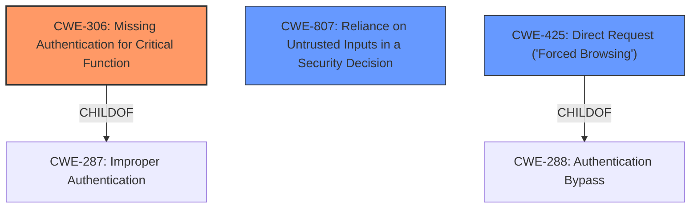

# Analysis for CVE-2021-24917

# Summary
| CWE ID | CWE Name | Confidence | CWE Abstraction Level | CWE Vulnerability Mapping Label | CWE-Vulnerability Mapping Notes |
|---|---|---|---|---|---|
| CWE-306 | Missing Authentication for Critical Function | 0.8 | Base | Primary | Allowed |
| CWE-807 | Reliance on Untrusted Inputs in a Security Decision | 0.7 | Base | Secondary | Allowed |
| CWE-425 | Direct Request ('Forced Browsing') | 0.6 | Base | Secondary | Allowed |

## Evidence and Confidence

*   **Confidence Score:** 0.8
*   **Evidence Strength:** HIGH

## Relationship Analysis
The primary weakness is CWE-306 **Missing Authentication for Critical Function**, as the plugin **fails to implement any authentication** for a critical function, exposing the secret login page. This is supported by the CVE details indicating that the plugin "does not correctly validate the source of the request". CWE-807 **Reliance on Untrusted Inputs in a Security Decision**, is a related secondary weakness, as the plugin **relies on the Referer header, which is an untrusted input**, to make a security decision. CWE-425 **Direct Request ('Forced Browsing')** also applies because the plugin doesn't adequately enforce authorization, allowing direct access to restricted URLs. All three are Base level CWEs.

## Vulnerability Chain
The chain of events starts with the **lack of authentication (CWE-306)** for accessing the `/wp-admin/options.php` page. The plugin then **relies on an untrusted input (CWE-807)**, the `Referer` header, which can be easily manipulated by an attacker. This leads to an **authorization bypass (CWE-425)**, allowing the attacker to access the secret login page.

## Summary of Analysis
The primary CWE is CWE-306 **Missing Authentication for Critical Function** because the core issue is the complete absence of authentication for the critical function of accessing the options page, which should be protected. The vulnerability description key phrases support this by highlighting that an "unauthenticated user" can "get the secret login page" by manipulating the "referer string." The CVE Reference Links Content Summary confirms that the plugin "does not correctly validate the source of the request" and "fails to properly check if a user is authenticated."

CWE-807 **Reliance on Untrusted Inputs in a Security Decision** is a secondary weakness, as the plugin relies on the `Referer` header, an untrusted input, for some level of validation, which can be easily bypassed.

CWE-425 **Direct Request ('Forced Browsing')** is also applicable because the plugin doesn't adequately enforce authorization, allowing direct access to restricted URLs. This is further highlighted by the CVE Reference Links Content Summary stating the attack vector is a "Direct HTTP Request" to `/wp-admin/options.php`.

The retriever results list CWE-863 **Incorrect Authorization** as a possibility, and the CVE does list this CWE, but CWE-306 **Missing Authentication for Critical Function** is more accurate as there is no authentication occurring at all, rather than an incorrect authorization check.

CWE-352 **Cross-Site Request Forgery (CSRF)** was considered, but it requires the user to be tricked into making a request. In this case, the attacker directly makes the request.

Relevant CWE Information:
# Enhanced Context (25 CWEs)
The following CWEs were identified as potentially relevant to this vulnerability:

## CWE-208: Observable Timing Discrepancy
**Abstraction Level**: Base
**Similarity Score**: 0.81
**Source**: dense
**Description**:
Two separate operations in a product require different amounts of time to complete, in a way that is observable to an actor and reveals security-relevant information about the state of the product, such as whether a particular operation was successful or not.
*This CWE is not applicable as the vulnerability is not based on timing discrepancies*

## CWE-203: Observable Discrepancy
**Abstraction Level**: Base
**Similarity Score**: 0.78
**Source**: dense
**Description**:
The product behaves differently or sends different responses under different circumstances in a way that is observable to an unauthorized actor, which exposes security-relevant information about the state of the product, such as whether a particular operation was successful or not.
*This CWE is not applicable as the vulnerability is not based on discrepancies in behavior.*

## CWE-204: Observable Response Discrepancy
**Abstraction Level**: Base
**Similarity Score**: 0.78
**Source**: dense
**Description**:
The product provides different responses to incoming requests in a way that reveals internal state information to an unauthorized actor outside of the intended control sphere.
*This CWE is not applicable as the vulnerability is not based on discrepancies in the response.*

## CWE-345: Insufficient Verification of Data Authenticity
**Abstraction Level**: Class
**Similarity Score**: 0.78
**Source**: dense
**Description**:
The product does not sufficiently verify the origin or authenticity of data, in a way that causes it to accept invalid data.
*This CWE is not applicable as the vulnerability is not based on verifying data authenticity.*

## CWE-807: Reliance on Untrusted Inputs in a Security Decision
**Abstraction Level**: Base
**Similarity Score**: 0.77
**Source**: dense
**Description**:
The product uses a protection mechanism that relies on the existence or values of an input, but the input can be modified by an untrusted actor in a way that bypasses the protection mechanism.
*This CWE is applicable as a secondary weakness because the plugin relies on the Referer header, an untrusted input, to make a security decision*

## CWE-41: Improper Resolution of Path Equivalence
**Abstraction Level**: Base
**Similarity Score**: 0.77
**Source**: dense
**Description**:
The product is vulnerable to file system contents disclosure through path equivalence. Path equivalence involves the use of special characters in file and directory names. The associated manipulations are intended to generate multiple names for the same object.
*This CWE is not applicable as the vulnerability is not based on path equivalence.*

## CWE-330: Use of Insufficiently Random Values
**Abstraction Level**: Class
**Similarity Score**: 0.77
**Source**: dense
**Description**:
The product uses insufficiently random numbers or values in a security context that depends on unpredictable numbers.
*This CWE is not applicable as the vulnerability is not based on random values.*

## CWE-668: Exposure of Resource to Wrong Sphere
**Abstraction Level**: Class
**Similarity Score**: 0.77
**Source**: dense
**Description**:
The product exposes a resource to the wrong control sphere, providing unintended actors with inappropriate access to the resource.
*This CWE is too broad and less precise than CWE-306.*

## CWE-303: Incorrect Implementation of Authentication Algorithm
**Abstraction Level**: Base
**Similarity Score**: 0.77
**Source**: dense
**Description**:
The requirements for the product dictate the use of an established authentication algorithm, but the implementation of the algorithm is incorrect.
*This CWE is not applicable as there is no authentication algorithm present.*

## CWE-1391: Use of Weak Credentials
**Abstraction Level**: Class
**Similarity Score**: 0.77
**Source**: dense
**Description**:
The product uses weak credentials (such as a default key or hard-coded password) that can be calculated, derived, reused, or guessed by an attacker.
*This CWE is not applicable as there are no credentials involved.*

## CWE-863: Incorrect Authorization
**Abstraction Level**: Class
**Similarity Score**: 5305.33
**Source**: sparse
**Description**:
The product performs an authorization check when an actor attempts to access a resource or perform an action, but it does not correctly perform the check.
*While related, this is not the primary issue as there is no authorization check performed at all.*

## CWE-425: Direct Request ('Forced Browsing')
**Abstraction Level**: Base
**Similarity Score**: 5249.82
**Source**: sparse
**Description**:
The web application does not adequately enforce appropriate authorization on all restricted URLs, scripts, or files.
*