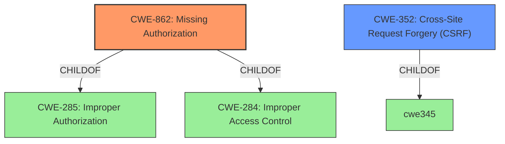

# Analysis for CVE-2021-25116

# Summary
| CWE ID | CWE Name | Confidence | CWE Abstraction Level | CWE Vulnerability Mapping Label | CWE-Vulnerability Mapping Notes |
|---|---|---|---|---|---|
| CWE-862 | Missing Authorization | 0.9 | Class | Primary | Allowed-with-Review |
| CWE-352 | Cross-Site Request Forgery (CSRF) | 0.8 | Compound | Secondary | Allowed |

## Evidence and Confidence

*   **Confidence Score:** 0.85
*   **Evidence Strength:** HIGH

## Relationship Analysis
The primary weakness is the **lack of authorization** (CWE-862), which is a child of CWE-285 (Improper Authorization) and CWE-284 (Improper Access Control). The vulnerability also involves **lack of CSRF protection** (CWE-352), which is a compound weakness requiring multiple conditions. CWE-862 represents the missing authorization check in the `remove_asset` AJAX action, and CWE-352 represents the lack of CSRF protection. The relationships between these CWEs help clarify the different facets of the vulnerability.

## Vulnerability Chain
The vulnerability chain starts with the **lack of authorization checks** and **lack of CSRF protection** in the `remove_asset` AJAX action. This allows low-privilege users to **delete arbitrary assets** and **put arbitrary posts in the trash**. The root cause is the **missing authorization** and **CSRF** checks, while the impact is the unauthorized deletion of assets and posts.

## Summary of Analysis
Based on the provided evidence, the most appropriate CWEs for this vulnerability are CWE-862 (Missing Authorization) and CWE-352 (Cross-Site Request Forgery). The "**rootcause: lack of authorization and CSRF checks**" phrase from the vulnerability description directly supports the selection of these CWEs. The CVE Reference Links Content Summary confirms that the `remove_asset` AJAX action **lacks authorization and CSRF checks**.

CWE-862 is selected because the plugin **does not perform an authorization check** when a user attempts to remove an asset. This allows low-privilege users to perform actions they are not authorized to perform.
CWE-352 is selected because the plugin **does not sufficiently verify** that the request was intentionally provided by the user. This makes the plugin vulnerable to CSRF attacks.

The selected CWEs are at an appropriate level of specificity. CWE-862 is a Class-level CWE, but there isn't a more specific Base-level child that better represents the vulnerability. CWE-352 is a Compound CWE, which is appropriate for this vulnerability because it involves multiple weaknesses.

Relevant CWE Information:

# Enhanced Context (25 CWEs)
The following CWEs were identified as potentially relevant to this vulnerability:

## CWE-807: Reliance on Untrusted Inputs in a Security Decision
**Abstraction Level**: Base
**Similarity Score**: 0.77
**Source**: dense

**Description**:
The product uses a protection mechanism that relies on the existence or values of an input, but the input can be modified by an untrusted actor in a way that bypasses the protection mechanism.
*This CWE was not selected because it's not the most descriptive of the vulnerability.*

## CWE-639: Authorization Bypass Through User-Controlled Key
**Abstraction Level**: Base
**Similarity Score**: 0.76
**Source**: dense

**Description**:
The system's authorization functionality does not prevent one user from gaining access to another user's data or record by modifying the key value identifying the data.
*This CWE was not selected because the vulnerability is due to a complete lack of authorization, not an authorization bypass through a user-controlled key.*

## CWE-472: External Control of Assumed-Immutable Web Parameter
**Abstraction Level**: Base
**Similarity Score**: 0.76
**Source**: dense

**Description**:
The web application does not sufficiently verify inputs that are assumed to be immutable but are actually externally controllable, such as hidden form fields.
*This CWE was not selected because the vulnerability is not about the modification of assumed-immutable parameters, but about the lack of authorization and CSRF protection.*

## CWE-425: Direct Request ('Forced Browsing')
**Abstraction Level**: Base
**Similarity Score**: 0.75
**Source**: dense

**Description**:
The web application does not adequately enforce appropriate authorization on all restricted URLs, scripts, or files.
*This CWE was not selected because the main issue is the **lack of authorization checks** on an AJAX action, rather than the overall enforcement of authorization on URLs.*

## CWE-1220: Insufficient Granularity of Access Control
**Abstraction Level**: Base
**Similarity Score**: 0.75
**Source**: dense

**Description**:
The product implements access controls via a policy or other feature with the intention to disable or restrict accesses (reads and/or writes) to assets in a system from untrusted agents. However, implemented access controls lack required granularity, which renders the control policy too broad because it allows accesses from unauthorized agents to the security-sensitive assets.
*This CWE was not selected because there is no existing access control that lacks granularity; access control is simply missing.*

## CWE-799: Improper Control of Interaction Frequency
**Abstraction Level**: Class
**Similarity Score**: 0.75
**Source**: dense

**Description**:
The product does not properly limit the number or frequency of interactions that it has with an actor, such as the number of incoming requests.
*This CWE was not selected because it doesn't describe the authorization issue.*

## CWE-1390: Weak Authentication
**Abstraction Level**: Class
**Similarity Score**: 0.75
**Source**: dense

**Description**:
The product uses an authentication mechanism to restrict access to specific users or identities, but the mechanism does not sufficiently prove that the claimed identity is correct.
*This CWE was not selected because it is about weak authentication, while the description specifies that there is a **lack of authorization and CSRF checks**.*

## CWE-1289: Improper Validation of Unsafe Equivalence in Input
**Abstraction Level**: Base
**Similarity Score**: 0.75
**Source**: dense

**Description**:
The product receives an input value that is used as a resource identifier or other type of reference, but it does not validate or incorrectly validates that the input is equivalent to a potentially-unsafe value.
*This CWE was not selected because it doesn't describe the authorization issue.*

## CWE-41: Improper Resolution of Path Equivalence
**Abstraction Level**: Base
**Similarity Score**: 0.75
**Source**: dense

**Description**:
The product is vulnerable to file system contents disclosure through path equivalence. Path equivalence involves the use of special characters in file and directory names. The associated manipulations are intended to generate multiple names for the same object.
*This CWE was not selected because it doesn't describe the authorization issue.*

## CWE-184: Incomplete List of Disallowed Inputs
**Abstraction Level**: Base
**Similarity Score**: 0.75
**Source**: dense

**Description**:
The product implements a protection mechanism that relies on a list of inputs (or properties of inputs) that are not allowed by policy or otherwise require other action to neutralize before additional processing takes place, but the list is incomplete.
*This CWE was not selected because it doesn't describe the authorization issue.*

## CWE-863: Incorrect Authorization
**Abstraction Level**: Class
**Similarity Score**: 6453.50
**Source**: sparse

**Description**:
The product performs an authorization check when an actor attempts to access a resource or perform an action, but it does not correctly perform the check.
*This CWE was not selected because the plugin **does not perform authorization checks**, and not because it performs them incorrectly.*

## CWE-285: Improper Authorization
**Abstraction Level**: Class
**Similarity Score**: 6376.63
**Source**: sparse

**Description**:
The product does not perform or incorrectly performs an authorization check when an actor attempts to access a resource or perform an action.
*This CWE was not selected because the plugin **does not perform authorization checks**, and not because it performs them incorrectly.*

## CWE-116: Improper Encoding or Esc