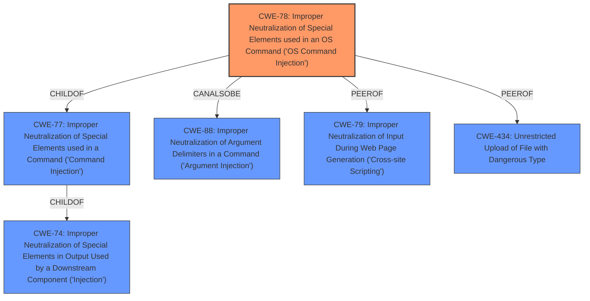

# Enhanced Analysis for CVE-2021-25296

# Summary
| CWE ID | CWE Name | Confidence | CWE Abstraction Level | CWE Vulnerability Mapping Label | CWE-Vulnerability Mapping Notes |
|---|---|---|---|---|---|
| CWE-78 | Improper Neutralization of Special Elements used in an OS Command ('OS Command Injection') | 1.0 | Base | Allowed | Primary CWE |

## Evidence and Confidence

*   **Confidence Score:** 1.0
*   **Evidence Strength:** HIGH

## Relationship Analysis
The primary relationship that influenced the decision was the ChildOf relationship between CWE-78 and CWE-77, and also peer relationships with CWE-88, CWE-79, and CWE-434. While CWE-77 is a parent Class of CWE-78, CWE-78 is a more specific Base that accurately reflects the **OS command injection** vulnerability. The other peer CWEs were considered but deemed less relevant as they describe different injection types.



## Vulnerability Chain
The vulnerability chain starts with **improper input sanitization**, leading to **OS command injection**. An authenticated user can inject malicious commands via the `plugin_output_len` parameter, which are then executed on the Nagios XI server.
  - **Root Cause:** **Improper input sanitization** of the `plugin_output_len` parameter.
  - **Weakness:** **OS command injection** due to the lack of neutralization of special elements.
  - **Impact:** Arbitrary code execution on the server, potentially leading to system compromise.

## Summary of Analysis
The analysis is based on the provided vulnerability description, the CVE Reference Links Content Summary, and the Retriever results. The key evidence includes the **root cause** identified as **improper input sanitization** and the resulting **weakness** as **OS command injection**.

The CVE Reference Links Content Summary explicitly states: "The root cause is the lack of sanitization of the `plugin_output_len` variable in the `windowswmi.inc.php` file. This user-controlled variable is directly appended to shell commands, allowing for command injection."

The Retriever results strongly suggest CWE-78 as the primary candidate, with a score of 1.0. CWE-78 (Improper Neutralization of Special Elements used in an OS Command ('OS Command Injection')) aligns perfectly with the vulnerability description, which mentions that the **improper sanitization** leads to the ability to inject and execute arbitrary OS commands.

CWE-78 is chosen as the optimal level of specificity because it clearly describes the specific type of injection occurring (OS command injection) compared to its parent class CWE-77. The mapping guidance for CWE-78 also states that it is at the Base level of abstraction, which is a preferred level for mapping root causes.
Other CWEs such as CWE-79 (Cross-site Scripting), CWE-89 (SQL Injection), CWE-434 (Unrestricted Upload of File with Dangerous Type), and CWE-94 (Code Injection) were considered but deemed less relevant because they describe different types of injection vulnerabilities.
CWE-20 (Improper Input Validation) was considered as a high-level cause, but CWE-78 provides a more specific description of the vulnerability.
CWE-184 (Incomplete List of Disallowed Inputs) was considered but the evidence points more directly to a lack of sanitization than an incomplete denylist.
The final decision is based on the direct evidence of **OS command injection** resulting from **improper input sanitization**, aligning with the CWE-78 description and mapping guidance.


## CWE Relationship Analysis

Current CWEs represent these abstraction levels: .


### Vulnerability Chain Analysis

**Chain starting from CWE-79:**
- 79 (Improper Neutralization of Input During Web Page Generation ('Cross-site Scripting')) - ROOT


**Chain starting from CWE-88:**
- 88 (Improper Neutralization of Argument Delimiters in a Command ('Argument Injection')) - ROOT


### CWE Relationship Diagram

```mermaid
graph TD
    classDef primary fill:#f96,stroke:#333,stroke-width:2px
    classDef secondary fill:#69f,stroke:#333
    classDef tertiary fill:#9e9,stroke:#333
```