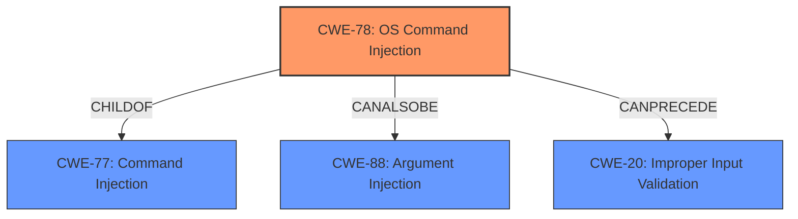

# Analysis Report for CVE-2021-25297

# Vulnerability Analysis Report: CVE-2021-25297

## Description


## Analysis (with Relationship Data)

# Summary
| CWE ID | CWE Name | Confidence | CWE Abstraction Level | CWE Vulnerability Mapping Label | CWE-Vulnerability Mapping Notes |
|---|---|---|---|---|---|
| CWE-78 | Improper Neutralization of Special Elements used in an OS Command ('OS Command Injection') | 1.0 | Base | Allowed | Primary CWE |
| CWE-20 | Improper Input Validation | 0.7 | Class | Discouraged | Secondary Candidate |

## Evidence and Confidence

*   **Confidence Score:** 0.9
*   **Evidence Strength:** HIGH

## Relationship Analysis
The primary relationship impacting the decision is the ChildOf relationship between CWE-78 and CWE-77, where CWE-78 is a more specific case of CWE-77, which is a command injection. The vulnerability description explicitly mentions "OS command injection," making CWE-78 the more appropriate choice. CWE-78 also has a CanAlsoBe relationship with CWE-88 (Improper Neutralization of Argument Delimiters in a Command), which could be a secondary weakness if the injection occurs through argument manipulation. CWE-20 is a general class and is discouraged when a more specific CWE is available.



## Vulnerability Chain
The vulnerability chain starts with **improper sanitization** of user-controlled input, leading to **OS command injection**.

1.  **Improper Sanitization:** The root cause is the **improper sanitization** of user-controlled input.
2.  **OS Command Injection:** This leads directly to **OS command injection**, where an attacker can execute arbitrary commands.

## Summary of Analysis
The analysis concludes that CWE-78 (Improper Neutralization of Special Elements used in an OS Command ('OS Command Injection')) is the most appropriate CWE for this vulnerability. This decision is based on the explicit mention of "OS command injection" in the vulnerability description and the root cause being **improper sanitization** of input used in constructing OS commands.

The vulnerability description states: "Nagios XI version xi-5.7.5 is affected by **OS command injection**. The vulnerability exists in the file /usr/local/nagiosxi/html/includes/configwizards/switch/switch.inc.php due to **improper sanitization** of authenticated user-controlled input by a single HTTP request, which can lead to **OS command injection** on the Nagios XI server."

The "CVE Reference Links Content Summary" also confirms this: "The vulnerability stems from the lack of sanitization of user-controlled input, specifically the `ip_address` parameter, when constructing a filename and executing a command via the `exec()` function in PHP... The primary vulnerability is command injection, where an attacker can inject arbitrary shell commands into a command being executed by the server due to the lack of input sanitization."

CWE-78 is at the Base level of abstraction, which is preferred for root cause analysis. While CWE-77 (Improper Neutralization of Special Elements used in a Command ('Command Injection')) is a parent Class, CWE-78 is more specific and directly addresses the OS command context. CWE-20 (Improper Input Validation) is a broader Class and less precise than CWE-78 in this context.

Based on the available evidence and the specificity of CWE-78, it is the most appropriate choice for this vulnerability.

Relevant CWE Information:

# Enhanced Context (25 CWEs)
The following CWEs were identified as potentially relevant to this vulnerability:

## CWE-1289: Improper Validation of Unsafe Equivalence in Input
**Abstraction Level**: Base
**Similarity Score**: 0.76
**Source**: dense

**Description**:
The product receives an input value that is used as a resource identifier or other type of reference, but it does not validate or incorrectly validates that the input is equivalent to a potentially-unsafe value.

**Mapping Guidance**:
- Usage: Allowed
- Rationale: This CWE entry is at the Base level of abstraction, which is a preferred level of abstraction for mapping to the root causes of vulnerabilities.

**Why Not Used:** Not applicable, the vulnerability is not about validating equivalence.

## CWE-807: Reliance on Untrusted Inputs in a Security Decision
**Abstraction Level**: Base
**Similarity Score**: 0.74
**Source**: dense

**Description**:
The product uses a protection mechanism that relies on the existence or values of an input, but the input can be modified by an untrusted actor in a way that bypasses the protection mechanism.

**Mapping Guidance**:
- Usage: Allowed
- Rationale: This CWE entry is at the Base level of abstraction, which is a preferred level of abstraction for mapping to the root causes of vulnerabilities.

**Why Not Used:** While the product relies on untrusted input, the core issue is the injection of commands, not the reliance on the input for a security decision.

## CWE-184: Incomplete List of Disallowed Inputs
**Abstraction Level**: Base
**Similarity Score**: 0.74
**Source**: dense

**Description**:
The product implements a protection mechanism that relies on a list of inputs (or properties of inputs) that are not allowed by policy or otherwise require other action to neutralize before additional processing takes place, but the list is incomplete.

**Mapping Guidance**:
- Usage: Allowed
- Rationale: This CWE entry is at the Base level of abstraction, which is a preferred level of abstraction for mapping to the root causes of vulnerabilities.

**Why Not Used:** The vulnerability doesn't stem from an incomplete list of disallowed inputs but from the **improper sanitization** of inputs.

## CWE-179: Incorrect Behavior Order: Early Validation
**Abstraction Level**: Base
**Similarity Score**: 0.73
**Source**: dense

**Description**:
The product validates input before applying protection mechanisms that modify the input, which could allow an attacker to bypass the validation via dangerous inputs that only arise after the modification.

**Mapping Guidance**:
- Usage: Allowed
- Rationale: This CWE entry is at the Base level of abstraction, which is a preferred level of abstraction for mapping to the root causes of vulnerabilities.

**Why Not Used:** There is no evidence of early validation in the vulnerability description.

## CWE-1288: Improper Validation of Consistency within Input
**Abstraction Level**: Base
**Similarity Score**: 0.73
**Source**: dense

**Description**:
The product receives a complex input with multiple elements or fields that must be consistent with each other, but it does not validate or incorrectly validates that the input is actually consistent.

**Mapping Guidance**:
- Usage: Allowed
- Rationale: This CWE entry is at the Base level of abstraction, which is a preferred level of abstraction for mapping to the root causes of vulnerabilities.

**Why Not Used:** The vulnerability doesn't involve validating consistency within a complex input.

## CWE-138: Improper Neutralization of Special Elements
**Abstraction Level**: Class
**Similarity Score**: 0.73
**Source**: dense

**Description**:
The product receives input from an upstream component, but it does not neutralize or incorrectly neutralizes special elements that could be interpreted as control elements or syntactic markers when they are sent to a downstream component.

**Mapping Guidance**:
- Usage: Discouraged
- Rationale: This CWE entry is a level-1 Class (i.e., a child of a Pillar). It might have lower-level children that would be more appropriate

**Why Not Used:** Although the description matches, it's a Class-level CWE, and CWE-78 is a more specific Base-level CWE.

## CWE-74: Improper Neutralization of Special Elements in Output Used by a Downstream Component ('Injection')
**Abstraction Level**: Class
**Similarity Score**: 0.73
**Source**: dense

**Description**:
The product constructs all or part of a command, data structure, or record using externally-influenced input from an upstream component, but it does not neutralize or incorrectly neutralizes special elements that could modify how it is parsed or interpreted when it is sent to a downstream component.

**Mapping Guidance**:
- Usage: Discouraged
- Rationale: CWE-74 is high-level and often misused when lower-level weaknesses are more appropriate.

**Why Not Used:** CWE-78 is a specific child of CWE-74 and is a better fit.

## CWE-838: Inappropriate Encoding for Output Context
**Abstraction Level**: Base
**Similarity Score**: 0.73
**Source**: dense

**Description**:
The product uses or specifies an encoding when generating output to


## CWE Relationship Analysis

Current CWEs represent these abstraction levels: .


### Vulnerability Chain Analysis

**Chain starting from CWE-838:**
- 838 (Inappropriate Encoding for Output Context) - ROOT


**Chain starting from CWE-88:**
- 88 (Improper Neutralization of Argument Delimiters in a Command ('Argument Injection')) - ROOT


### CWE Relationship Diagram

```mermaid
graph TD
    classDef primary fill:#f96,stroke:#333,stroke-width:2px
    classDef secondary fill:#69f,stroke:#333
    classDef tertiary fill:#9e9,stroke:#333
```


*Report generated on 2025-04-02 14:14:49*
