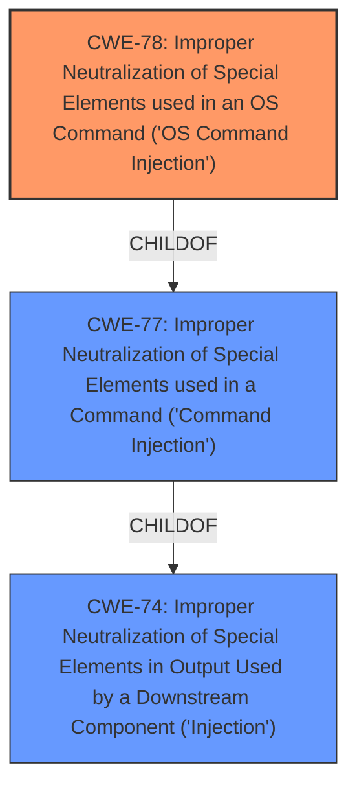

# Enhanced Analysis for CVE-2021-25298

# Summary
| CWE ID | CWE Name | Confidence | CWE Abstraction Level | CWE Vulnerability Mapping Label | CWE-Vulnerability Mapping Notes |
|---|---|---|---|---|---|
| CWE-78 | Improper Neutralization of Special Elements used in an OS Command ('OS Command Injection') | 1.0 | Base | Allowed | Primary CWE |

## Evidence and Confidence

*   **Confidence Score:** 1.0
*   **Evidence Strength:** HIGH

## Relationship Analysis
The primary relationship that influenced the decision was the ChildOf relationship between CWE-78 and CWE-77, and CWE-74. CWE-78 is a base-level CWE, indicating a more specific type of command injection, which aligns well with the vulnerability description.



## Vulnerability Chain
The vulnerability chain begins with the **improper sanitization** of user-controlled input, leading directly to **OS command injection**. The lack of proper input handling allows an authenticated user to inject malicious commands that are then executed by the Nagios XI server.

## Summary of Analysis
The initial analysis strongly suggests that CWE-78 is the most appropriate mapping for this vulnerability. The vulnerability description explicitly states that the Nagios XI version xi-5.7.5 is affected by **OS command injection** due to **improper sanitization** of authenticated user-controlled input. The CVE Reference Links Content Summary confirms this by stating, "The application does not properly sanitize user-supplied input when constructing a command to be executed by the operating system, leading to command injection."

The Retriever Results also support this choice, with CWE-78 being the top-ranked CWE with a score of 1.000. The relationship analysis further reinforces this decision, as CWE-78 is a base-level CWE that is a child of CWE-77 (Improper Neutralization of Special Elements used in a Command) and CWE-74 (Improper Neutralization of Special Elements in Output Used by a Downstream Component ('Injection')). This hierarchical relationship indicates that CWE-78 is a more specific type of command injection, which aligns well with the vulnerability description.

The mapping guidance for CWE-78 states that it is at the Base level of abstraction, which is a preferred level of abstraction for mapping to the root causes of vulnerabilities. The guidance also states that it is allowed and that the name and description should be carefully read to ensure that the mapping is an appropriate fit.

Based on the evidence and analysis, CWE-78 is the optimal choice for this vulnerability.

Relevant CWE Information:

# Enhanced Context (25 CWEs)

## CWE-78: Improper Neutralization of Special Elements used in an OS Command ('OS Command Injection')
**Abstraction:** Base
**Similarity Score**: 5.03

**Description**:
The product constructs all or part of an OS command using externally-influenced input from an upstream component, but it does not neutralize or incorrectly neutralizes special elements that could modify the intended OS command when it is sent to a downstream component.

**Rationale:** The vulnerability description explicitly mentions **OS command injection**, and the root cause is **improper sanitization** of user-controlled input. This aligns perfectly with the description of CWE-78. The "CVE Reference Links Content Summary" further supports this by stating that the application does not properly sanitize user-supplied input, leading to command injection.


## CWE Relationship Analysis

Current CWEs represent these abstraction levels: .


### Vulnerability Chain Analysis

**Chain starting from CWE-78:**
- 78 (Improper Neutralization of Special Elements used in an OS Command ('OS Command Injection')) - ROOT


**Chain starting from CWE-77:**
- 77 (Improper Neutralization of Special Elements used in a Command ('Command Injection')) - ROOT


### CWE Relationship Diagram

```mermaid
graph TD
    classDef primary fill:#f96,stroke:#333,stroke-width:2px
    classDef secondary fill:#69f,stroke:#333
    classDef tertiary fill:#9e9,stroke:#333
```