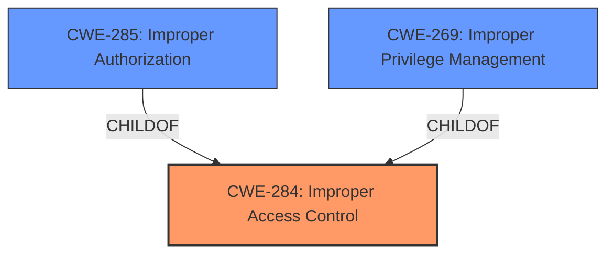

# Raw Analyzer Response for CVE-2021-25337

# Summary
| CWE ID | CWE Name | Confidence | CWE Abstraction Level | CWE Vulnerability Mapping Label | CWE-Vulnerability Mapping Notes |
|---|---|---|---|---|---|
| CWE-284 | Improper Access Control | 0.8 | Pillar | Discouraged | The vulnerability description explicitly mentions "**Improper access control**" as the root cause. While CWE-284 is a high-level Pillar, it aligns directly with the described weakness. |

## Evidence and Confidence

*   **Confidence Score:** 0.8
*   **Evidence Strength:** MEDIUM

## Relationship Analysis
CWE-284 is a Pillar-level CWE, meaning it's a very high-level category. While more specific CWEs exist, the description's direct mention of "**Improper access control**" makes it a reasonable starting point. The Retriever Results suggested other CWEs like CWE-285 (Improper Authorization) and CWE-269 (Improper Privilege Management), which are children of CWE-284. However, without more specific details about the type of access control issue (authorization vs. privilege management), sticking with the high-level CWE-284 is appropriate.

## Vulnerability Chain
The vulnerability chain is relatively simple:
1.  **Root Cause:** **Improper access control** (CWE-284) in the clipboard service.
2.  **Impact:** Untrusted applications can read or write certain local files.

## Summary of Analysis
The initial analysis focused on the vulnerability description's key phrase "**Improper access control**". The Retriever Results provided several candidate CWEs, but many were more specific than the available information allowed. For example, CWE-285 (Improper Authorization) and CWE-269 (Improper Privilege Management) could be applicable, but the description doesn't provide enough detail to differentiate between authorization and privilege management issues.

The MITRE mapping guidance discourages the use of CWE-284 due to its high level of abstraction. However, in this case, the direct match with the "**Improper access control**" phrase provides sufficient justification for its use, especially given the limited information. While a more specific CWE would be preferable, it's not possible to select one without further information. Therefore, CWE-284 is chosen as the primary CWE with a confidence level of 0.8. This score reflects the direct match with the description, but acknowledges the desirability of a more specific classification.

The selection of CWE-284 is based on the explicit mention of "**Improper access control**" in the vulnerability description. The relationships analysis confirms that more specific CWEs exist (e.g., CWE-285, CWE-269), but the lack of detail prevents their selection. The MITRE mapping guidance is considered, but overridden due to the direct match with the vulnerability description. The selected CWE is at the optimal level of specificity given the available evidence.

Relevant CWE Information: