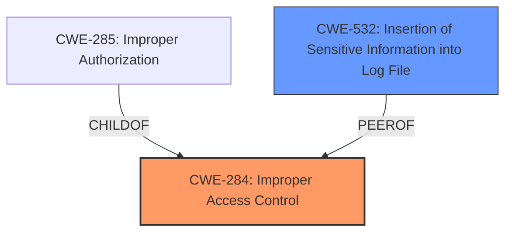

# Analysis Report for CVE-2021-25369

# Vulnerability Analysis Report: CVE-2021-25369

## Description


## Analysis (with Relationship Data)

# Summary
| CWE ID | CWE Name | Confidence | CWE Abstraction Level | CWE Vulnerability Mapping Label | CWE-Vulnerability Mapping Notes |
|---|---|---|---|---|---|
| CWE-284 | Improper Access Control | 0.7 | Pillar | Primary | Discouraged |
| CWE-532 | Insertion of Sensitive Information into Log File | 0.6 | Base | Secondary | Allowed |

## Evidence and Confidence

*   **Confidence Score:** 0.7
*   **Evidence Strength:** MEDIUM

## Relationship Analysis
The primary selected CWE is CWE-284, which is a Pillar and is the highest level of abstraction. The retriever results also include CWE-285 Improper Authorization which is a child of CWE-284. The relationship analysis indicates that there could be lower level CWEs that could be better.



## Vulnerability Chain
The vulnerability chain starts with the **improper access control** (CWE-284) on the sec_log file which results in the **exposure of sensitive kernel information** (CWE-532).

## Summary of Analysis
Initially, the analysis focused on the **improper access control** as the primary weakness, aligning with CWE-284. However, due to the high-level nature of CWE-284 (Pillar), and the presence of more specific child CWEs like CWE-285, a deeper analysis was performed. The key phrase "exposes sensitive kernel information" indicates that the sensitive information is being written to the log file.

The decision to include CWE-532 is based on the evidence: "exposes sensitive kernel information to userspace". This indicates that sensitive information is being written to a log file.

The final selection of CWEs aims for the optimal level of specificity by including both the general **improper access control** issue (CWE-284) and the specific consequence of **exposing sensitive kernel information** (CWE-532).

Relevant CWE Information:

# Enhanced Context (25 CWEs)

## CWE-404: Improper Resource Shutdown or Release
**Abstraction Level**: Class
**Similarity Score**: 0.76
**Source**: dense

**Description**:
The product does not release or incorrectly releases a resource before it is made available for re-use.
**Reasons for not selecting:** This CWE is about resource management, not access control or information exposure, so it doesn't fit the vulnerability description.

## CWE-668: Exposure of Resource to Wrong Sphere
**Abstraction Level**: Class
**Similarity Score**: 0.76
**Source**: dense

**Description**:
The product exposes a resource to the wrong control sphere, providing unintended actors with inappropriate access to the resource.
**Reasons for not selecting:** While related to exposure, this is a high-level class. The exposure of kernel information is more directly related to logging sensitive data, making CWE-532 a better fit.

## CWE-274: Improper Handling of Insufficient Privileges
**Abstraction Level**: Base
**Similarity Score**: 0.76
**Source**: dense

**Description**:
The product does not handle or incorrectly handles when it has insufficient privileges to perform an operation, leading to resultant weaknesses.
**Reasons for not selecting:** The vulnerability is about *improper* access control, not handling *insufficient* privileges.

## CWE-280: Improper Handling of Insufficient Permissions or Privileges 
**Abstraction Level**: Base
**Similarity Score**: 0.76
**Source**: dense

**Description**:
The product does not handle or incorrectly handles when it has insufficient privileges to access resources or functionality as specified by their permissions. This may cause it to follow unexpected code paths that may leave the product in an invalid state.
**Reasons for not selecting:** This CWE focuses on the *handling* of insufficient permissions, not the root cause of *improper* access control.

## CWE-667: Improper Locking
**Abstraction Level**: Class
**Similarity Score**: 0.76
**Source**: dense

**Description**:
The product does not properly acquire or release a lock on a resource, leading to unexpected resource state changes and behaviors.
**Reasons for not selecting:** This CWE is about concurrency issues, not access control or information exposure.

## CWE-226: Sensitive Information in Resource Not Removed Before Reuse
**Abstraction Level**: Base
**Similarity Score**: 0.75
**Source**: dense

**Description**:
The product releases a resource such as memory or a file so that it can be made available for reuse, but it does not clear or "zeroize" the information contained in the resource before the product performs a critical state transition or makes the resource available for reuse by other entities.
**Reasons for not selecting:** This CWE is about resource reuse and clearing sensitive data, not access control or logging.

## CWE-754: Improper Check for Unusual or Exceptional Conditions
**Abstraction Level**: Class
**Similarity Score**: 0.75
**Source**: dense

**Description**:
The product does not check or incorrectly checks for unusual or exceptional conditions that are not expected to occur frequently during day to day operation of the product.
**Reasons for not selecting:** This CWE is about error handling, not access control or information exposure.

## CWE-664: Improper Control of a Resource Through its Lifetime
**Abstraction Level**: Pillar
**Similarity Score**: 0.75
**Source**: dense

**Description**:
The product does not maintain or incorrectly maintains control over a resource throughout its lifetime of creation, use, and release.
**Reasons for not selecting:** Too broad.

## CWE-665: Improper Initialization
**Abstraction Level**: Class
**Similarity Score**: 0.75
**Source**: dense

**Description**:
The product does not initialize or incorrectly initializes a resource, which might leave the resource in an unexpected state when it is accessed or used.
**Reasons for not selecting:** Not related to the described vulnerability.

## CWE-41: Improper Resolution of Path Equivalence
**Abstraction Level**: Base
**Similarity Score**: 0.75
**Source**: dense

**Description**:
The product is vulnerable to file system contents disclosure through path equivalence. Path equivalence involves the use of special characters in file and directory names. The associated manipulations are intended to generate multiple names for the same object.
**Reasons for not selecting:** Not related to the described vulnerability.

## CWE-863: Incorrect Authorization
**Abstraction Level**: Class
**Similarity Score**: 4982.12
**Source**: sparse

**Description**:
The product performs an authorization check when an actor attempts to access a resource or perform an action, but it does not correctly perform the check.
**Reasons for not selecting:** CWE-863 is more specific than CWE-284, but the description doesn't indicate whether the authorization check is performed *incorrectly*.

## CWE-285: Improper Authorization
**Abstraction Level**: Class
**Similarity Score**: 4927.28
**Source**: sparse

**Description**:
The product does not perform or incorrectly performs an authorization check when an actor attempts to access a resource or perform an action.
**Reasons for not selecting:** This is more specific than CWE-284, but still does not include details on the sensitive data.

## CWE-927: Use of Implicit Intent for Sensitive Communication
**Abstraction Level**: Variant
**Similarity Score**: 4920.49
**Source**: sparse

**Description**:
The Android application uses an implicit intent for transmitting sensitive data to other applications.
**Reasons for not selecting:** Android Specific.

## CWE-639: Authorization Bypass Through User-Controlled Key
**Abstraction Level**: Base
**Similarity Score**: 4858.93
**Source**: sparse

**Description**:
The system's authorization functionality does not prevent one user from gaining access to another user's data or record by modifying the key value identifying the data.
**Reasons for not selecting:** Not related to the described vulnerability.

## CWE-668: Exposure of Resource to Wrong Sphere
**Abstraction Level**: Class
**Similarity Score**: 4711.87
**Source**: sparse

**Description**:
The product exposes a resource to the wrong control sphere, providing unintended actors with inappropriate access to the resource.
**Reasons for not selecting:** It is a level-1 Class (i.e., a child of a Pillar). It is not useful for trend analysis.

## CWE-613: Insufficient Session Expiration
**Abstraction Level**: base
**Similarity Score**: 4.33
**Source**: graph


## CWE Relationship Analysis

Current CWEs represent these abstraction levels: .


### Vulnerability Chain Analysis

**Chain starting from CWE-613:**
- 613 (Insufficient Session Expiration) - ROOT


**Chain starting from CWE-280:**
- 280 (Improper Handling of Insufficient Permissions or Privileges ) - ROOT


### CWE Relationship Diagram

```mermaid
graph TD
    classDef primary fill:#f96,stroke:#333,stroke-width:2px
    classDef secondary fill:#69f,stroke:#333
    classDef tertiary fill:#9e9,stroke:#333
```


*Report generated on 2025-03-31 11:58:50*
