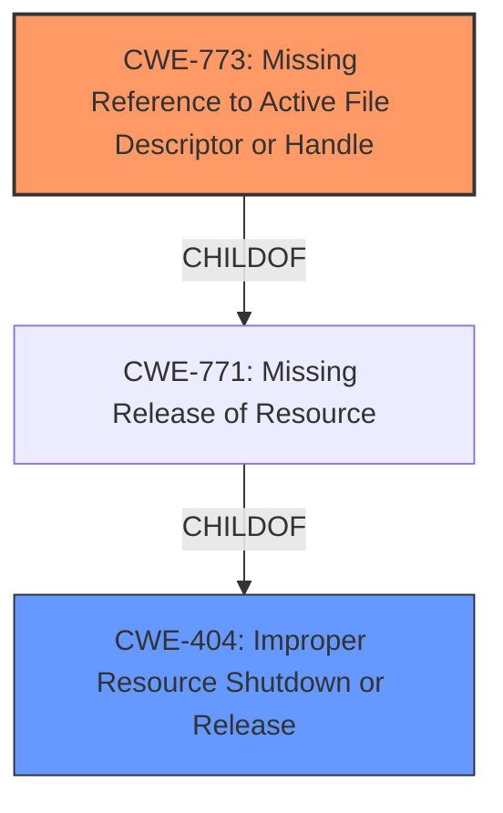

# Analysis for CVE-2021-25370

# Summary
| CWE ID  | CWE Name                     | Confidence | CWE Abstraction Level | CWE Vulnerability Mapping Label | CWE-Vulnerability Mapping Notes |
|---------|------------------------------|------------|-----------------------|---------------------------------|-----------------------------------|
| CWE-773 | Missing Reference to Active File Descriptor or Handle | 0.75       | Variant               | Allowed                           | Primary CWE                       |
| CWE-404 | Improper Resource Shutdown or Release | 0.5       | Class               | Allowed-with-Review                           | Secondary Candidate                       |

## Evidence and Confidence

*   **Confidence Score:** 0.7
*   **Evidence Strength:** MEDIUM

## Relationship Analysis
The primary relationship considered was the hierarchical structure with CWE-773 as a variant of CWE-771 (Missing Release of Resource) and ultimately related to CWE-404. The abstraction levels helped in selecting the most specific variant that matched the description.

## Vulnerability Chain
The chain of the vulnerability starts with an **incorrect implementation handling file descriptor**, which leads to a missing reference or improper release of the file descriptor and eventually results in memory corruption and kernel panic.

## Summary of Analysis
The initial assessment focused on identifying the root cause of the vulnerability, which is the **incorrect implementation handling file descriptor**. The description indicates that this **incorrect implementation** leads to memory corruption and kernel panic, suggesting a resource management issue.

The primary CWE selected is CWE-773 (Missing Reference to Active File Descriptor or Handle) because the **incorrect implementation handling file descriptor** directly aligns with the description of CWE-773, which states, "The product does not properly maintain references to a file descriptor or handle, which prevents that file descriptor/handle from being reclaimed." This maps directly to the **rootcause** listed in the "Vulnerability Description Key Phrases".

CWE-404 (Improper Resource Shutdown or Release) was considered as a secondary CWE because it's a broader category encompassing resource management issues. While the vulnerability leads to memory corruption, the root cause is more specifically related to the handling of file descriptors. CWE-773 provides a more precise classification of the **incorrect implementation** aspect.

The evidence for CWE-773 is derived from the "Vulnerability Description Key Phrases," specifically the **rootcause**, which mentions the **incorrect implementation handling file descriptor**.

The relationship graph illustrates how CWE-773 is a child of CWE-771, which in turn is a child of CWE-404. This hierarchical relationship helped in choosing the most specific CWE that accurately represents the vulnerability.

Other CWEs Considered:
- CWE-787 (Out-of-bounds Write): While the vulnerability results in memory corruption, the root cause is not directly related to writing beyond the bounds of a buffer. Therefore, CWE-787 is not the primary CWE.
- CWE-476 (NULL Pointer Dereference): There is no explicit mention of NULL pointer dereference in the vulnerability description, making this CWE less relevant.
- CWE-755 (Improper Handling of Exceptional Conditions): This CWE is too generic and does not specifically address the file descriptor handling issue.
- CWE-1285 (Improper Validation of Specified Index, Position, or Offset in Input): This CWE is not applicable since the vulnerability is not about validating indices or offsets.
- CWE-775 (Missing Release of File Descriptor or Handle after Effective Lifetime): Similar to CWE-773, but slightly less precise. CWE-773 focuses on the missing reference aspect, which aligns better with the **incorrect implementation handling file descriptor**.
- CWE-129 (Improper Validation of Array Index) and CWE-1284 (Improper Validation of Specified Quantity in Input) are not applicable as they deal with input validation issues related to array indices or quantities, which are not evident in the vulnerability description.
- CWE-908 (Use of Uninitialized Resource) is not applicable because the issue is with how the file descriptor is handled, not whether it's initialized.
- CWE-911 (Improper Update of Reference Count) may seem relevant, but the description focuses on the missing reference to the file descriptor rather than an explicit reference count issue.

The final selection of CWE-773 is based on its precise match to the **rootcause** described in the vulnerability description, making it the most appropriate classification.