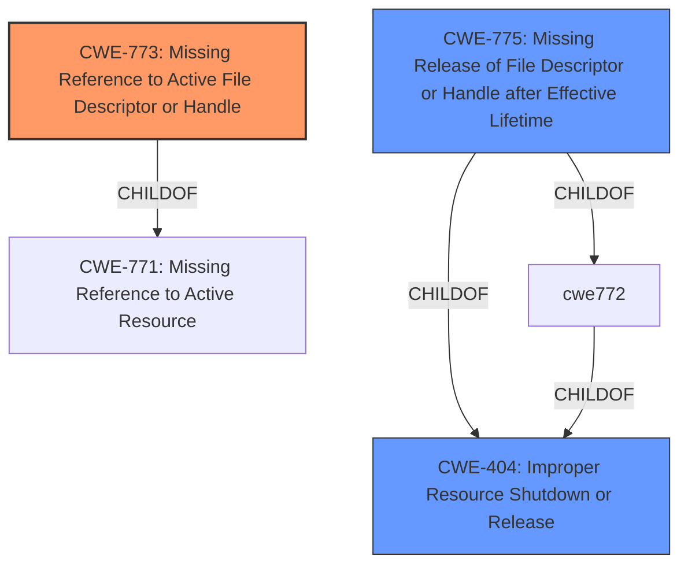

# Raw Analyzer Response for CVE-2021-25370

# Summary
| CWE ID  | CWE Name                                                                 | Confidence | CWE Abstraction Level | CWE Vulnerability Mapping Label | CWE-Vulnerability Mapping Notes |
| :-------- | :----------------------------------------------------------------------- | :---------- | :---------------------- | :------------------------------ | :------------------------------ |
| CWE-773 | Missing Reference to Active File Descriptor or Handle                   | 0.85       | Variant                 | Primary CWE                     | Allowed                       |
| CWE-404 | Improper Resource Shutdown or Release                                 | 0.60       | Class                   | Secondary Candidate             | Allowed-with-Review           |
| CWE-775 | Missing Release of File Descriptor or Handle after Effective Lifetime | 0.50       | Variant                 | Secondary Candidate             | Allowed                       |

## Evidence and Confidence

*   **Confidence Score:** 0.80
*   **Evidence Strength:** MEDIUM

## Relationship Analysis

The primary CWE is CWE-773, which is a variant of CWE-771 (Missing Reference to Active Resource). CWE-773 is more specific because it focuses on file descriptors or handles. The other candidates, CWE-404 and CWE-775, represent broader or slightly different perspectives on resource management issues. CWE-404 is a class-level CWE which makes it less specific. CWE-775 focuses on the missing release of a file descriptor *after* its lifetime, which doesn't precisely align with the "incorrect implementation handling" aspect of the vulnerability.

## Vulnerability Chain

The vulnerability chain begins with an **incorrect implementation handling file descriptor**, which leads to a missing reference. This results in memory corruption and, ultimately, a kernel panic.

Incorrect Implementation Handling of File Descriptor -> Missing Reference to Active File Descriptor -> Memory Corruption -> Kernel Panic

## Summary of Analysis

The initial analysis focused on identifying the root cause of the vulnerability, which is the **incorrect implementation handling file descriptor** in the dpu driver. The retriever results suggested several CWEs, including CWE-787 (Out-of-bounds Write), CWE-476 (NULL Pointer Dereference), and CWE-773 (Missing Reference to Active File Descriptor or Handle).

The analysis of the vulnerability description key phrases points to **incorrect implementation handling file descriptor** as a root cause. Given this root cause, the most relevant CWE is CWE-773 (Missing Reference to Active File Descriptor or Handle). This CWE directly addresses the scenario where the product does not properly maintain references to a file descriptor, preventing it from being reclaimed. This aligns with the **incorrect implementation** and memory corruption issues described.

CWE-773 is a more precise fit than the other high-scoring candidates. CWE-787, while a possible outcome of the **incorrect implementation**, is not the root cause itself. Similarly, CWE-476 (NULL Pointer Dereference) is a potential consequence but not the primary weakness.

The selection of CWE-773 is further supported by its Abstraction level (Variant), which is preferred for root cause analysis. The mapping guidance for CWE-773 also recommends careful review to ensure an appropriate fit, which has been done in this analysis.

Other CWEs considered but not used:

*   CWE-787 (Out-of-bounds Write): While memory corruption is an impact, the root cause is the file descriptor handling.
*   CWE-476 (NULL Pointer Dereference): A possible impact, but not the primary weakness related to resource management.
*   CWE-755 (Improper Handling of Exceptional Conditions): Too general and doesn't directly address the file descriptor issue.
*   CWE-1285 (Improper Validation of Specified Index, Position, or Offset in Input): Not relevant to the file descriptor handling issue.
*   CWE-775 (Missing Release of File Descriptor or Handle after Effective Lifetime): Similar to CWE-773, but less precise. CWE-773 addresses the missing *reference* which allows it to be reclaimed, while CWE-775 focuses on release *after* lifetime.

The evidence supporting this decision is the "Vulnerability Description Key Phrases" which highlights **incorrect implementation handling file descriptor** as the root cause.

The final selection of CWE-773 is based on its direct relevance to the root cause, its appropriate level of specificity (Variant), and its alignment with the vulnerability description.