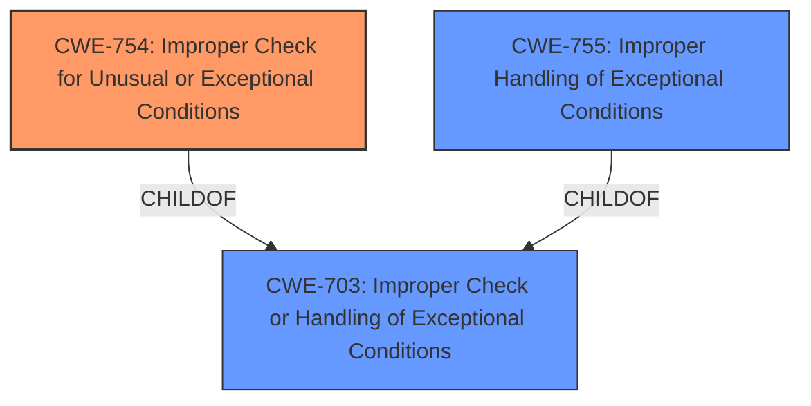

# Enhanced Analysis for CVE-2021-25380

# Summary
| CWE ID | CWE Name | Confidence | CWE Abstraction Level | CWE Vulnerability Mapping Label | CWE-Vulnerability Mapping Notes |
|---|---|---|---|---|---|
| CWE-754 | Improper Check for Unusual or Exceptional Conditions | 0.8 | Class | Primary | Allowed-with-Review |
| CWE-703 | Improper Check or Handling of Exceptional Conditions | 0.6 | Pillar | Secondary | Discouraged |
| CWE-755 | Improper Handling of Exceptional Conditions | 0.5 | Class | Secondary | Discouraged |

## Evidence and Confidence

*   **Confidence Score:** 0.8
*   **Evidence Strength:** MEDIUM

## Relationship Analysis
The primary CWE selected is CWE-754, which is a child of CWE-703. This indicates a hierarchical relationship where CWE-754 is a more specific case of CWE-703. However, since the description explicitly mentions "**improper handling of exceptional conditions**," the higher level CWE-703 was also considered, although ultimately not selected as the primary. CWE-755 is also a child of CWE-703, and represents the product does not handle or incorrectly handles an exceptional condition.



## Vulnerability Chain
The vulnerability chain is simple. The **improper handling of exceptional conditions** leads to the attacker being able to execute actions registered by the user.

## Summary of Analysis
The vulnerability description states "**Improper handling of exceptional conditions** in Bixby prior to version 3.0.53.02 allows attacker to execute the actions registered by the user." The key phrase from the description is "**Improper handling of exceptional conditions**" which is the root cause of the vulnerability.

Based on the retriever results, the top CWEs were CWE-755, CWE-703, and CWE-754. All three of these relate to the concept of improper handling of exceptional conditions. The mapping guidance for CWE-703 and CWE-755 is "Discouraged" because they are high-level classifications. The mapping guidance for CWE-754 is "Allowed-with-Review," because it is a Class and might have Base-level children that would be more appropriate. However, there are no further children to select, and it is a better fit than the higher-level CWEs.

The description directly mentions "**Improper handling of exceptional conditions**" which aligns directly with CWE-754's description: "The product does not check or incorrectly checks for unusual or exceptional conditions that are not expected to occur frequently during day to day operation of the product."

I considered the other CWEs in the Retriever Results, but they don't fit well. CWE-927 is "Use of Implicit Intent for Sensitive Communication," CWE-287 is "Improper Authentication", CWE-939 is "Improper Authorization in Handler for Custom URL Scheme", CWE-613 is "Insufficient Session Expiration", CWE-253 is "Incorrect Check of Function Return Value", CWE-130 is "Improper Handling of Length Parameter Inconsistency", and CWE-20 is "Improper Input Validation".

The final decision is to map the vulnerability to CWE-754 as the primary CWE because it is the most specific and accurate representation of the weakness. Other CWEs considered were not selected due to their lower relevance and less direct alignment with the vulnerability description. I am confident in this mapping due to the explicit mention of the weakness in the vulnerability description and the support from the retriever results.


## CWE Relationship Analysis

Current CWEs represent these abstraction levels: .


### Vulnerability Chain Analysis

**Chain starting from CWE-755:**
- 755 (Improper Handling of Exceptional Conditions) - ROOT


**Chain starting from CWE-703:**
- 703 (Improper Check or Handling of Exceptional Conditions) - ROOT


### CWE Relationship Diagram

```mermaid
graph TD
    classDef primary fill:#f96,stroke:#333,stroke-width:2px
    classDef secondary fill:#69f,stroke:#333
    classDef tertiary fill:#9e9,stroke:#333
```