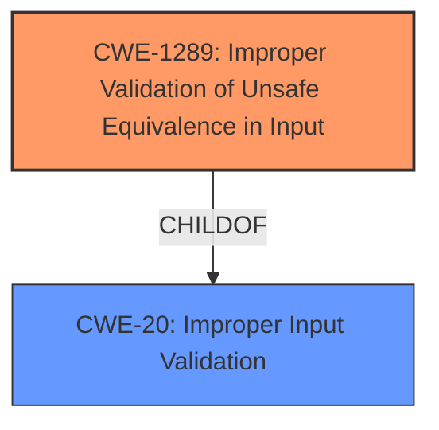

# Enhanced Analysis for CVE-2021-25510

# Summary
| CWE ID  | CWE Name                                                        | Confidence | CWE Abstraction Level | CWE Vulnerability Mapping Label | CWE-Vulnerability Mapping Notes |
| :-------- | :-------------------------------------------------------------- | :--------- | :-------------------- | :------------------------------ | :------------------------------ |
| CWE-1289 | Improper Validation of Unsafe Equivalence in Input            | 0.75       | Base                  | Allowed                         | Primary CWE                     |
| CWE-20  | Improper Input Validation                                       | 0.50       | Class                  | Discouraged                     | Secondary Candidate             |

## Evidence and Confidence

*   **Confidence Score:** 0.7
*   **Evidence Strength:** MEDIUM

## Relationship Analysis
The primary relationship influencing the CWE selection is the direct match of "**improper validation**" in the vulnerability description to the core concept of CWE-1289, which is at the Base level of abstraction. The retriever results also suggest CWE-20, which is a parent Class of CWE-1289 but discouraged for direct use when more specific options exist. The relationships of CWE-20 with other CWEs such as path traversal are not directly relevant to the provided vulnerability description.



## Vulnerability Chain
The vulnerability chain begins with **improper validation**, leading to arbitrary code execution.

Root Cause: **Improper Validation** (CWE-1289) -> Impact: Arbitrary Code Execution

## Summary of Analysis
The initial analysis identified **improper validation** as the root cause based on the "Vulnerability Description Key Phrases". The Retriever Results suggested several CWEs including CWE-20, CWE-1285, and CWE-181. However, CWE-1289, "Improper Validation of Unsafe Equivalence in Input," provides a more specific description aligning with the concept of validating potentially unsafe values, even though the specific type of unsafe equivalence isn't detailed in the description. CWE-20, "Improper Input Validation," is a broader class and is discouraged.

The final decision to use CWE-1289 is based on the explicit mention of **improper validation** in the vulnerability description and its better fit compared to other suggested CWEs. The selected CWE is at the Base level of abstraction, which is the preferred level. While the description lacks specifics, the core issue involves a validation failure, making CWE-1289 the most appropriate choice.

Relevant CWE Information:

# Enhanced Context (25 CWEs)

## CWE-1289: Improper Validation of Unsafe Equivalence in Input
**Abstraction Level**: Base
**Similarity Score**: 0.76
**Source**: dense

**Description**:
The product receives an input value that is used as a resource identifier or other type of reference, but it does not validate or incorrectly validates that the input is equivalent to a potentially-unsafe value.

**Mapping Guidance**:
- Usage: Allowed
- Rationale: This CWE entry is at the Base level of abstraction, which is a preferred level of abstraction for mapping to the root causes of vulnerabilities.

**Technical Explanation:**
CWE-1289 (Improper Validation of Unsafe Equivalence in Input) directly addresses the vulnerability where the system fails to properly validate an input value against potentially unsafe equivalents. This failure leads to the possibility of local arbitrary code execution. The **root cause** of the vulnerability is the **improper validation** of the input, allowing it to be manipulated in a way that leads to the execution of unintended code.

**Security Implications:**
The security implication of this vulnerability is that an attacker can execute arbitrary code on the system. This can lead to a compromise of the system's integrity, confidentiality, and availability.

**Hierarchical Relationships:**
CWE-1289 is a child of CWE-20 (Improper Input Validation).

**Mapping Guidance Influence:**
The MITRE mapping guidance allows the use of CWE-1289, as it is at the Base level of abstraction.

## CWE-20: Improper Input Validation
**Abstraction Level**: Class
**Similarity Score**: 0.105
**Source**: sparse

**Description**:
The product receives input or data, but it does not validate or incorrectly validates that the input has the properties that are required to process the data safely and correctly.

**Mapping Guidance**:
- Usage: Discouraged

**Technical Explanation:**
CWE-20 (Improper Input Validation) is a general class of weaknesses that occur when a product does not validate or incorrectly validates input. While the vulnerability description mentions **improper validation**, it is beneficial to look for a more specific CWE.

**Security Implications:**
The security implication of this vulnerability is that an attacker can provide malicious input that can compromise the system. This can lead to a wide range of problems, including information exposures, denial of service, and arbitrary code execution.

**Hierarchical Relationships:**
CWE-20 is a class-level CWE.

**Mapping Guidance Influence:**
The MITRE mapping guidance discourages the use of CWE-20 when lower-level CWEs can be used instead.


## CWE Relationship Analysis

Current CWEs represent these abstraction levels: .


### Vulnerability Chain Analysis

**Chain starting from CWE-1289:**
- 1289 (Improper Validation of Unsafe Equivalence in Input) - ROOT


**Chain starting from CWE-181:**
- 181 (Incorrect Behavior Order: Validate Before Filter) - ROOT


### CWE Relationship Diagram

```mermaid
graph TD
    classDef primary fill:#f96,stroke:#333,stroke-width:2px
    classDef secondary fill:#69f,stroke:#333
    classDef tertiary fill:#9e9,stroke:#333
```