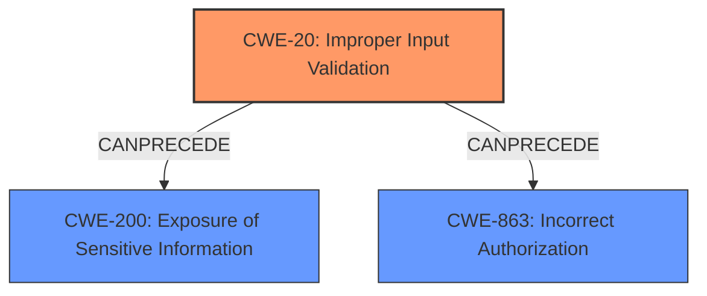

# Analysis for CVE-2021-25745

# Summary
| CWE ID | CWE Name | Confidence | CWE Abstraction Level | CWE Vulnerability Mapping Label | CWE-Vulnerability Mapping Notes |
|---|---|---|---|---|---|
| CWE-20: Improper Input Validation | Improper Input Validation | 0.9 | Class | Primary | Allowed |
| CWE-200: Exposure of Sensitive Information | Exposure of Sensitive Information | 0.8 | Class | Secondary | Allowed |
| CWE-863: Incorrect Authorization | Incorrect Authorization | 0.6 | Class | Secondary | Allowed-with-Review |

## Evidence and Confidence

*   **Confidence Score:** 0.8
*   **Evidence Strength:** HIGH

## Relationship Analysis
The primary weakness is **CWE-20 Improper Input Validation**, as the ingress-nginx controller **fails to properly validate** the input path. This can lead to **CWE-200 Exposure of Sensitive Information**, as the improperly validated path can be used to access sensitive files. The vulnerability description also suggests an authorization issue **CWE-863 Incorrect Authorization**, because a user with low privileges(create/update ingress objects) is able to access sensitive information.

## Vulnerability Chain
The chain of events starts with the **CWE-20 Improper Input Validation** of the `path` field in the Ingress object. This allows an attacker to perform **Path Traversal**, leading to **CWE-200 Exposure of Sensitive Information**, specifically the ingress-nginx controller's service account token. With the default configuration, this token provides access to all secrets in the cluster. This can be seen as an **CWE-863 Incorrect Authorization** because a low privilege user is able to retrieve cluster secrets.

## Summary of Analysis
The primary assessment is based on the provided evidence from the CVE Reference Links Content Summary, which clearly states: "The root cause is improper input validation in the `k8s.io/ingress-nginx` component. Specifically, the `spec.rules[].http.paths[].path` field of an Ingress object was not properly sanitized, allowing a malicious user to specify paths that can lead to the disclosure of sensitive information." This is direct evidence supporting **CWE-20 Improper Input Validation**. The resulting exposure of the service account token is a direct consequence, making **CWE-200 Exposure of Sensitive Information** a secondary CWE. The access to all cluster secrets due to default configuration of the ingress-nginx controller suggests **CWE-863 Incorrect Authorization** to be a tertiary issue.

The graph relationships support the classification, with **CWE-20** being a root cause that can lead to **CWE-200** and **CWE-863**. All three CWEs are at an appropriate level of specificity, accurately representing the vulnerability.

Other CWEs Considered:

*   **CWE-668: Exposure of Resource to Wrong Sphere**: This is a higher-level class that doesn't provide the specific root cause. The **improper input validation** is a more precise description of the **weakness**. Therefore, CWE-20 is a better choice.
*   **CWE-522: Insufficiently Protected Credentials**: While the vulnerability leads to exposure of credentials, the root cause isn't primarily about credential protection. It's about the **lack of input validation** that allows access to those credentials.

Relevant CWE Information:

# Enhanced Context (25 CWEs)
## CWE-668: Exposure of Resource to Wrong Sphere
**Abstraction Level**: Class
**Similarity Score**: 0.76
**Source**: dense

**Description**:
The product exposes a resource to the wrong control sphere, providing unintended actors with inappropriate access to the resource.

**Mapping Guidance**:
- Usage: Discouraged
- Rationale: CWE-668 is high-level and is often misused as a catch-all when lower-level CWE IDs might be applicable. It is sometimes used for low-information vulnerability reports [REF-1287]. It is a level-1 Class (i.e., a child of a Pillar). It is not useful for trend analysis.

## CWE-664: Improper Control of a Resource Through its Lifetime
**Abstraction Level**: Pillar
**Similarity Score**: 0.75
**Source**: dense

**Description**:
The product does not maintain or incorrectly maintains control over a resource throughout its lifetime of creation, use, and release.

**Mapping Guidance**:
- Usage: Discouraged
- Rationale: This CWE entry is high-level when lower-level children are available.

## CWE-538: Insertion of Sensitive Information into Externally-Accessible File or Directory
**Abstraction Level**: Base
**Similarity Score**: 0.74
**Source**: dense

**Description**:
The product places sensitive information into files or directories that are accessible to actors who are allowed to have access to the files, but not to the sensitive information.

**Mapping Guidance**:
- Usage: Allowed
- Rationale: This CWE entry is at the Base level of abstraction, which is a preferred level of abstraction for mapping to the root causes of vulnerabilities.

## CWE-610: Externally Controlled Reference to a Resource in Another Sphere
**Abstraction Level**: Class
**Similarity Score**: 0.73
**Source**: dense

**Description**:
The product uses an externally controlled name or reference that resolves to a resource that is outside of the intended control sphere.

**Mapping Guidance**:
- Usage: Discouraged
- Rationale: This CWE entry is a level-1 Class (i.e., a child of a Pillar). It might have lower-level children that would be more appropriate

## CWE-653: Improper Isolation or Compartmentalization
**Abstraction Level**: Class
**Similarity Score**: 0.73
**Source**: dense

**Description**:
The product does not properly compartmentalize or isolate functionality, processes, or resources that require different privilege levels, rights, or permissions.

**Mapping Guidance**:
- Usage: Allowed
- Rationale: This CWE entry is at the Base level of abstraction, which is a preferred level of abstraction for mapping to the root causes of vulnerabilities.

## CWE-226: Sensitive Information in Resource Not Removed Before Reuse
**Abstraction Level**: Base
**Similarity Score**: 0.73
**Source**: dense

**Description**:
The product releases a resource such as memory or a file so that it can be made available for reuse, but it does not clear or "zeroize" the information contained in the resource before the product performs a critical state transition or makes the resource available for reuse by other entities.

**Mapping Guidance**:
- Usage: Allowed
- Rationale: This CWE entry is at the Base level of abstraction, which is a preferred level of abstraction for mapping to the root causes of vulnerabilities.

## CWE-669: Incorrect Resource Transfer Between Spheres
**Abstraction Level**: Class
**Similarity Score**: 0.73
**Source**: dense

**Description**:
The product does not properly transfer a resource/behavior to another sphere, or improperly imports a resource/behavior from another sphere, in a manner that provides unintended control over that resource.

**Mapping Guidance**:
- Usage: Allowed-with-Review
- Rationale: This CWE entry is a Class and might have Base-level children that would be more appropriate

## CWE-552: Files or Directories Accessible to External Parties
**Abstraction Level**: Base
**Similarity Score**: 0.73
**Source**: dense

**Description**:
The product makes files or directories accessible to unauthorized actors, even though they should not be.

**Mapping Guidance**:
- Usage: Allowed
- Rationale: This CWE entry is at the Base level of abstraction, which is a preferred level of abstraction for mapping to the root causes of vulnerabilities.

## CWE-497: Exposure of Sensitive System Information to an Unauthorized Control Sphere
**Abstraction Level**: Base
**Similarity Score**: 0.72
**Source**: dense

**Description**:
The product does not properly prevent sensitive system-level information from being accessed by unauthorized actors who do not have the same level of access to the underlying system as the product does.

**Mapping Guidance**:
- Usage: Allowed
- Rationale: This CWE entry is at the Base level of abstraction, which is a preferred level of abstraction for mapping to the root causes of vulnerabilities.

## CWE-404: Improper Resource Shutdown or Release
**Abstraction Level**: Class
**Similarity Score**: 0.72
**Source**: dense

**Description**:
The product does not release or incorrectly releases a resource before it is made available for re-use.

**Mapping Guidance**:
- Usage: Allowed-