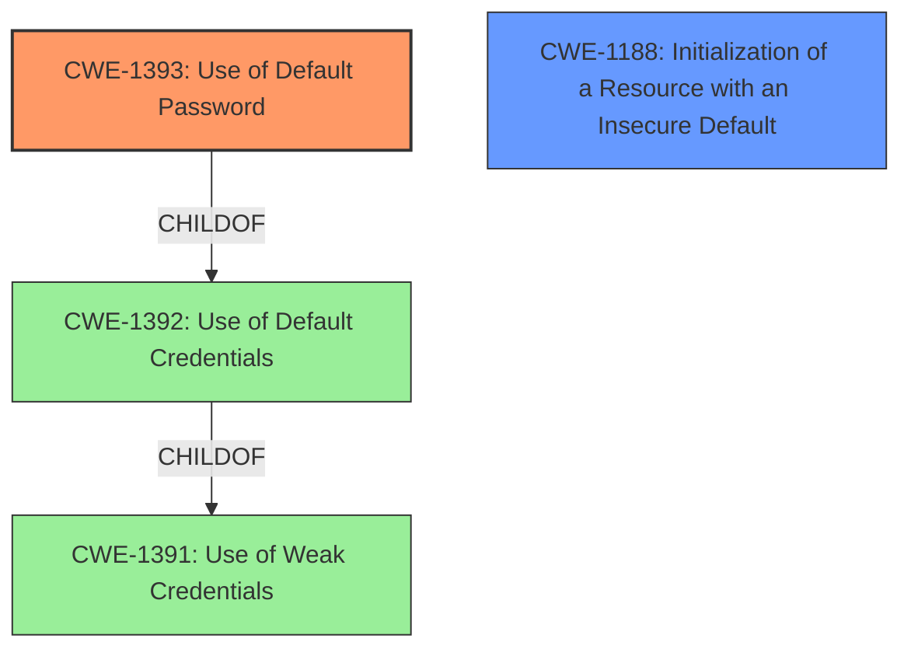

# Raw Analyzer Response for CVE-2021-25863

# Summary
| CWE ID | CWE Name | Confidence | CWE Abstraction Level | CWE Vulnerability Mapping Label | CWE-Vulnerability Mapping Notes |
|---|---|---|---|---|---|
| CWE-1393 | Use of Default Password | 1.0 | Base | Allowed | Primary CWE |
| CWE-1188 | Initialization of a Resource with an Insecure Default | 0.7 | Base | Allowed | Secondary Candidate |

## Evidence and Confidence

*   **Confidence Score:** 0.9
*   **Evidence Strength:** HIGH

## Relationship Analysis
The primary relationship influencing the decision is the parent-child relationship where CWE-1393 (Use of Default Password) is a child of CWE-1392 (Use of Default Credentials) and CWE-1391 (Use of Weak Credentials). The vulnerability specifically mentions a **default password**, making CWE-1393 the most specific and appropriate choice. CWE-1188 is also relevant as the **default password** represents an insecure default configuration.

## Vulnerability Chain
The vulnerability chain starts with the **default password** being set for the admin account, leading to potential unauthorized access.

## Summary of Analysis
The analysis is based on the vulnerability description which clearly states that Open5GS 2.1.3 uses a **default password** of 1423 for the admin account. The "Vulnerability Description Key Phrases" section also highlights "**default password**" as a key **weakness**. The CVE Reference Links Content Summary confirms the existence of the **default password** and its impact, "the webui automatically creates a default administrative account with the username "admin" and password "1423"". This strong evidence supports the selection of CWE-1393 (Use of Default Password) as the primary CWE. CWE-1188 is also considered because the use of a **default password** is a form of insecure default initialization.

Relevant CWE Information:

# Enhanced Context (25 CWEs)

## CWE-1393: Use of Default Password
**CWE-1393 (Use of Default Password)** is the most accurate because the **weakness** lies in the use of a default password specifically. The description of CWE-1393 directly matches the vulnerability: "The product uses default passwords for potentially critical functionality." The "Mapping Guidance" for CWE-1393 states, "This CWE entry is at the Base level of abstraction, which is a preferred level of abstraction for mapping to the root causes of vulnerabilities."

## CWE-1188: Initialization of a Resource with an Insecure Default
**CWE-1188 (Initialization of a Resource with an Insecure Default)** is a secondary candidate because the **default password** is an example of an insecure default. The description of CWE-1188 is "The product initializes or sets a resource with a default that is intended to be changed by the administrator, but the default is not secure." The use of a **default password** is the initialization of the admin account with an insecure **default**.

**CWEs Considered but Not Used**

*   CWE-798 (Use of Hard-coded Credentials): While a **default password** can be considered a type of hard-coded credential, the vulnerability specifically mentions a default password, making CWE-1393 a more accurate and specific classification.
*   CWE-259 (Use of Hard-coded Password): Similar to CWE-798, this is less specific than CWE-1393, which explicitly focuses on default passwords.
*   CWE-1392 (Use of Default Credentials): This is a parent of CWE-1393. Since the issue is specifically a password, CWE-1393 is more precise.
*   CWE-306 (Missing Authentication for Critical Function): While the **default password** weakens authentication, the primary issue is the existence of the **default password** itself, not the complete absence of authentication.
*   CWE-321 (Use of Hard-coded Cryptographic Key): This is not applicable because the vulnerability involves a password, not a cryptographic key.
*   CWE-472 (External Control of Assumed-Immutable Web Parameter): This is not applicable as the issue isn't about external control of parameters.
*   CWE-697 (Incorrect Comparison): This is not applicable as the vulnerability doesn't involve incorrect comparisons.
*   CWE-256 (Plaintext Storage of a Password): This is not applicable because the vulnerability doesn't mention storing passwords in plaintext.