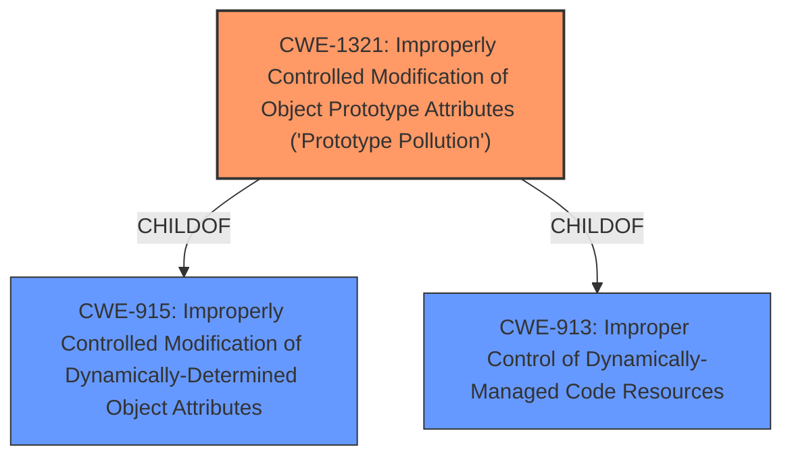

# Analysis Report for CVE-2021-25913

# Vulnerability Analysis Report: CVE-2021-25913

## Description


## Analysis (with Relationship Data)

# Summary
| CWE ID    | CWE Name                                                                                    | Confidence | CWE Abstraction Level | CWE Vulnerability Mapping Label | CWE-Vulnerability Mapping Notes |
| --------- | ------------------------------------------------------------------------------------------- | ---------- | --------------------- | ------------------------------- | ------------------------------- |
| CWE-1321  | Improperly Controlled Modification of Object Prototype Attributes ('Prototype Pollution') | 1          | Variant               | Primary                         | Allowed                         |

## Evidence and Confidence

*   **Confidence Score:** 1
*   **Evidence Strength:** HIGH

## Relationship Analysis
The primary CWE is CWE-1321, which is a Variant of CWE-915 and CWE-913. The vulnerability involves the modification of object prototype attributes, which can lead to denial of service and remote code execution. The relationship analysis confirms that CWE-1321 is the most specific and appropriate CWE for this vulnerability.



## Vulnerability Chain
The vulnerability chain starts with the **lack of input validation** on the 'field' argument in the `SetOrGet()` function, leading to **prototype pollution**. This can then lead to denial of service or remote code execution.

## Summary of Analysis
The initial analysis pointed to CWE-1321 as the primary weakness, and the detailed analysis of the vulnerability description and supporting evidence confirms this. The **rootcause** is **prototype pollution**, which allows an attacker to cause a denial of service and potentially achieve remote code execution.

The selection of CWE-1321 is based on the following:
*   The **Vulnerability Description Key Phrases** explicitly mentions **prototype pollution** as the **rootcause**.
*   The **CWE for similar CVE Descriptions** identifies CWE-1321 as the **Primary CWE Match**.
*   The **CVE Reference Links Content Summary** confirms that the vulnerability stems from a lack of proper input validation, allowing for manipulation of the object's prototype.
*   The **Retriever Results** lists CWE-1321 as the top combined result.
*   The CWE description of CWE-1321 states: "The product receives input from an upstream component that specifies attributes that are to be initialized or updated in an object, but it does not properly control modifications of attributes of the object prototype." This perfectly matches the vulnerability description.

The evidence from the vulnerability description is:
> Prototype pollution vulnerability in set-or-get version 1.0.0 through 1.2.10 allows an attacker to cause a denial of service and may lead to remote code execution.
> **Vulnerability Description Key Phrases**
> -   **rootcause:** **prototype pollution**

Other CWEs Considered:

*   CWE-20: Improper Input Validation - While the vulnerability stems from a lack of input validation, CWE-1321 is a more specific variant that directly addresses the prototype pollution issue. CWE-20 is too high-level and doesn't capture the specific nature of the weakness.
*   CWE-915: Improperly Controlled Modification of Dynamically-Determined Object Attributes - CWE-1321 is a child of CWE-915 and is more specific to prototype pollution.

The selected CWE is at the optimal level of specificity because it directly addresses the **rootcause** of the vulnerability, which is the improper control of modifications to the object prototype. It is a Variant-level CWE, which is a preferred level of abstraction.


## CWE Relationship Analysis

Current CWEs represent these abstraction levels: .


### Vulnerability Chain Analysis

**Chain starting from CWE-915:**
- 915 (Improperly Controlled Modification of Dynamically-Determined Object Attributes) - ROOT


**Chain starting from CWE-1321:**
- 1321 (Improperly Controlled Modification of Object Prototype Attributes ('Prototype Pollution')) - ROOT


### CWE Relationship Diagram

```mermaid
graph TD
    classDef primary fill:#f96,stroke:#333,stroke-width:2px
    classDef secondary fill:#69f,stroke:#333
    classDef tertiary fill:#9e9,stroke:#333
```


*Report generated on 2025-03-31 07:33:15*
