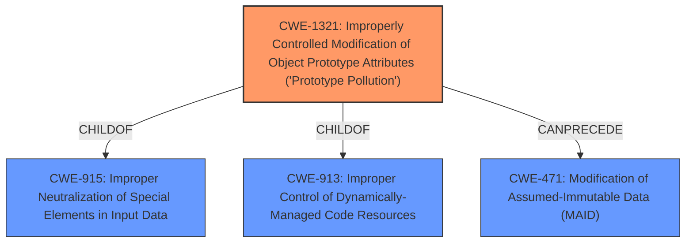

# Enhanced Analysis for CVE-2021-25927

# Summary
| CWE ID | CWE Name | Confidence | CWE Abstraction Level | CWE Vulnerability Mapping Label | CWE-Vulnerability Mapping Notes |
|---|---|---|---|---|---|
| CWE-1321 | Improperly Controlled Modification of Object Prototype Attributes ('Prototype Pollution') | 1.0 | Variant | Allowed | Primary CWE |

## Evidence and Confidence

*   **Confidence Score:** 1.0
*   **Evidence Strength:** HIGH

## Relationship Analysis
The primary relationship influencing this decision is that CWE-1321 is a Variant-level CWE specifically designed for "Prototype Pollution" vulnerabilities. It is a child of CWE-915 (Improper Neutralization of Special Elements in Input Data) and CWE-913 (Improper Control of Dynamically-Managed Code Resources).



## Vulnerability Chain
The vulnerability chain starts with the lack of input validation, leading to **prototype pollution**, which can result in denial of service and potentially remote code execution.

## Summary of Analysis
The analysis strongly supports CWE-1321 as the primary CWE. The vulnerability description explicitly mentions "**prototype pollution**", and the CVE Reference Links Content Summary details how the `unflatten()` function **lacks proper input validation** and allows modification of the prototype chain via `__proto__`, `constructor`, or `prototype` properties. The identified root cause is the **improperly controlled modification of object prototype attributes**, which aligns perfectly with CWE-1321. The CWE for similar CVE Descriptions section lists CWE-1321 as the Primary CWE Match and the Top CWE.

The evidence is strong:
- Vulnerability Description Key Phrases: "**rootcause:** **prototype pollution**"
- CVE Reference Links Content Summary: "**Prototype Pollution:** The core vulnerability is prototype pollution. By supplying a malicious object with keys like `__proto__.polluted` in the `unflatten` function, an attacker can inject properties into the base Object prototype."

CWE-1321 is at the optimal level of specificity, being a Variant that directly addresses prototype pollution vulnerabilities.

Relevant CWE Information:

# Enhanced Context (25 CWEs)
The following CWEs were identified as potentially relevant to this vulnerability:

## CWE-125: Out-of-bounds Read
**Abstraction Level**: Base
**Similarity Score**: 0.76
**Source**: dense
**Description**:
The product reads data past the end, or before the beginning, of the intended buffer.
**Mapping Guidance**:
- Usage: Allowed

This was not selected as it does not describe the vulnerability.

## CWE-131: Incorrect Calculation of Buffer Size
**Abstraction Level**: Base
**Similarity Score**: 0.76
**Source**: dense
**Description**:
The product does not correctly calculate the size to be used when allocating a buffer, which could lead to a buffer overflow.
**Mapping Guidance**:
- Usage: Allowed

This was not selected as it does not describe the vulnerability.

## CWE-805: Buffer Access with Incorrect Length Value
**Abstraction Level**: Base
**Similarity Score**: 0.76
**Source**: dense
**Description**:
The product uses a sequential operation to read or write a buffer, but it uses an incorrect length value that causes it to access memory that is outside of the bounds of the buffer.
**Mapping Guidance**:
- Usage: Allowed

This was not selected as it does not describe the vulnerability.

## CWE-126: Buffer Over-read
**Abstraction Level**: Variant
**Similarity Score**: 0.76
**Source**: dense
**Description**:
The product reads from a buffer using buffer access mechanisms such as indexes or pointers that reference memory locations after the targeted buffer.
**Mapping Guidance**:
- Usage: Allowed

This was not selected as it does not describe the vulnerability.

## CWE-191: Integer Underflow (Wrap or Wraparound)
**Abstraction Level**: Base
**Similarity Score**: 0.75
**Source**: dense
**Description**:
The product subtracts one value from another, such that the result is less than the minimum allowable integer value, which produces a value that is not equal to the correct result.
**Mapping Guidance**:
- Usage: Allowed

This was not selected as it does not describe the vulnerability.

## CWE-119: Improper Restriction of Operations within the Bounds of a Memory Buffer
**Abstraction Level**: Class
**Similarity Score**: 0.75
**Source**: dense
**Description**:
The product performs operations on a memory buffer, but it reads from or writes to a memory location outside the buffer's intended boundary. This may result in read or write operations on unexpected memory locations that could be linked to other variables, data structures, or internal program data.
**Mapping Guidance**:
- Usage: Discouraged

This was not selected because it is too general and there is a better fit with CWE-1321

## CWE-667: Improper Locking
**Abstraction Level**: Class
**Similarity Score**: 0.75
**Source**: dense
**Description**:
The product does not properly acquire or release a lock on a resource, leading to unexpected resource state changes and behaviors.
**Mapping Guidance**:
- Usage: Allowed-with-Review

This was not selected as it does not describe the vulnerability.

## CWE-788: Access of Memory Location After End of Buffer
**Abstraction Level**: Base
**Similarity Score**: 0.75
**Source**: dense
**Description**:
The product reads or writes to a buffer using an index or pointer that references a memory location after the end of the buffer.
**Mapping Guidance**:
- Usage: Discouraged

This was not selected as it does not describe the vulnerability.

## CWE-404: Improper Resource Shutdown or Release
**Abstraction Level**: Class
**Similarity Score**: 0.75
**Source**: dense
**Description**:
The product does not release or incorrectly releases a resource before it is made available for re-use.
**Mapping Guidance**:
- Usage: Allowed-with-Review

This was not selected as it does not describe the vulnerability.

## CWE-226: Sensitive Information in Resource Not Removed Before Reuse
**Abstraction Level**: Base
**Similarity Score**: 0.75
**Source**: dense
**Description**:
The product releases a resource such as memory or a file so that it can be made available for reuse, but it does not clear or "zeroize" the information contained in the resource before the product performs a critical state transition or makes the resource available for reuse by other entities.
**Mapping Guidance**:
- Usage: Allowed

This was not selected as it does not describe the vulnerability.

## CWE-125: Out-of-bounds Read
**Abstraction Level**: Base
**Similarity Score**: 5812.94
**Source**: sparse
**Description**:
The product reads data past the end, or before the beginning, of the intended buffer.
**Mapping Guidance**:
- Usage: Allowed

This was not selected as it does not describe the vulnerability.

## CWE-1321: Improperly Controlled Modification of Object Prototype Attributes ('Prototype Pollution')
**Abstraction Level**: Variant
**Similarity Score**: 5695.41
**Source**: sparse
**Description**:
The product receives input from an upstream component that specifies attributes that are to be initialized or updated in an object, but it does not properly control modifications of attributes of the object prototype.
**Mapping Guidance**:
- Usage: Allowed

This was selected as the primary CWE.

## CWE-190: Integer Overflow or Wraparound
**Abstraction Level**: Base
**Similarity Score**: 5687.34
**Source**: sparse
**Description**:
The product performs a calculation that can
         produce an integer overflow or wraparound when the logic
         assumes that the resulting value will always be larger than
         the original value. This occurs when an integer value is
         incremented to a value that is too large to store in the
         associated representation. When this occurs, the value may
         become a very small or negative number.
**Mapping Guidance**:
- Usage: Allowed

This was not selected as it does not describe the vulnerability.

## CWE-1284: Improper Validation of Specified Quantity in Input


## CWE Relationship Analysis

Current CWEs represent these abstraction levels: .


### Vulnerability Chain Analysis

**Chain starting from CWE-131:**
- 131 (Incorrect Calculation of Buffer Size) - ROOT


**Chain starting from CWE-190:**
- 190 (Integer Overflow or Wraparound) - ROOT


### CWE Relationship Diagram

```mermaid
graph TD
    classDef primary fill:#f96,stroke:#333,stroke-width:2px
    classDef secondary fill:#69f,stroke:#333
    classDef tertiary fill:#9e9,stroke:#333
```