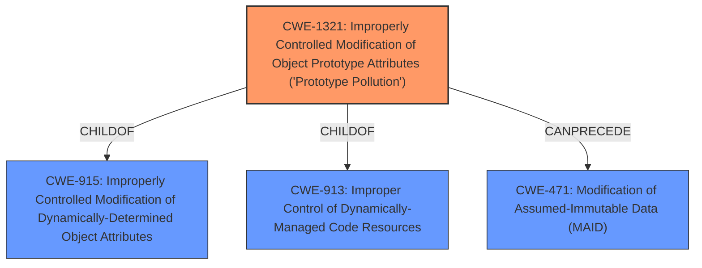

# Analysis for CVE-2021-25944

# Summary
| CWE ID  | CWE Name | Confidence | CWE Abstraction Level | CWE Vulnerability Mapping Label | CWE-Vulnerability Mapping Notes |
|------------------|---------------------------------------------------------------------------------------------------------|------------|-------------------------|--------------------------------------|----------------------------------------------------------------------------------|
| **CWE-1321** | Improperly Controlled Modification of Object Prototype Attributes ('Prototype Pollution') | 1 | Variant | Primary | Allowed |

## Evidence and Confidence

*   **Confidence Score:** 1
*   **Evidence Strength:** HIGH

## Relationship Analysis
The primary CWE, CWE-1321, is a Variant of CWE-915 and CWE-913, indicating it's a specific type of vulnerability related to object property handling. It can precede CWE-471, suggesting a potential chain where prototype pollution leads to modification of assumed immutable data. The Variant level is appropriate as the description details specifically prototype pollution rather than a more general class of weakness.

## Vulnerability Chain
The vulnerability chain starts with **lack of input validation** in the `_deepDefaults()` function, leading to **improperly controlled modification of object prototype attributes (CWE-1321)**, which can then lead to denial of service or remote code execution.

## Summary of Analysis
The analysis is based on the provided vulnerability description and the CVE reference links content summary. The **root cause** is clearly identified as **prototype pollution**, and the technical details support this assessment.

The "CVE Reference Links Content Summary" clearly describes the vulnerability: "The vulnerability stems from a lack of input validation in the `_deepDefaults()` function of the `deep-defaults` npm module. Specifically, the function does not check the type of object before assigning a value to a property. This allows an attacker to inject a `__proto__` property into the source object which is then merged into the target object via the vulnerable function."

The mapping guidance for CWE-1321 indicates that it is an "Allowed" mapping because it is a Variant level of abstraction. The relationships show that CWE-1321 can precede CWE-471, which is Modification of Assumed-Immutable Data, further suggesting a possible chain of vulnerabilities.

Other CWEs considered but not used:

*   CWE-1188: Initialization of a Resource with an Insecure Default - While the `deep-defaults` library might have insecure defaults, the **root cause** is the **lack of input validation** allowing for **prototype pollution**, making CWE-1321 a more accurate fit.
*   CWE-843: Access of Resource Using Incompatible Type ('Type Confusion') - Type confusion might occur due to **prototype pollution**, but it is not the primary weakness. The main issue is the ability to modify the prototype, not necessarily accessing resources with incompatible types.
*   CWE-1333: Inefficient Regular Expression Complexity - There is no indication of regular expressions being involved in this vulnerability.
*   CWE-119: Improper Restriction of Operations within the Bounds of a Memory Buffer - While prototype pollution can lead to memory corruption, it is not directly related to buffer overflows. The vulnerability is at a higher level, related to object property handling.
*   CWE-453: Insecure Default Variable Initialization - Like CWE-1188, this is related to defaults, but the **root cause** is the **lack of input validation** allowing **prototype pollution**.
*   CWE-787: Out-of-bounds Write, CWE-121: Stack-based Buffer Overflow, CWE-122: Heap-based Buffer Overflow - These CWEs are related to buffer overflows, which are not the **root cause** of this vulnerability.