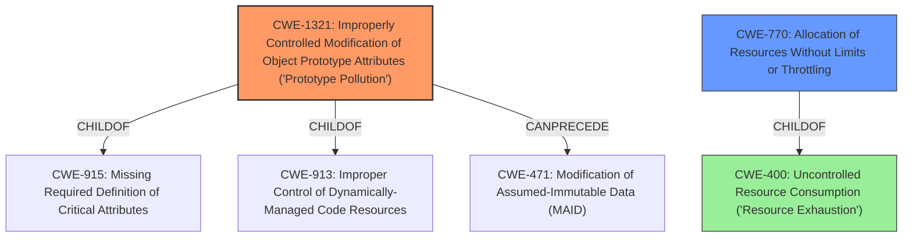

# Raw Analyzer Response for CVE-2021-25953

# Summary
| CWE ID    | CWE Name                                                                                    | Confidence | CWE Abstraction Level | CWE Vulnerability Mapping Label | CWE-Vulnerability Mapping Notes |
| :-------- | :------------------------------------------------------------------------------------------ | :--------- | :---------------------- | :------------------------------ | :------------------------------ |
| CWE-1321  | Improperly Controlled Modification of Object Prototype Attributes ('Prototype Pollution') | 1.0        | Variant                 | Allowed                         | Primary CWE                     |
| CWE-770   | Allocation of Resources Without Limits or Throttling                                      | 0.6        | Base                    | Allowed                         | Secondary CWE                   |
| CWE-400 | Uncontrolled Resource Consumption ('Resource Exhaustion')                                     | 0.5       | Class                   | Allowed-with-Review           | Secondary CWE                   |

## Evidence and Confidence

*   **Confidence Score:** 0.8
*   **Evidence Strength:** HIGH

## Relationship Analysis
The primary weakness is CWE-1321, which directly addresses the **prototype pollution** vulnerability. The vulnerability description and the CVE Reference Links Content Summary both explicitly mention **prototype pollution**. CWE-1321 is a variant of CWE-915 (Missing Required Definition of Critical Attributes) and CWE-913 (Improper Control of Dynamically-Managed Code Resources). CWE-1321 can precede CWE-471 (Modification of Assumed-Immutable Data (MAID)), showing a potential chain. CWE-770, Allocation of Resources Without Limits or Throttling, is added as a secondary CWE since the vulnerability can lead to denial of service through resource exhaustion if the polluted prototype causes excessive resource usage. CWE-770 is a parent of CWE-789 (Memory Allocation with Excessive Size Value) and child of CWE-400 (Uncontrolled Resource Consumption).

## Vulnerability Chain
The vulnerability chain starts with the lack of input validation on the properties passed to the `merge()` function, leading to **prototype pollution**. This **prototype pollution** can then lead to denial of service (DoS) due to resource exhaustion, or potentially remote code execution (RCE).

## Summary of Analysis
The initial assessment focused on the **prototype pollution** aspect, leading to the selection of CWE-1321 as the primary CWE. The CVE Reference Links Content Summary explicitly states the **prototype pollution** vulnerability.

> **Root Cause:**
> The vulnerability lies in the `merge()` function of the `putil-merge` npm module. This function lacks proper validation of the input object's property types before assigning values. Specifically, it doesn't check if a property being assigned is a genuine property of the object or if it's part of the prototype chain (e.g., `__proto__`).
>
> **Weaknesses/Vulnerabilities Present:**
> - **Prototype Pollution:**  The primary weakness is a prototype pollution vulnerability. By including `__proto__` in the input, an attacker can modify the prototype of the Object, affecting all objects that inherit from it.
> - **Lack of Input Validation:** The absence of input validation on the properties passed to the `merge()` function enables this vulnerability.

The graph relationships also influenced the selection of CWE-770 (Allocation of Resources Without Limits or Throttling) and CWE-400 (Uncontrolled Resource Consumption) as secondary CWEs, as the **prototype pollution** can lead to resource exhaustion, which is a form of denial of service. The selected CWEs are at the optimal level of specificity, with CWE-1321 being a Variant and CWE-770 being a Base, which are preferred levels of abstraction.

Other CWEs considered but not used:

*   CWE-843 (Access of Resource Using Incompatible Type ('Type Confusion')): While type confusion might be a factor, the primary issue is the modification of the prototype, making CWE-1321 a more direct fit.
*   CWE-1188 (Initialization of a Resource with an Insecure Default): This CWE is not applicable since the vulnerability is not due to an insecure default value but rather the **improper** handling of input that modifies the prototype.
*   CWE-1333 (Inefficient Regular Expression Complexity): There is no evidence of inefficient regular expressions being used in the vulnerability.
*   CWE-1284 (Improper Validation of Specified Quantity in Input): While there's a lack of input validation, the vulnerability isn't specifically about validating quantities; it's about validating properties being assigned to the object, making CWE-1321 more appropriate.
*   CWE-409 (Improper Handling of Highly Compressed Data (Data Amplification)): This CWE is not relevant as there is no mention of compressed data in the vulnerability description.
*   CWE-122 (Heap-based Buffer Overflow) and CWE-121 (Stack-based Buffer Overflow): There is no evidence of a buffer overflow in the description.
*   CWE-787 (Out-of-bounds Write): There is no evidence of out-of-bounds write, but rather the prototype being changed.