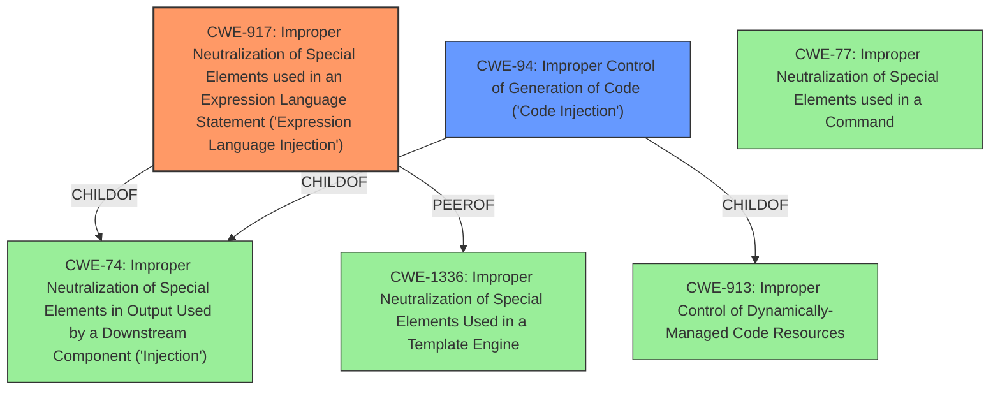

# Analysis for CVE-2021-26084

# Summary
| CWE ID | CWE Name | Confidence | CWE Abstraction Level | CWE Vulnerability Mapping Label | CWE-Vulnerability Mapping Notes |
|---|---|---|---|---|---|
| CWE-917 | Improper Neutralization of Special Elements used in an Expression Language Statement ('Expression Language Injection') | 1.0 | Base | Primary | Allowed |
| CWE-94 | Improper Control of Generation of Code ('Code Injection') | 0.7 | Base | Secondary | Allowed-with-Review |

## Evidence and Confidence

*   **Confidence Score:** 0.9
*   **Evidence Strength:** HIGH

## Relationship Analysis
The primary CWE, CWE-917, is a Base level CWE that is a ChildOf CWE-74 (Improper Neutralization of Special Elements in Output Used by a Downstream Component ('Injection')) and PeerOf CWE-1336 (Improper Neutralization of Special Elements Used in a Template Engine). The secondary CWE, CWE-94, is also a Base level CWE and a ChildOf CWE-74. The parent CWE, CWE-74, is a Class level CWE which is too high level, so the decision was to use CWE-917 and CWE-94 since they are more specific.

## Vulnerability Chain
The vulnerability chain starts with **improper input sanitization** which leads to an **OGNL injection** vulnerability, which results in arbitrary code execution.
  - Root Cause: **Improper Input Sanitization**
  - Weakness: **OGNL Injection** (CWE-917, CWE-94)
  - Impact: Arbitrary Code Execution

## Summary of Analysis
The primary weakness is **OGNL injection** which allows an unauthenticated attacker to execute arbitrary code on a Confluence Server or Data Center instance. The vulnerability description key phrases indicate the root cause is **improper input sanitization**. The CVE Reference Links Content Summary states "The vulnerability is due to an OGNL (Object-Graph Navigation Language) injection flaw". The most appropriate CWE is CWE-917, Improper Neutralization of Special Elements used in an Expression Language Statement ('Expression Language Injection'). The description of CWE-917 is "The product constructs all or part of an expression language (EL) statement in a framework such as a Java Server Page (JSP) using externally-influenced input from an upstream component, but it does not neutralize or incorrectly neutralizes special elements that could modify the intended EL statement before it is executed." The usage for CWE-917 is Allowed and the rationale is "This CWE entry is at the Base level of abstraction, which is a preferred level of abstraction for mapping to the root causes of vulnerabilities."
CWE-94, Improper Control of Generation of Code ('Code Injection'), is being included as a secondary CWE since the **OGNL injection** leads to code execution. The description of CWE-94 is "The product constructs all or part of a code segment using externally-influenced input from an upstream component, but it does not neutralize or incorrectly neutralizes special elements that could modify the syntax or behavior of the intended code segment." The usage for CWE-94 is Allowed-with-Review because "This entry is frequently misused for vulnerabilities with a technical impact of "code execution," which does not by itself indicate a root cause weakness, since dozens of weaknesses can enable code execution."

CWE-74, Improper Neutralization of Special Elements in Output Used by a Downstream Component ('Injection'), was considered but not used because it is a Class level CWE and the children CWE-917 and CWE-94 are more specific and therefore more appropriate.

Relevant CWE Information:
## Vulnerability Description
In affected versions of Confluence Server and Data Center, an **OGNL injection** vulnerability exists that would allow an unauthenticated attacker to execute arbitrary code on a Confluence Server or Data Center instance. The affected versions are before version 6.13.23, from version 6.14.0 before 7.4.11, from version 7.5.0 before 7.11.6, and from version 7.12.0 before 7.12.5.

### Vulnerability Description Key Phrases
- **rootcause:** **improper input sanitization**
- **weakness:** **OGNL injection**
- **impact:** arbitrary code execution
- **attacker:** unauthenticated attacker
- **product:** Confluence Server and Data Center
- **version:** multiple versions before specific releases

## CVE Reference Links Content Summary
Based on the provided content, here's an analysis of CVE-2021-26084:

**Root Cause of Vulnerability:**
- The vulnerability is due to an OGNL (Object-Graph Navigation Language) injection flaw in Atlassian Confluence Server and Data Center.

**Weaknesses/Vulnerabilities Present:**
- Unauthenticated OGNL injection vulnerability. This means an attacker does not need to log in or have any prior access to the system to exploit it.

**Impact of Exploitation:**
- Remote Code Execution (RCE). Successful exploitation allows an attacker to execute arbitrary code on the Confluence server. This can lead to complete system compromise, data theft, or denial of service.

**Attack Vectors:**
- The attack vector is through a network request to the vulnerable Confluence instance, and does not require user interaction.

**Required Attacker Capabilities/Position:**
- An attacker needs to be able to send network requests to the target Confluence server. No authentication is required.

**Additional details:**

- The vulnerability is actively exploited in the wild, indicating a high level of risk.
- The vulnerability has a CVSS score of 9.8, classified as Critical.
- Specific vulnerable and fixed versions are mentioned.
- The issue was discovered through Atlassian's public bug bounty program.
- The Atlassian page mentions a related issue `CONFSERVER-68844` which is also an RCE via OGNL injection (CVE-2021-39114).