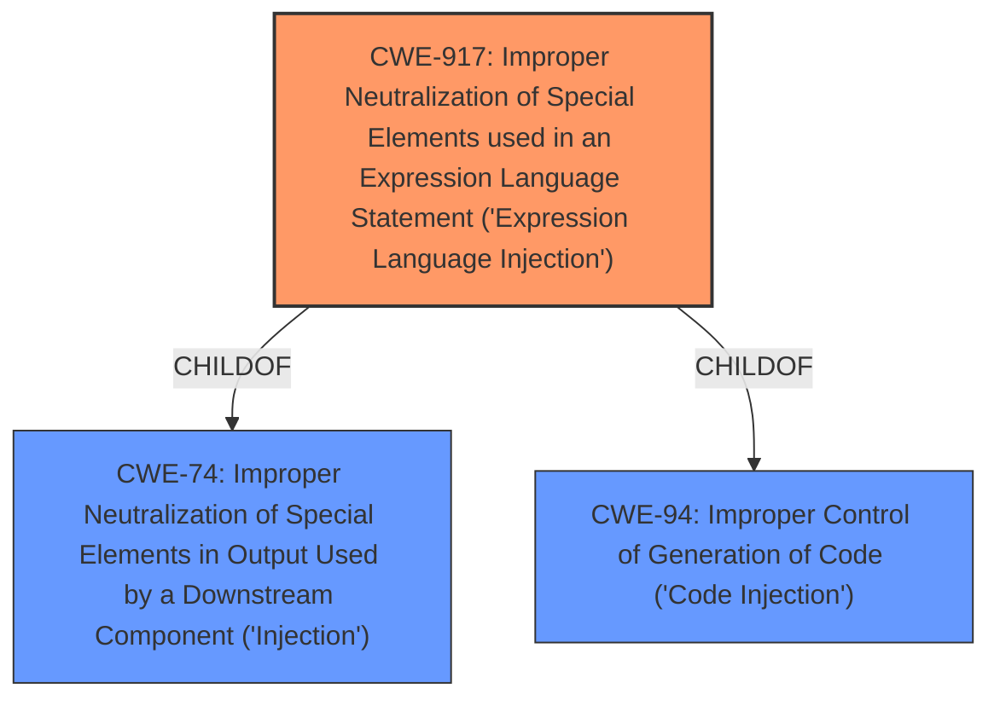

# Enhanced Analysis for CVE-2021-26084

# Summary
| CWE ID | CWE Name | Confidence | CWE Abstraction Level | CWE Vulnerability Mapping Label | CWE-Vulnerability Mapping Notes |
|---|---|---|---|---|---|
| CWE-917 | Improper Neutralization of Special Elements used in an Expression Language Statement ('Expression Language Injection') | 0.9 | Base | Allowed | Primary CWE: This CWE directly addresses the **OGNL injection** vulnerability described. |
| CWE-94 | Improper Control of Generation of Code ('Code Injection') | 0.7 | Base | Allowed-with-Review | Secondary Candidate: The **OGNL injection** leads to arbitrary code execution, which aligns with the impact of this CWE. |
| CWE-74 | Improper Neutralization of Special Elements in Output Used by a Downstream Component ('Injection') | 0.6 | Class | Discouraged | Secondary Candidate: This is a more general injection class, the more specific CWE-917 is preferred. |

## Evidence and Confidence

*   **Confidence Score:** 0.8
*   **Evidence Strength:** HIGH

## Relationship Analysis
The primary CWE is CWE-917, which is a base level CWE that describes **improper neutralization** in Expression Language statements. CWE-917 is a child of CWE-74 (Improper Neutralization of Special Elements in Output Used by a Downstream Component ('Injection')) and CWE-94 (Improper Control of Generation of Code ('Code Injection')). CWE-94 is considered because the **OGNL injection** leads to arbitrary code execution. CWE-74 is a more general class of injection vulnerabilities.



## Vulnerability Chain
The vulnerability chain starts with **improper input sanitization**, which leads to an **OGNL injection** vulnerability and ultimately results in arbitrary code execution.
  - **Root Cause:** **Improper input sanitization**
  - **Weakness:** **OGNL injection** (CWE-917)
  - **Impact:** Arbitrary code execution (CWE-94)

## Summary of Analysis
The initial assessment correctly identified CWE-917 as the primary weakness due to the presence of **OGNL injection**. The vulnerability description explicitly mentions **OGNL injection**, and the CVE Reference Links Content Summary confirms that the root cause is due to an **OGNL (Object-Graph Navigation Language) injection** flaw.

The following is quoted from the vulnerability description:
> In affected versions of Confluence Server and Data Center, an **OGNL injection** vulnerability exists that would allow an unauthenticated attacker to execute arbitrary code on a Confluence Server or Data Center instance.

The relationship graph highlights the connection between CWE-917 and its parent CWEs (CWE-74 and CWE-94), further solidifying the selection of CWE-917 as the most specific and appropriate classification.
CWE-94 is included as a secondary candidate because the OGNL injection leads to code execution.

CWE-20 was considered but not selected because the provided information is more specific than the general class of **improper input validation**.
CWE-74 was considered but not selected as the primary because CWE-917 provides more specific details related to Expression Language injection.

I am confident in the selection of CWE-917 as the primary weakness, as it directly reflects the **OGNL injection** vulnerability described in the provided information.

Relevant CWE Information:
INSERT


## CWE Relationship Analysis

Current CWEs represent these abstraction levels: .


### Vulnerability Chain Analysis

**Chain starting from CWE-74:**
- 74 (Improper Neutralization of Special Elements in Output Used by a Downstream Component ('Injection')) - ROOT


**Chain starting from CWE-94:**
- 94 (Improper Control of Generation of Code ('Code Injection')) - ROOT


### CWE Relationship Diagram

```mermaid
graph TD
    classDef primary fill:#f96,stroke:#333,stroke-width:2px
    classDef secondary fill:#69f,stroke:#333
    classDef tertiary fill:#9e9,stroke:#333
```