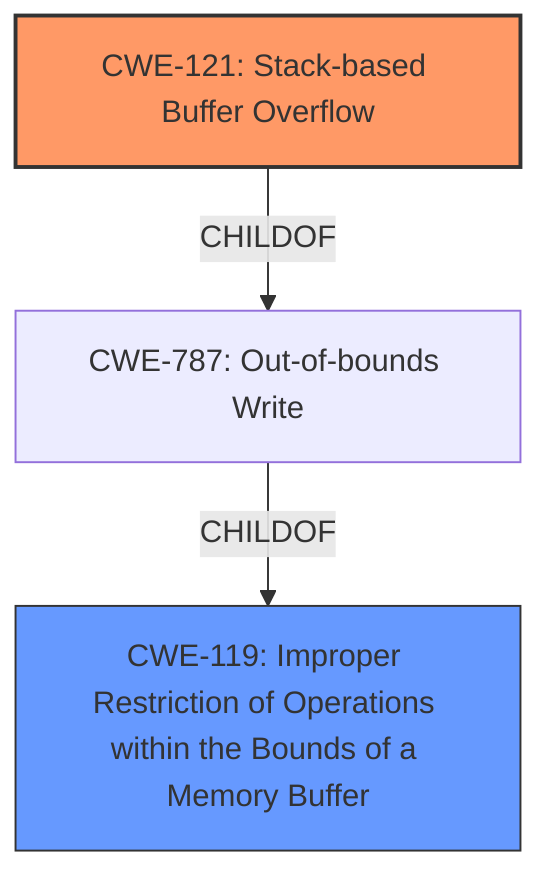

# Analysis for CVE-2021-26112

# Summary
| CWE ID | CWE Name | Confidence | CWE Abstraction Level | CWE Vulnerability Mapping Label | CWE-Vulnerability Mapping Notes |
|---|---|---|---|---|---|
| CWE-121 | Stack-based Buffer Overflow | 1.0 | Variant | Primary | Allowed |
| CWE-119 | Improper Restriction of Operations within the Bounds of a Memory Buffer | 0.7 | Class | Secondary | Discouraged |

## Evidence and Confidence

*   **Confidence Score:** 0.9
*   **Evidence Strength:** HIGH

## Relationship Analysis
The primary CWE is CWE-121, which is a variant of CWE-787 (Out-of-bounds Write) and CWE-119 (Improper Restriction of Operations within the Bounds of a Memory Buffer). CWE-119 is a class-level CWE, and the mapping guidance discourages its use when more specific CWEs are available. The vulnerability description clearly states that it is a "stack-based buffer overflow," making CWE-121 a more precise and appropriate choice.

## Vulnerability Chain
The vulnerability chain starts with the **stack-based buffer overflow** [CWE-121], leading to the corruption of control data in memory and the potential execution of arbitrary code.

## Summary of Analysis
The initial analysis identified **stack-based buffer overflow** [CWE-121] as the primary weakness based on the vulnerability description and CVE reference links. The Retriever Results also listed CWE-121, but with a lower score than CWE-119 and CWE-190. However, the description explicitly mentions "stack-based buffer overflow" which strongly supports the selection of CWE-121. The graph relationships show that CWE-121 is a child of CWE-787 and CWE-119. Given the mapping guidance discouraging the use of the class-level CWE-119 when more specific variants are available, CWE-121 is the most appropriate choice. The evidence provided is sufficient to confidently classify this vulnerability as a **stack-based buffer overflow** [CWE-121].

# Relevant CWE Information:

## Vulnerability Description
Multiple **stack-based buffer overflow** vulnerabilities [**CWE-121**] both in network daemons and in the command line interpreter of FortiWAN before 4.5.9 may allow an unauthenticated attacker to potentially corrupt control data in memory and execute arbitrary code via specifically crafted requests.

### Vulnerability Description Key Phrases
- **rootcause:** **stack-based buffer overflow**
- **weakness:** **CWE-121**
- **impact:** corrupt control data in memory and execute arbitrary code
- **vector:** specifically crafted requests
- **attacker:** unauthenticated attacker
- **product:** FortiWAN
- **version:** before 4.5.9
- **component:** network daemons and command line interpreter

## CVE Reference Links Content Summary
- **Root cause of vulnerability**: Stack-based buffer overflow vulnerabilities exist in both network daemons and the command line interpreter of FortiWAN.
- **Weaknesses/vulnerabilities present**: Stack-based buffer overflows [CWE-121].
- **Impact of exploitation**: An unauthenticated attacker can potentially corrupt control data in memory and execute arbitrary code.
- **Attack vectors**: Specifically crafted requests to network daemons or the command line interpreter.
- **Required attacker capabilities/position**: An unauthenticated attacker can send malicious requests.

## Retriever Results

### Top Combined Results

| Rank | CWE ID | Name | Abstraction | Usage  | Retrievers | Individual Scores |
|------|--------|------|-------------|-------|------------|-------------------|
| 1 | 119 | Improper Restriction of Operations within the Bounds of a Memory Buffer | Class | Discouraged | alternate_terms | 0.800 |
| 2 | 190 | Integer Overflow or Wraparound | Base | Allowed | alternate_terms | 0.800 |
| 3 | 121 | Stack-based Buffer Overflow | Variant | Allowed | sparse | 0.341 |
| 4 | 120 | Buffer Copy without Checking Size of Input ('Classic Buffer Overflow') | Base | Allowed-with-Review | sparse | 0.313 |
| 5 | 193 | Off-by-one Error | Base | Allowed | sparse | 0.294 |

## CWE-121: Stack-based Buffer Overflow
**Technical Explanation:**
The vulnerability is a **stack-based buffer overflow** [CWE-121], which occurs when a program writes data beyond the boundaries of a buffer located on the stack. In this case, the vulnerability exists in FortiWAN's network daemons and command-line interpreter. An unauthenticated attacker can exploit this by sending specifically crafted requests that **overflow** the buffer, potentially overwriting control data and executing arbitrary code. This is a critical vulnerability because it allows for remote code execution without authentication.

**Security Implications:**
The security implications of a **stack-based buffer overflow** [CWE-121] are severe. An attacker can gain complete control of the affected system by executing arbitrary code. This can lead to data theft, system compromise, or denial of service. The fact that the attacker is unauthenticated makes the vulnerability even more dangerous.

**Relationships:**
CWE-121 is a variant of CWE-787 (Out-of-bounds Write) and CWE-119 (Improper Restriction of Operations within the Bounds of a Memory Buffer). It is more specific than its parents, which makes it a better fit for the vulnerability.

**Mapping Guidance Influence:**
The mapping guidance for CWE-121 states that it is at the Variant level of abstraction, which is a preferred level. The usage is ALLOWED, which supports the choice of this CWE.

**Confidence:** 1.0

## CWE-119: Improper Restriction of Operations within the Bounds of a Memory Buffer
**Technical Explanation:**
While the vulnerability is a **stack-based buffer overflow** [CWE-121], it can be seen as an instance of CWE-119, which is a more general class describing improper restriction of operations within the bounds of a memory buffer. The **buffer overflow** falls under the umbrella of writing to memory locations outside the intended boundary.

**Security Implications:**
The security implications are similar to CWE-121, with the main impact being the potential to read or write to unexpected memory locations.

**Relationships:**
CWE-119 is a parent of CWE-121, making it a more general classification.

**Mapping Guidance Influence:**
The mapping guidance for CWE-119 is DISCOURAGED, stating that it is commonly misused and that lower-level CWEs should be used instead. This is why CWE-121 is the primary choice.

**Why other CWEs were considered but not used:**

*   **CWE-190 (Integer Overflow or Wraparound):** While integer overflows can sometimes lead to buffer overflows, there is no mention of integer overflow in the vulnerability description.
*   **CWE-120 (Buffer Copy without Checking Size of Input):** This CWE describes a classic buffer overflow where the size of the input is not checked. While this could be the case, the description specifically mentions "stack-based" suggesting a more specific type of buffer overflow.
*   **CWE-193 (Off-by-one Error):** This CWE is not directly related to the vulnerability description, which describes a more general buffer overflow.
*   **CWE-134 (Use of Externally-Controlled Format String):** There is no indication of format string usage in the vulnerability description.
*   **CWE-128 (Wrap-around Error):** Similar to CWE-190, there is no mention of wrap-around errors in the description.
*   **CWE-1284 (Improper Validation of Specified Quantity in Input):** While improper input validation might be a contributing factor, the root cause is the **stack-based buffer overflow** [CWE-121].
*   **CWE-124 (Buffer Underwrite):** The vulnerability is an **overflow**, not an underwrite.
*   **CWE-122 (Heap-based Buffer Overflow):** The vulnerability is specifically a stack-based overflow, not a heap-based overflow.