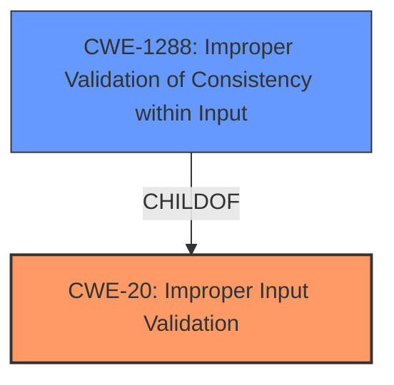

# Enhanced Analysis for CVE-2021-26251

# Summary
| CWE ID | CWE Name | Confidence | CWE Abstraction Level | CWE Vulnerability Mapping Label | CWE-Vulnerability Mapping Notes |
|---|---|---|---|---|---|
| CWE-20 | Improper Input Validation | 0.75 | Class | Primary | Discouraged |
| CWE-1288 | Improper Validation of Consistency within Input | 0.60 | Base | Secondary | Allowed |

## Evidence and Confidence

*   **Confidence Score:** 0.70
*   **Evidence Strength:** MEDIUM

## Relationship Analysis
The primary relationship is that CWE-1288: Improper Validation of Consistency within Input is a ChildOf CWE-20: Improper Input Validation. This means that CWE-1288 is a more specific type of input validation issue. Given the general nature of the provided description, it's difficult to confidently select the more specific CWE-1288 over the broader CWE-20.



## Vulnerability Chain
The chain of events is:
1.  **Root Cause:** **Improper input validation** (CWE-20) in the Intel(R) Distribution of OpenVINO(TM) Toolkit.
2.  **Impact:** Allows an authenticated user to potentially enable denial of service.

## Summary of Analysis
Initially, the vulnerability description points towards **improper input validation** as the root cause, which aligns with CWE-20. The CVE Reference Links Content Summary reinforces this by explicitly stating the **root cause** as **improper input validation**.

The Retriever Results also list CWE-20, albeit with a "Discouraged" usage due to its high-level nature. However, the provided information lacks the specifics needed to select a more granular CWE with high confidence. CWE-1288: Improper Validation of Consistency within Input is a potential candidate, but there isn't enough information to say whether the input validation issue involves checking for consistency within the input, or if it's a more general form of **improper input validation**.

Therefore, I'm assigning CWE-20 as the primary CWE due to the clear evidence in the vulnerability description and CVE summary, while acknowledging its general nature. CWE-1288 is a secondary candidate.

Relevant CWE Information:

# Enhanced Context (25 CWEs)
The following CWEs were identified as potentially relevant to this vulnerability:

## CWE-20: Improper Input Validation
**Abstraction:** Class
**Description**:
The product receives input or data, but it does
        not validate or incorrectly validates that the input has the
        properties that are required to process the data safely and
        correctly.

**Mapping Guidance**
**Usage:** Discouraged
**Rationale:** CWE-20 is commonly misused in low-information vulnerability reports when lower-level CWEs could be used instead, or when more details about the vulnerability are available [REF-1287]. It is not useful for trend analysis. It is also a level-1 Class (i.e., a child of a Pillar).

## CWE-1288: Improper Validation of Consistency within Input
**Abstraction:** Base
**Description**:
The product receives a complex input with multiple elements or fields that must be consistent with each other, but it does not validate or incorrectly validates that the input is actually consistent.

**Mapping Guidance**
**Usage:** Allowed
**Rationale:** This CWE entry is at the Base level of abstraction, which is a preferred level of abstraction for mapping to the root causes of vulnerabilities.

## CWE-1285: Improper Validation of Specified Index, Position, or Offset in Input
**Abstraction:** Base
**Description**:
The product receives input that is expected to specify an index, position, or offset into an indexable resource such as a buffer or file, but it does not validate or incorrectly validates that the specified index/position/offset has the required properties.

**Mapping Guidance**
**Usage:** Allowed
**Rationale:** This CWE entry is at the Base level of abstraction, which is a preferred level of abstraction for mapping to the root causes of vulnerabilities.

**CWE-1285:**
I considered CWE-1285 "Improper Validation of Specified Index, Position, or Offset in Input", but there's no evidence to suggest that the **improper input validation** specifically involves an index, position, or offset. Therefore, it's not the best fit.

**CWE-1173:**
I considered CWE-1173 "Improper Use of Validation Framework," but the vulnerability description doesn't mention anything about a validation framework. It's possible a framework is in use, but without evidence, it's not appropriate to assign this CWE.


## CWE Relationship Analysis

Current CWEs represent these abstraction levels: .


### Vulnerability Chain Analysis

**Chain starting from CWE-1288:**
- 1288 (Improper Validation of Consistency within Input) - ROOT


**Chain starting from CWE-1173:**
- 1173 (Improper Use of Validation Framework) - ROOT


### CWE Relationship Diagram

```mermaid
graph TD
    classDef primary fill:#f96,stroke:#333,stroke-width:2px
    classDef secondary fill:#69f,stroke:#333
    classDef tertiary fill:#9e9,stroke:#333
```