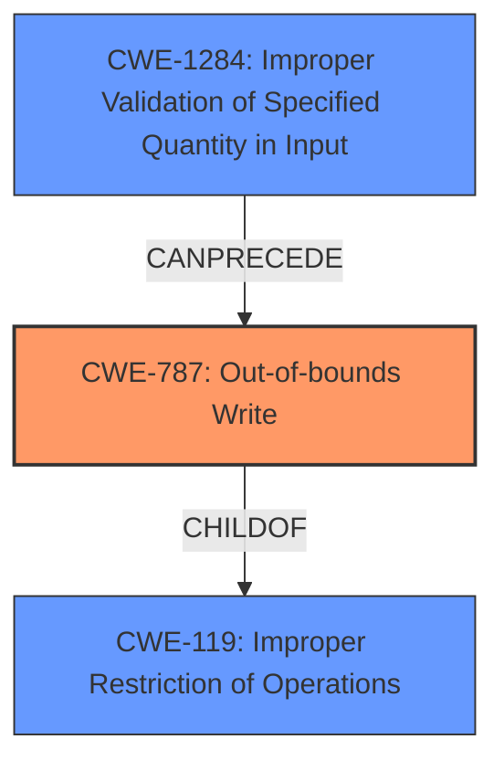

# Analysis for CVE-2021-26259

# Summary
| CWE ID | CWE Name | Confidence | CWE Abstraction Level | CWE Vulnerability Mapping Label | CWE-Vulnerability Mapping Notes |
|---|---|---|---|---|---|
| CWE-787 | Out-of-bounds Write | 1.0 | Base | Allowed | Primary CWE |
| CWE-1284 | Improper Validation of Specified Quantity in Input | 0.7 | Base | Allowed | Secondary Candidate |

## Evidence and Confidence

*   **Confidence Score:** 0.85
*   **Evidence Strength:** HIGH

## Relationship Analysis
The primary relationship that influenced my decision was the hierarchical relationship between CWE-787 (Out-of-bounds Write) and CWE-119 (Improper Restriction of Operations within the Bounds of a Memory Buffer). CWE-787 is a child of CWE-119, making it a more specific and appropriate choice given the detailed description of the vulnerability as a heap buffer overflow. Additionally, CWE-1284 (Improper Validation of Specified Quantity in Input) can lead to buffer overflows if input quantities, such as size, are not validated correctly.

## Vulnerability Chain
The vulnerability chain begins with **improper input validation** (CWE-1284), where the size of the table border is not properly checked. This **lack of validation** leads to a **heap buffer overflow** (CWE-787) when rendering the table row, potentially resulting in arbitrary code execution and denial of service.

## Summary of Analysis
The initial analysis focused on identifying the root cause of the vulnerability. The description clearly indicates a **heap buffer overflow** in the `render_table_row()` function, making CWE-787 (Out-of-bounds Write) a strong candidate. The "CVE Reference Links Content Summary" section further supports this by stating: "The primary vulnerability is a heap-based buffer overflow, specifically in the `render_table_row()` function."

The retriever results also pointed to CWE-119 (Improper Restriction of Operations within the Bounds of a Memory Buffer). However, the mapping guidance for CWE-119 discourages its use when more specific CWEs are available. Given that a **heap buffer overflow** is explicitly mentioned, CWE-787, a child of CWE-119, is a more appropriate and specific choice.

Additionally, the "CVE Reference Links Content Summary" mentions "Insufficient Input Validation," suggesting that the code does not properly validate the `border` attribute of the HTML `<table>` tag. This led to the consideration of CWE-1284 (Improper Validation of Specified Quantity in Input) as a secondary CWE, since the border size could be considered a specified quantity.

The final decision to assign CWE-787 as the primary CWE and CWE-1284 as a secondary CWE is based on the evidence of a **heap buffer overflow** and **insufficient input validation**. Both CWEs are at the Base level of abstraction, which is the preferred level.

Relevant CWE Information:

# Enhanced Context (25 CWEs)

## CWE-131: Incorrect Calculation of Buffer Size
**Abstraction Level**: Base
**Similarity Score**: 0.78
**Source**: dense

**Description**:
The product does not correctly calculate the size to be used when allocating a buffer, which could lead to a buffer overflow.

**Why Not Selected**: While related to buffer overflows, the root cause isn't necessarily an incorrect calculation, but rather a missing validation.

## CWE-191: Integer Underflow (Wrap or Wraparound)
**Abstraction Level**: Base
**Similarity Score**: 0.78
**Source**: dense

**Description**:
The product subtracts one value from another, such that the result is less than the minimum allowable integer value, which produces a value that is not equal to the correct result.

**Why Not Selected**: There's no evidence of integer underflow.

## CWE-805: Buffer Access with Incorrect Length Value
**Abstraction Level**: Base
**Similarity Score**: 0.77
**Source**: dense

**Description**:
The product uses a sequential operation to read or write a buffer, but it uses an incorrect length value that causes it to access memory that is outside of the bounds of the buffer.

**Why Not Selected**: While related, the core issue is the out-of-bounds write due to missing validation.

## CWE-126: Buffer Over-read
**Abstraction Level**: Variant
**Similarity Score**: 0.77
**Source**: dense

**Description**:
The product reads from a buffer using buffer access mechanisms such as indexes or pointers that reference memory locations after the targeted buffer.

**Why Not Selected**: The vulnerability description specifies a heap buffer overflow, which is an out-of-bounds write.

## CWE-125: Out-of-bounds Read
**Abstraction Level**: Base
**Similarity Score**: 0.77
**Source**: dense

**Description**:
The product reads data past the end, or before the beginning, of the intended buffer.

**Why Not Selected**: The vulnerability description specifies a heap buffer overflow, which is an out-of-bounds write.

## CWE-124: Buffer Underwrite ('Buffer Underflow')
**Abstraction Level**: Base
**Similarity Score**: 0.77
**Source**: dense

**Description**:
The product writes to a buffer using an index or pointer that references a memory location prior to the beginning of the buffer.

**Why Not Selected**: The vulnerability description specifies a heap buffer overflow, which is an out-of-bounds write that goes past the buffer, not before.

## CWE-193: Off-by-one Error
**Abstraction Level**: Base
**Similarity Score**: 0.76
**Source**: dense

**Description**:
A product calculates or uses an incorrect maximum or minimum value that is 1 more, or 1 less, than the correct value.

**Why Not Selected**: While possible, there's no specific evidence of an off-by-one error.

## CWE-127: Buffer Under-read
**Abstraction Level**: Variant
**Similarity Score**: 0.76
**Source**: dense

**Description**:
The product reads from a buffer using buffer access mechanisms such as indexes or pointers that reference memory locations prior to the targeted buffer.

**Why Not Selected**: The vulnerability description specifies a heap buffer overflow, which is an out-of-bounds write.

## CWE-190: Integer Overflow or Wraparound
**Abstraction Level**: Base
**Similarity Score**: 0.75
**Source**: dense

**Description**:
The product performs a calculation that can
         produce an integer overflow or wraparound when the logic
         assumes that the resulting value will always be larger than
         the original value. This occurs when an integer value is
         incremented to a value that is too large to store in the
         associated representation. When this occurs, the value may
         become a very small or negative number.

**Why Not Selected**: While an integer overflow might occur, the root cause is the missing input validation.

## CWE-130: Improper Handling of Length Parameter Inconsistency
**Abstraction Level**: Base
**Similarity Score**: 0.75
**Source**: dense

**Description**:
The product parses a formatted message or structure, but it does not handle or incorrectly handles a length field that is inconsistent with the actual length of the associated data.

**Why Not Selected**: While related to data handling, the primary weakness is the missing validation of the border attribute.

## CWE-123: Write-what-where Condition
**Abstraction Level**: base
**Similarity Score**: 5.03
**Source**: graph

**Description**:
CWE-123: Write-what-where Condition

**Why Not Selected**: This is a potential consequence of a heap overflow, but not the root cause. The root cause is writing outside the bounds of a buffer.

## CWE-170: Improper Null Termination
**Abstraction Level**: base
**Similarity Score**: 5.03
**Source**: graph

**Description**:
CWE-170: Improper Null Termination

**Why Not Selected**: There is no evidence of improper null termination.

## CWE-416: Use After Free
**Abstraction Level**: variant
**Similarity Score**: 4.53
**Source**: graph

**Description**:
CWE-416: Use After Free

**Why Not Selected**: There is no evidence of a use-after-free condition.

## CWE-825: Expired Pointer Dereference
**Abstraction Level**: base
**Similarity Score**: 4