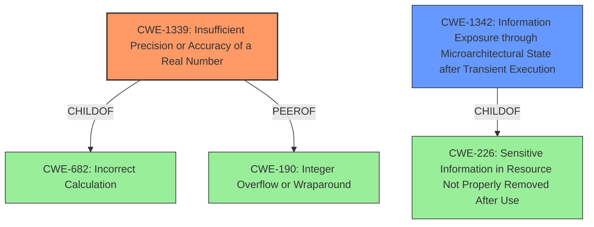

# Analysis for CVE-2021-26314

# Summary
| CWE ID | CWE Name | Confidence | CWE Abstraction Level | CWE Vulnerability Mapping Label | CWE-Vulnerability Mapping Notes |
|---|---|---|---|---|---|
| CWE-1339 | Insufficient Precision or Accuracy of a Real Number | 0.8 | Base | Allowed | Primary CWE |
| CWE-1342 | Information Exposure through Microarchitectural State after Transient Execution | 0.6 | Base | Allowed | Secondary Candidate |

## Evidence and Confidence

*   **Confidence Score:** 0.7
*   **Evidence Strength:** MEDIUM

## Relationship Analysis
The primary CWE identified is CWE-1339 (Insufficient Precision or Accuracy of a Real Number). This CWE is at the Base level, aligning well with the root cause described. It has relationships like PeerOf CWE-190 (Integer Overflow or Wraparound) and ChildOf CWE-682 (Incorrect Calculation).

CWE-1342 (Information Exposure through Microarchitectural State after Transient Execution) is considered as a secondary candidate due to the speculative execution aspect. It's also at the Base level and ChildOf CWE-226 (Sensitive Information in Resource Not Properly Removed After Use).

## Vulnerability Chain
The vulnerability chain starts with the **floating point value injection**, leading to speculative execution with incorrect floating point results, and finally resulting in data leakage.
  - Root Cause: CWE-1339 (Insufficient Precision or Accuracy of a Real Number)
  - Mechanism: Speculative execution with incorrect floating-point results, potentially involving microarchitectural issues (CWE-1342)
  - Impact: Data Leakage

## Summary of Analysis
Initially, the analysis focused on the **floating point value injection** as the root cause. The Retriever Results highlighted CWE-1339 (Insufficient Precision or Accuracy of a Real Number), which directly addresses issues with real number precision and accuracy, aligning well with the vulnerability description. Additionally, speculative execution and its potential to leak information was evident from the description leading to the consideration of CWE-1342.

The evidence supporting CWE-1339 is derived from the "**floating point value injection** in all supported CPU products, in conjunction with software vulnerabilities relating to speculative execution with incorrect floating point results, may cause the use of incorrect data from FPVI and may result in data leakage." and "The vulnerability stems from a potential floating-point value injection (FPVI) during speculative execution on affected CPUs." The focus on floating point values and their potential for inaccuracies directly supports this mapping.

CWE-1342 is a plausible secondary weakness because the vulnerability description also refers to "speculative execution," which can lead to information exposure through microarchitectural states.

The selected CWEs are at the optimal level of specificity because they address the core weaknesses described in the vulnerability: the **floating point value injection** (CWE-1339) and the potential for information leakage through microarchitectural side channels during speculative execution (CWE-1342).

Relevant CWE Information:

# Enhanced Context (25 CWEs)
The following CWEs were identified as potentially relevant to this vulnerability:

## CWE-191: Integer Underflow (Wrap or Wraparound)
**Abstraction Level**: Base
**Similarity Score**: 0.79
**Source**: dense

**Description**:
The product subtracts one value from another, such that the result is less than the minimum allowable integer value, which produces a value that is not equal to the correct result.

**Mapping Guidance**:
- Usage: Allowed
- Rationale: This CWE entry is at the Base level of abstraction, which is a preferred level of abstraction for mapping to the root causes of vulnerabilities.

## CWE-131: Incorrect Calculation of Buffer Size
**Abstraction Level**: Base
**Similarity Score**: 0.79
**Source**: dense

**Description**:
The product does not correctly calculate the size to be used when allocating a buffer, which could lead to a buffer overflow.

**Mapping Guidance**:
- Usage: Allowed
- Rationale: This CWE entry is at the Base level of abstraction, which is a preferred level of abstraction for mapping to the root causes of vulnerabilities.

## CWE-805: Buffer Access with Incorrect Length Value
**Abstraction Level**: Base
**Similarity Score**: 0.78
**Source**: dense

**Description**:
The product uses a sequential operation to read or write a buffer, but it uses an incorrect length value that causes it to access memory that is outside of the bounds of the buffer.

**Mapping Guidance**:
- Usage: Allowed
- Rationale: This CWE entry is at the Base level of abstraction, which is a preferred level of abstraction for mapping to the root causes of vulnerabilities.

## CWE-197: Numeric Truncation Error
**Abstraction Level**: Base
**Similarity Score**: 0.77
**Source**: dense

**Description**:
Truncation errors occur when a primitive is cast to a primitive of a smaller size and data is lost in the conversion.

**Mapping Guidance**:
- Usage: Allowed
- Rationale: This CWE entry is at the Base level of abstraction, which is a preferred level of abstraction for mapping to the root causes of vulnerabilities.

## CWE-125: Out-of-bounds Read
**Abstraction Level**: Base
**Similarity Score**: 0.77
**Source**: dense

**Description**:
The product reads data past the end, or before the beginning, of the intended buffer.

**Mapping Guidance**:
- Usage: Allowed
- Rationale: This CWE entry is at the Base level of abstraction, which is a preferred level of abstraction for mapping to the root causes of vulnerabilities.

## CWE-119: Improper Restriction of Operations within the Bounds of a Memory Buffer
**Abstraction Level**: Class
**Similarity Score**: 0.77
**Source**: dense

**Description**:
The product performs operations on a memory buffer, but it reads from or writes to a memory location outside the buffer's intended boundary. This may result in read or write operations on unexpected memory locations that could be linked to other variables, data structures, or internal program data.

**Mapping Guidance**:
- Usage: Discouraged
- Rationale: CWE-119 is commonly misused in low-information vulnerability reports when lower-level CWEs could be used instead, or when more details about the vulnerability are available.

## CWE-190: Integer Overflow or Wraparound
**Abstraction Level**: Base
**Similarity Score**: 0.77
**Source**: dense

**Description**:
The product performs a calculation that can
         produce an integer overflow or wraparound when the logic
         assumes that the resulting value will always be larger than
         the original value. This occurs when an integer value is
         incremented to a value that is too large to store in the
         associated representation. When this occurs, the value may
         become a very small or negative number.

**Mapping Guidance**:
- Usage: Allowed
- Rationale: This CWE entry is at the Base level of abstraction, which is a preferred level of abstraction for mapping to the root causes of vulnerabilities.

## CWE-126: Buffer Over-read
**Abstraction Level**: Variant
**Similarity Score**: 0.77
**Source**: dense

**Description**:
The product reads from a buffer using buffer access mechanisms such as indexes or pointers that reference memory locations after the targeted buffer.

**Mapping Guidance**:
- Usage: Allowed
- Rationale: This CWE entry is at the Variant level of abstraction, which is a preferred level of abstraction for mapping to the root causes of vulnerabilities.

## CWE-124: Buffer Underwrite ('Buffer Underflow')
**Abstraction Level**: Base
**Similarity Score**: 0.77
**Source**: dense

**Description**:
The product writes to a buffer using an index or pointer that references a memory location prior to the beginning of the buffer.

**Mapping Guidance**:
- Usage: Allowed
- Rationale: This CWE entry is at the Base level of abstraction, which is a preferred level of abstraction for mapping to the root causes of vulnerabilities.

## CWE-667: Improper Locking
**Abstraction Level**: Class
**Similarity Score**: