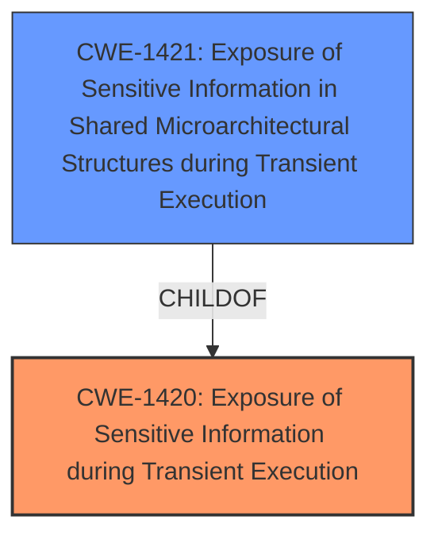

# Analysis Report for CVE-2021-26341

# Vulnerability Analysis Report: CVE-2021-26341

## Description


## Analysis (with Relationship Data)

# Summary
| CWE ID | CWE Name | Confidence | CWE Abstraction Level | CWE Vulnerability Mapping Label | CWE-Vulnerability Mapping Notes |
|---|---|---|---|---|---|
| CWE-1420 | Exposure of Sensitive Information during Transient Execution | 0.9 | Base | Primary | Allowed-with-Review |
| CWE-1421 | Exposure of Sensitive Information in Shared Microarchitectural Structures during Transient Execution | 0.7 | Base | Secondary | Allowed |

## Evidence and Confidence

*   **Confidence Score:** 0.8
*   **Evidence Strength:** HIGH

## Relationship Analysis
The primary CWE is CWE-1420, which describes the general case of sensitive information exposure during transient execution. CWE-1421 is a child of CWE-1420 and represents a more specific scenario where the information exposure occurs through shared microarchitectural structures. Since the vulnerability description mentions the potential for data leakage due to transient execution in AMD CPUs, and the CVE summary highlights speculative execution and detectable cache activity, both CWEs are relevant. CWE-1420 is the primary because it directly addresses the transient execution and data leakage, while CWE-1421 is secondary because it highlights the involvement of microarchitectural structures like caches.



## Vulnerability Chain
The vulnerability chain starts with the AMD CPU's ability to execute instructions beyond unconditional direct branches (**ROOTCAUSE**). This speculative execution leads to detectable cache activity, which can then be observed by an attacker to potentially leak data.
  - AMD CPUs transiently execute instructions beyond unconditional direct branches
  - **WEAKNESS**: Speculative execution leads to detectable cache activity.
  - **IMPACT**: Potential data leakage through observable cache activity.

## Summary of Analysis
The analysis indicates that the primary weakness is CWE-1420, Exposure of Sensitive Information during Transient Execution. This is supported by the vulnerability description which mentions "AMD CPUs may transiently execute beyond unconditional direct branches, which may potentially result in data leakage." The CVE Reference Links Content Summary further reinforces this by stating "AMD CPUs may transiently execute instructions following an unconditional direct branch" and "Potential data leakage through observable cache activity."

CWE-1421, Exposure of Sensitive Information in Shared Microarchitectural Structures during Transient Execution, is also relevant because the vulnerability involves speculative execution and observable cache activity. This suggests that the sensitive information is being exposed through shared microarchitectural structures.

The retriever results also support these findings, with CWE-1342 and CWE-1420 being among the top combined results, indicating their relevance to the vulnerability description. CWE-1421 has a high individual score from the dense retriever.

I considered other CWEs, such as CWE-1342, but they are not as directly related to the root cause and impact as CWE-1420 and CWE-1421.

The selected CWEs are at the optimal level of specificity because they accurately represent the technical details of the vulnerability, including the transient execution and the potential for data leakage through shared microarchitectural structures.

Relevant CWE Information:

# Enhanced Context (25 CWEs)
The following CWEs were identified as potentially relevant to this vulnerability:

## CWE-1420: Exposure of Sensitive Information during Transient Execution
**Abstraction Level**: Base
**Similarity Score**: 0.77
**Source**: dense

**Description**:
A processor event or prediction may allow incorrect operations (or correct operations with incorrect data) to execute transiently, potentially exposing data over a covert channel.

**Mapping Guidance**:
- Usage: Allowed-with-Review
- Rationale: This CWE entry is at the Base level of abstraction, which is a preferred level of abstraction for mapping to the root causes of vulnerabilities.

## CWE-1421: Exposure of Sensitive Information in Shared Microarchitectural Structures during Transient Execution
**Abstraction Level**: Base
**Similarity Score**: 0.77
**Source**: dense

**Description**:

			A processor event may allow transient operations to access
			architecturally restricted data (for example, in another address
			space) in a shared microarchitectural structure (for example, a CPU
			cache), potentially exposing the data over a covert channel.
		  

**Mapping Guidance**:
- Usage: Allowed
- Rationale: This CWE entry is at the Base level of abstraction, which is a preferred level of abstraction for mapping to the root causes of vulnerabilities

## CWE-1342: Information Exposure through Microarchitectural State after Transient Execution
**Abstraction Level**: Base
**Similarity Score**: 0.77
**Source**: dense

**Description**:
The processor does not properly clear microarchitectural state after incorrect microcode assists or speculative execution, resulting in transient execution.

**Mapping Guidance**:
- Usage: Allowed
- Rationale: This CWE entry is at the Base level of abstraction, which is a preferred level of abstraction for mapping to the root causes of vulnerabilities.


## CWE Relationship Analysis

Current CWEs represent these abstraction levels: .


### Vulnerability Chain Analysis

**Chain starting from CWE-1421:**
- 1421 (Exposure of Sensitive Information in Shared Microarchitectural Structures during Transient Execution) - ROOT


**Chain starting from CWE-1420:**
- 1420 (Exposure of Sensitive Information during Transient Execution) - ROOT


### CWE Relationship Diagram

```mermaid
graph TD
    classDef primary fill:#f96,stroke:#333,stroke-width:2px
    classDef secondary fill:#69f,stroke:#333
    classDef tertiary fill:#9e9,stroke:#333
```


*Report generated on 2025-03-30 20:16:53*
