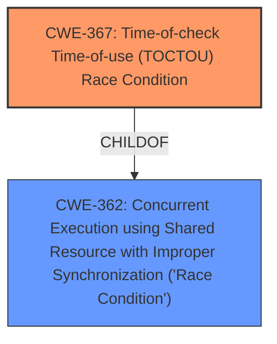

# Analysis Report for CVE-2021-26350

# Vulnerability Analysis Report: CVE-2021-26350

## Description


## Analysis (with Relationship Data)

# Summary
| CWE ID | CWE Name | Confidence | CWE Abstraction Level | CWE Vulnerability Mapping Label | CWE-Vulnerability Mapping Notes |
|---|---|---|---|---|---|
| CWE-367 | Time-of-check Time-of-use (TOCTOU) Race Condition | 0.9 | Base | Primary | Allowed |
| CWE-362 | Concurrent Execution using Shared Resource with Improper Synchronization ('Race Condition') | 0.7 | Class | Secondary | Allowed-with-Review |

## Evidence and Confidence

*   **Confidence Score:** 0.9
*   **Evidence Strength:** HIGH

## Relationship Analysis
The primary CWE is CWE-367, which is a base level CWE and a specific type of race condition. It is a child of the class-level CWE-362. CWE-362 describes concurrent execution using shared resources with improper synchronization. The relationship clarifies that CWE-367 is a specific instance of CWE-362, involving a time-of-check time-of-use problem.



## Vulnerability Chain
The vulnerability chain starts with a **TOCTOU race condition** (CWE-367). This leads to the ability to obtain and manipulate the address of a message port register, resulting in a potential denial of service. The root cause is the race condition, and the impact is denial of service.

## Summary of Analysis
The primary weakness is a **TOCTOU race condition** (CWE-367) that allows an attacker to manipulate the address of a message port register, potentially leading to a denial of service.

The vulnerability description states: "A **TOCTOU race condition** in SMU may allow for the caller to obtain and manipulate the address of a message port register which may result in a potential denial of service." The CVE Reference Links Content Summary also explicitly mentions "A TOCTOU race condition exists in the System Management Unit (SMU)."

CWE-367 (Time-of-check Time-of-use (TOCTOU) Race Condition) is the best fit because it specifically describes the scenario where the product checks the state of a resource before using it, but the resource's state can change between the check and use, invalidating the results of the check. The description aligns perfectly with the **TOCTOU race condition** identified in the vulnerability description.

CWE-362 (Concurrent Execution using Shared Resource with Improper Synchronization ('Race Condition')) is also applicable because it describes the broader class of race conditions. However, since the vulnerability specifically mentions a **TOCTOU race condition**, CWE-367 is more specific and thus more appropriate as the primary CWE.

Other CWEs were considered but deemed less appropriate:

*   CWE-667 (Improper Locking), CWE-662 (Improper Synchronization), and CWE-833 (Deadlock) were considered because they relate to concurrency issues. However, the vulnerability is more specifically a **TOCTOU race condition**, not a general locking or synchronization issue.
*   CWE-476 (NULL Pointer Dereference) was considered but is not directly related to the **TOCTOU race condition** described.
*   CWE-119 (Improper Restriction of Operations within the Bounds of a Memory Buffer) was considered, but the vulnerability does not directly involve buffer overflows or out-of-bounds access.

The selection of CWE-367 is at the optimal level of specificity because it directly corresponds to the identified **TOCTOU race condition**. The evidence strongly supports this classification, and the relationship analysis clarifies its place within the broader category of race conditions (CWE-362).


## CWE Relationship Analysis

Current CWEs represent these abstraction levels: .


### Vulnerability Chain Analysis

**Chain starting from CWE-833:**
- 833 (Deadlock) - ROOT


**Chain starting from CWE-476:**
- 476 (NULL Pointer Dereference) - ROOT


### CWE Relationship Diagram

```mermaid
graph TD
    classDef primary fill:#f96,stroke:#333,stroke-width:2px
    classDef secondary fill:#69f,stroke:#333
    classDef tertiary fill:#9e9,stroke:#333
```


*Report generated on 2025-03-31 12:17:48*
